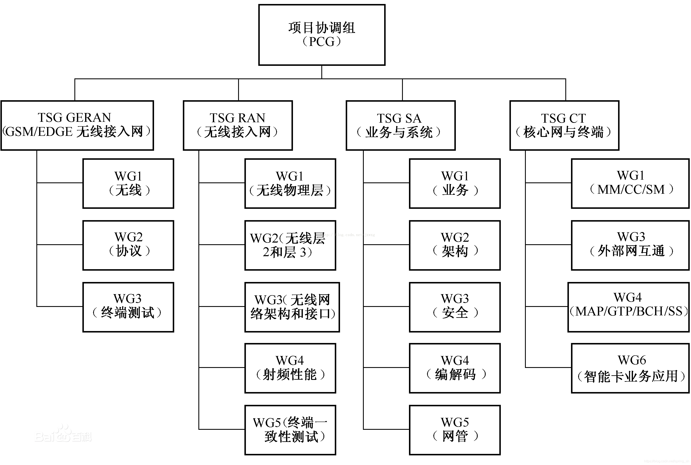

[[toc]]

# 傻瓜笔记：重要文档下载方式（3GPP标准、RFC）

## 3GPP

想下载 3GPP 的标准都研究了半天，这里持续记录一下一些重要文档的下载方式以防自己忘记。

### 3GPP专用缩写解释

首先是一些缩写，这个[老哥]([3GPP TR/TS_spring_sh的博客-CSDN博客](https://blog.csdn.net/spring_sh/article/details/106316924))解释了一下：

TSG 设立项目，
TSG / WG 进行研究，
研究项目称为 SI （study item）： 输出 TR（technical report）；
标准化项目称为 WI （work item）： 由TR输出 TS（technical specification);

会议及提案， 比如：
ftp.3gpp.org/tsg_ran/TSG_RAN/TSGR_86/
代表第86次会议，其下有提案

### 3GPP标准下载方法

[Specification Numbering (3gpp.org)](https://www.3gpp.org/specifications/79-specification-numbering) 有一个大表，是 3GPP 各个系列标号对应的含义，比如38是Radio technology beyond LTE，也就是 4G 之后的技术啦，也就是现在的 5G-NR。

找到想要的标号后点击他，可以进入该标号对应的系列，比如进入了[38系列]([3GPP specification series: 38series](https://www.3gpp.org/DynaReport/38-series.htm))，这里列出了一些技术。

在这个列表里找一个感兴趣的，比如[Specification # 38.401 (3gpp.org)](https://portal.3gpp.org/desktopmodules/Specifications/SpecificationDetails.aspx?specificationId=3219)，进入他的详情页，默认是在 General 选项卡。

Type就是上面提到的是标准（TS）还是报告（TR）；Radio technology中打钩的项目代表和哪一项有关系，比如上面的 38.401 就只打了 5G 的钩。

可以点击 General 选项卡上的 “Click to see all versions of this specification” 进 FTP 页面下载想要的版本。

也可以进 Versions 选项卡，点 Version 栏的版本标号，下载文件。

### 收藏、导读

- 37系列都是Multiple radio access technology

- 37.213 Physical layer procedures for shared spectrum channel access

- 37.824 Coexistence between NB-IoT and NR，图5.1.1-1是NR的 bandwidth

- 37.834 Study on Wireless Local Area Network (WLAN) ，主要针对UE对 wifi和NR的切换选择

- 37.890 Feasibility Study on 6 GHz for LTE and NR in Licensed and Unlicensed Operations

  Status 给出了三个ITU region在6G HZ左右的分配情况

- 23.729 Study on unlicensed spectrum offloading system enhancements

- 23.501 System architecture for the 5G System (5GS)，5.33章节是有关URLLC的

- 22.804 是应用的大杂烩：Communication for Automation in Vertical Domains

- 22.261中讲了5G service requirement
  异构下主要是要 collision 避免、冲突解析
  注意不仅仅是WiFi等其他存在异构，5G本身就有很多不同的标准，不只有NR，以及旧的
  6.9章还提到了中继UE的概念
  6.21指出，ran的sharing也很重要，写在22.101的28.2节
  表格7.1-1则提到了速度需求，表7.6.1则是URLLC的需求
  7.2章和7.6章则重点讲了URLLC
  注意推荐了几个标准TS 22.104是给CPS的，TS 22.186是给V2X的，高铁是TS 22.289
  附录A、C也可以看看

- 36.889是 LAA

- 37.213是频谱共享，很重要

- 22.263中描述了音视频的要求

- 38.133 RRM requirements

- 38.331 RRC 资源分配 Radio Resource Control between UE and NG-RAN

- 38.533 RRM

- 38.300 是NG-RAN的概述

- 38.201说了物理层基本没变

- 38.889是讲非授权频段的

- 23.501是System architecture。有一部分提到了URLLC，提到了要靠重复冗余的传输确保reliability。

- 21.916 是Release 16的概述

- 38.805是60Ghz的共享

- 38.812是NOMA的

- 38.824是URLLC物理层上的增强，也比较重要

- 38.901是NR的channel model

- 38.873是TDD，但是不重要，应该不会引用他

### 附：3GPP 组织结构图

## RFC

[IETF | RFCs](https://www.ietf.org/standards/rfcs/) 官网里面直接搜索就好了~

[RFC 768 - User Datagram Protocol (ietf.org)](https://datatracker.ietf.org/doc/rfc768/) 这个网站很有意思，还可以自动给 bibtex 很方便引用~