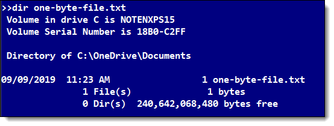
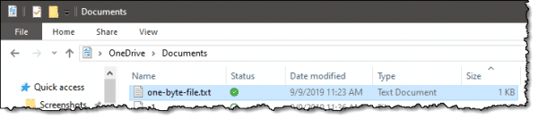
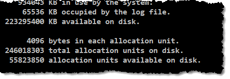

[[toc]]

# 为什么同一个文件在不同电脑上大小不一样

今天一个朋友问了我一个问题：为啥同一个文件在不同电脑上大小不一样啊？为啥啊？我直接懵了，这啥啊？为啥啊？直到看到了一篇文章[[1]](#ref1)，才解答了我和朋友的困惑。

## 簇的大小导致了文件大小不同

事实上这种事情经常发生，比如你在云盘上存小视频，明明它是 60G。结果下载下来以后，发现你的文件夹变成 80G 了，难道人家还赠送了你 20G 的小视频？这当然不可能发生。

核心原因就是

- 磁盘空间是按簇来划分的。即使是一个 Byte 大小的文件也会占用一个簇的空间。
- 磁盘格式化时可以设置簇大小，一般从 512 到 131,072 Bytes。
- 不同的实用程序以不同的方式显示磁盘空间。
- 网盘一般显示的是文件的实际大小。

## 实例分析

假设你有一个 1 Byte 的文件，你用命令行查看会是 1 Byte，用文件浏览器看他又成了 1 KB。

数据在磁盘上会存放在大小为 512 或 4096 Bytes 的扇区上。文件存储系统会记录文件在磁盘上的存储方式相关信息，包括是在哪个扇区上。但是文件系统一般不会一个一个扇区地进行记录和跟踪，而是把多个扇区并在一起管理，称为簇。

簇一般是 1, 2, 4, 8, 16 或更多个相邻扇区。文件系统会记录文件的位置，并维护一个列表，记录分配给文件的簇。

使用 CHKDSK 命令可以查看簇大小（即下图中的一个 allocation unit）。

理论上，当我们创建一个 1 Byte 大小的文件，文件系统会：

- 在他的文件表中创建一个列表项，俗称为”directory listing”。
- 从磁盘上分配一个簇来存储文件。
- 将数据写到磁盘中。

文件将会被被分配一个簇，即使他不需要这么大的空间。假设簇大小是上图的 4KB，则一个 1 Byte 的文件会消耗 4KB 空间，当它变成 4097 Byte 的时候，它会占用两个簇，从而是 8KB 的空间。

### 但是文件管理器显示的是 1KB，而不是 4KB

事实上，文件系统不止需要记录文件的数据，也需要记录文件名、分配给它的簇、时间戳、标签、权限等等诸多信息，所有的这些元数据（meta-data）都占用了文件 directory listing 中的空间。

在 NTFS 文件系统中，directory listing 的空间是一整块进行分配的，不管元数据实际有多大，每次分配都会是 1,024 Bytes。

所以是这么优化的：当文件很小的时候，不分配簇，而是利用 directory listing 中的剩余空间去存放它。这样，就可以节约簇的分配（这也是为什么你甚至可以看到文件属性中，文件的实际大小比占用空间小，占用空间甚至是0的情况）。

## 补充

在fat32文件系统的情况下，分区大小在2GB～8GB时簇的大小为4KB；分区大小在8GB～16GB时簇的大小为8KB；分区大小在 16GB～32GB时，簇的大小则达到了16KB。而ntfs格式中，当分区的大小在2GB以下时，簇的大小都比相应的fat32簇小；当分区的大小在2GB以上时(2GB～2TB)，簇的大小都为4KB。也就是说，ntfs可以比fat32更有效地管理磁盘空间，最大限度地避免了磁盘空间的浪费。

## References

1. [Why is the Same File a Different Size in Different Places?](https://askleo.com/why-is-the-same-file-a-different-size-in-different-places/) 

