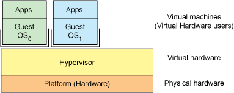
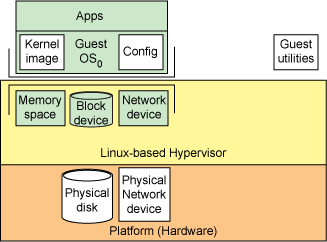
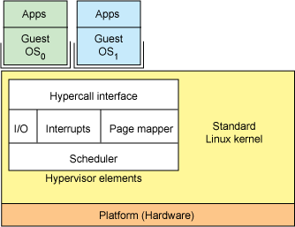
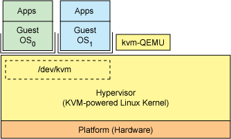
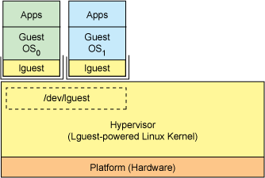
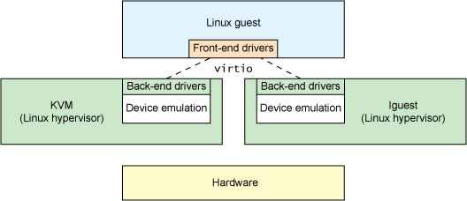
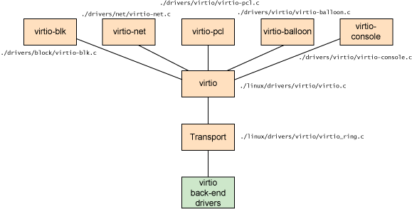
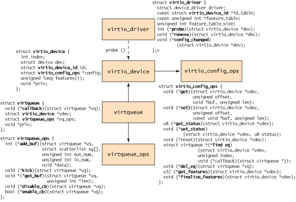

[[toc]]

# 虚拟化基础学习笔记

## 虚拟化和Hypervisor

这部分主要抄录自[[1]](#ref1)。这部分首先介绍虚拟化和 hypervisor ，再探索两个基于 Linux 的 hypervisor：KVM 和 Lguest，再探索 QEMU。

虚拟化就是通过某种方式隐藏底层物理硬件的过程，从而让多个操作系统可以透明地使用和共享它。这种架构的另一个更常见的名称是平台虚拟化。下图就展示了该分层架构。

平台虚拟化的好处很多。美国环境保护署（EPA）报告的一组有趣的统计数据就证明了其好处。EPA 研究服务器和数据中心的能源效率时发现，实际上服务器只有 5% 的时间是在工作的。在其他时间，服务器都处于 “休眠” 状态。在单个服务器上的虚拟化平台能够改善服务器的利用率，但是减少服务器的数量才是它的最大功用。减少服务器数量意味着减少不动资产、能耗、冷却和管理成本。使用更少的硬件还能提高可靠性。

hypervisor 是一种运行在物理服务器和操作系统之间的中间层软件，可以允许多个操作系统和应用共享一套基础物理硬件。可以将hypervisor 看做是虚拟环境中的“元”操作系统，可以协调访问服务器上的所有物理设备和虚拟机，所以又称为虚拟机监视器（virtual machine monitor）。hypervisor 是所有虚拟化技术的核心，非中断的支持多工作负载迁移是 hypervisor 的基本功能。当服务器启动并执行 hypervisor 时，会给每一台虚拟机分配适量的内存，cpu，网络和磁盘资源，并且加载所有虚拟机的客户操作系统。

### Hypervisor分类

hypervisor 可以划分为两大类。首先是类型 1，这种 hypervisor 是直接运行在物理硬件之上的。其次是类型 2，这种 hypervisor 运行在另一个操作系统（运行在物理硬件之上）中。类型 1 hypervisor 的一个例子是基于内核的虚拟机（KVM —— 它本身是一个基于操作系统的 hypervisor）。类型 2 hypervisor 包括 QEMU 和 WINE。

### Hypervisor 构成

hypervisor（不管是什么类型）仅是一个从其来宾操作系统抽象机器硬件的分层应用程序。通过这种方式，每个来宾操作系统看到的仅是一个 VM 而不是真实的硬件机器。我们大致看一下 hypervisor 的内部组成，以及它在 VM（来宾操作系统）上的表示。

hypervisor 需要少量设施启动来宾操作系统：一个需要驱动的内核映像、一个配置（比如 IP 地址和所需的内存量）、一个磁盘盒一个网络设备。磁盘和网络设备通常映射到机器的物理磁盘和网络设备（如下图所示）。最后，需要使用一组来宾操作系统工具启动和管理来宾操作系统。

然后，一个简化的 hypervisor 架构实现最后的关键功能，从而使来宾操作系统可以和宿主操作系统同时运行。实现这个功能需要一些特定的要素，如下图所示。首先，类似于将用户空间应用程序和内核函数连接起来的系统调用，一个通常可用的虚拟化调用（hapercall，hypervisor 对操作系统进行的系统调用）层允许来宾系统向宿主操作系统发出请求。可以在内核中虚拟化 I/O，或通过来宾操作系统的代码支持它。故障必须由 hypervisor 亲自处理，从而解决实际的故障，或将虚拟设备故障发送给来宾操作系统。hypervisor 还必须处理在来宾操作系统内部发生的异常。（毕竟，来宾操作系统发生的错误仅会停止该系统，而不会影响 hypervisor 或其他来宾操作系统）。hypervisor 的核心要素之一是页映射器，它将硬件指向特定操作系统（来宾或 hypervisor）的页。最后，需要使用一个高级别的调度器在hypervisor和来宾操作系统之间传输控制。

#### KVM

KVM （Kernel-based Virtual Machine）针对运行在 x86 硬件硬件上的、驻留在内核中的虚拟化基础结构。KVM 是第一个成为原生 Linux 内核（2.6.20）的一部分的 hypervisor。

KVM 在平台虚拟化中利用 QEMU，并使用 Linux 作为hypervisor，因此实现了这个构思，即让来宾操作系统能够和其他 Linux 应用程序协调执行。

#### Lguest

### Linux hypervisor

下面讨论两个基于 Linux 的 hypervisor。

### QEMU

这部分主要抄录自[[2]](#Reference)。

QEMU 是一个系统模拟器，不仅提供访客系统的虚拟化平台，还提供了整个系统的虚拟化，包括 PCI host controller，disk，network，video hardware，USB controller 和其他硬件设施。

## Virtio

这部分主要翻译自[[3]](#Reference)。

简而言之，Virtio 是一个半虚拟化 hypervisor 中的虚拟设备之上的一个抽象层。 virtio 是由 Rusty Russell 开发的，最初的目的是支持上面提到的，他自己开发的虚拟化方案 lguest。我们先讨论一下半虚拟化和虚拟设备，然后探索 virtio的实现细节，我们关注的是 2.6.30 内核中的virtio框架。

Linux 提供了大量各有优劣的实现 hypervisor 的方案，诸如 KVM，lguest 和 User-mode Linux。有了这些不同的方案，可以按需选择，比如各种虚拟化外设。virtio 提供了一个统一的前端来进行外设虚拟化，提供了标准化的接口来提高不同平台代码的重用性。

### 全虚拟化和半虚拟化

让我们讨论一下两类虚拟化机制：全虚拟化和半虚拟化。在全虚拟化中，访客系统运行在完全虚拟的环境中，但是他不知道自己是在虚拟环境下，不需要进行特殊的配置。相对的，半虚拟化中，访客操作系统不仅知道他是在 hypervisor 中运行，而且它还会提供代码使得 guest-to-hypervisor 的转换更加高效。

在全虚拟化机制下，hypervisor 必须模拟外设硬件，模拟最底层的信息，比如模拟一个网卡驱动。尽管在这层抽象下的虚拟化是彻底而纯净的，它也是最低效和极度复杂的一种虚拟化方案。在半虚拟化机制下，访客和 hypervisor 能够配合地让虚拟化更加高效，它的缺陷是操作系统知道自己是运行在虚拟化系统上的，需要进行改动。

上图中，在传统的全虚拟化环境中，在访客系统发出请求时，hypervisor 需要陷入 trap 中，然后去模拟硬件的行为。尽管这样更具扩展性，能够允许不加改动的操作系统运行为访客系统，但是不够高效。上图右边的半虚拟化环境下，访客操作系统明白它运行在 hypervisor 上，它知道自己有前端驱动，hypervisor 则负责实现了特定外设的驱动后端。这些前后端驱动就是 virtio 的来源，它为虚拟设备提供了标准化的接口，提升开发效率和代码复用率。

### Linux guest的抽象

在之前的章节中，我们看到 virtio 是半虚拟化 hypervisor 中一系列常见的虚拟设备的抽象。这种设计允许 hypervisor 向外暴露一系列常见的虚拟化设备，并提供公共 API。下图就解释了它的重要性。借助半虚拟化 hypervisor，访客实现了一系列公共的接口，特定的外设则被后端的驱动所模拟。后端驱动并不必是公共的，只要他们能够实现前端需要的行为就行了。

注意在真实环境下，外设的虚拟化发生在用户空间，使用的是 QEMU，所以后端驱动借助 QEMU 和 hypervisor 的用户空间来通信并管理设备的 I/O 。

virtio 的 API 依赖于一个简单的 buffer 抽象，来包裹访客需要的命令和数据。让我们深入 virtio API 和他的组成部分。

### Virtio 架构

除了在访客中实现的前端驱动和 hypervisor 中实现的后端驱动，virtio 还定义了两层来实现 guest-to-hypervisor 的通信。在最上层（也叫作 virtio）是虚拟队列接口，将前端和后端联系起来。驱动能够使用 0 或多个队列，取决于他们的需求。例如，virtio 网络驱动使用两个虚拟队列（一个接受，另一个传输），而 virtio block 驱动就只使用一个。虚拟队列实际上成环状的，但是也不是必须如此，只要前后端保持一致就行了。

上图中罗列了五个前端驱动，即block devices (例如磁盘)，network devices，PCI emulation，balloon driver (用来动态管理访客的内存使用) 和 console driver。每个前端驱动都有一个对应的后端驱动。

### 概念框架

从访客的视角来看，下图定义了 object hierarchy。在最上方的是 virtio_driver，它代表了访客的前端驱动。符合这个驱动的设备被封装成了 virtio_device（一种访客中的设备表示形式）。它与 virtio_config_ops 结构有关，该结构则负责定义和配置 virtio device的行为。virtqueue 又关联到了 virtio_device，在服务时维护一个对设备的引用。最后每个 virtqueue 对象引用了 virtqueue_ops 对象，该对象定义了底层队列用来服务 hypervisor 驱动的行为。

进程在一开始会创建一个 virtio driver，然后通过 register_virtio_driver 来注册它。 virtio_driver 结构定义了上层设备驱动，列出了驱动至此的设备的 ID，一个支持的特性的表（取决于外设的类型）以及一系列回调函数。当 hypervisor 在设备列表中识别出来一个匹配设备ID的新设备，就会调用 probe 函数来传输 virtio_device 对象（该函数在virtio_driver 对象中提供）。该对象和管理外设使用的数据（这和特定的驱动有关）一起被缓存下来。取决于外设的类型，virtio_config_ops函数可能会被触发，来读取或设置外设特定的选项。例如，从一个 virtio_blk 设备获取硬盘的读写状态，或是设置 block device 的 block size。

注意 virtio_device 不会包含 virtqueue 的引用 （但是 virtqueue 确实引用了virtio_device）。为了识别和 virtqueue 相关联的 virtio_device，你可以使用 virtio_config_ops 对象的 find_vq 函数。这个对象会返回和 virtio_device 实例相关的虚拟队列。find_vq 函数也会允许给 virtqueue 提供回调函数的特化，用来告知访客系统来自 hyperviso 的 response buffer。

virtqueue 是一个简单的结构，声明了一个额外的回调函数（该回调函数会在 hypervisor 消耗掉 buffer中的数据时候调用），一个 virtio_device 的引用，一个 virtqueue_ops 的引用和一个特殊的 priv 引用指向了要使用的底层实现。尽管回调函数是可选的，也可以动态启用或禁用该回调。

但是该结构的核心是 virtqueue_ops，它定义了指令和数据是怎样在访客和 hypervisor之间移动的。让我们看看如何向队列添加或删除对象。

### Virtio buffer

前端驱动和后端驱动是通过 buffer 来交流的。对于一个 I/O 请求，访客提供一个或多个 buffer 来表示它。例如，你可以提供三个 buffer，第一个代表一个读请求、之后的两个代表对应的响应数据。在内部，该配置是使用 scatter-gather list 来表示的，列表的每一项都是一个地址和一个长度。

### Core API 

### Virtio Vring

详见  [[4]](#Reference) 。

## Docker

## Reference

1. [剖析 Linux hypervisor](https://www.ibm.com/developerworks/cn/linux/l-hypervisor/) 

2. https://www.cnblogs.com/echo1937/p/7138294.html
3. [Virtio: An I/O virtualization framework for Linux](https://developer.ibm.com/articles/l-virtio/)
4. [virtio之vring](https://www.cnblogs.com/yi-mu-xi/p/12544695.html)
5. [容器、虚拟机与Docker概念全解析](https://www.linuxprobe.com/docker-and-vm.html)