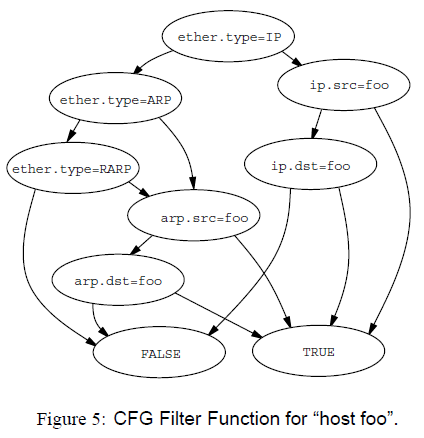
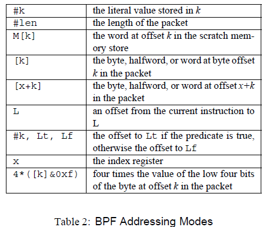

[[toc]]

# BPF 和 eBPF 初探

## BPF论文笔记

该文章由 UCB 发表在 1992 年的 Winter USENIX，题目是《The BSD Packet Filter: A New Architecture for User-level Packet Capture》。

BPF 全名为 BSD Packet Filter，最初被应用于网络监测，例如知名的`TCPdump` 工具中，它可以在内核态根据用户定义的规则直接过滤收到的包，相较竞争者 CSPF 更加高效。它设计了一个基于寄存器的虚拟机用来过滤包，而 CSPF 则使用的是基于栈的虚拟机。

BPF 有两个组成部分：

- Tap 部分负责收集数据
- Filter 部分负责按规则过滤包


收到包以后，驱动不仅会直接发给协议栈，还会发给 BPF 一份， BPF根据不同的filter直接“就地”进行过滤，不会再拷贝到内核中的其他buffer之后再就行处理，否则就太浪费资源了。处理后才会拷贝需要的部分到用户可以拿到的 buffer 中，用户态的应用只会看到他们需要的数据。

注意在BPF中进行处理的时候，不是一个一个包进行处理的，因为接收到包之间的时间间隔太短，使用`read`系统调用又是很费事的，所以 BPF 都是把接收到的数据打包起来进行分析，为了区分开这些数据，BPF 会包一层首部（header），用来作为数据的边界。

作者先比较了两种极端的情况，在接收所有包和拒绝所有包的情况下 BPF 和竞争者 NIT 的表现。


横轴是包的大小，纵轴是平均时间开销，斜率是读写速度。y轴上的截距是包长为0时候，也即对于每个包来说，固定的调用 filter 的开销。由于需要分配和初始化 buffer，NIT 调用时长在 80-100 微秒，而 BPF 则只要 5 微秒。除此以外，随着包长增加，可以看到当接受所有包时，虽然都会将包拷贝到 buffer 中，BPF 要更快一些。同时，当拒绝所有包的时候，由于 BPF 直接就地过滤掉了所有的包，不需要任何拷贝，所以它的开销几乎是常数，即固有的 filter 调用时间。

在网络监测中，一般来说（除非开启混乱模式），丢弃的信息要多于需要的信息，因此 BPF 在一般情况下优势巨大。

事实上，一个 filter 就好似一个断言，或真或假，代表是否需要该包。

为了验证断言，CSPF 采用的是如下的树形结构，好处是思路清晰。但是遍历树时需要使用栈，每次或者向栈中推入常量或包的数据，或者在栈顶两个元素之间进行二元运算。在跑完整个树结构后，再读取栈顶元素，如果是非零值或栈是空的，才会接收该包，否则丢弃。就算可以使用短路运算去优化实现代码，也依然有很大问题，首先网络是分层的，包结构里有很多首部，逐层嵌套，每次进行判断都要重新拆解包。其次接收也是接收一整个包，而不去考虑会有很多不需要的数据，明显是比 BPF 低效的。


而 BPF 则使用了下图的 CFG（Control Flow Graph）， CFG 是一个 DAG (Directed Acyclic Graph)，左边分支是说明节点是 false，右边分支是说明节点是 true。该结构运算时更多地使用寄存器，这也是一个更快速的原因。该方法的问题就是 DAG 怎么构造，怎么排序，这本身是另一个算法问题了，文中没有进行讨论。



BPF 的虚拟机设计，没有采用三地址形式的代码，而是采用的多为二元运算、单地址的运算。它也定义了一系列如下的 32 位的运算指令。在实现时是用的宏，但是在文中为了便于阅读，用了汇编形式。注意到取址运算很多是相对于包来说的，因为本来这个虚拟机就是用来分析包的。




由于数据在包中的位置不固定，BPF 定义了一个运算来简化地址运算的步骤，即 `4*([14]&0xf)` ，其实是在分析 IP header，乘 4 是因为 offset 是字长为单位，是 4 个字节。是下面代码的缩写。


## eBPF (extended BPF)

[官方网站](https://ebpf.io/zh-cn/)。

Linux 内核一直是实现监控/可观测性、网络和安全功能的理想环境。 不过很多情况下这并非易事，因为这些工作需要修改内核源码或加载内核模块， 最终实现形式是在已有的层层抽象之上叠加新的抽象。 eBPF 是一项革命性技术，它能在内核中运行沙箱程序（sandbox programs）， 而无需修改内核源码或者加载内核模块。

将 Linux 内核变成可编程之后，就能基于现有的（而非增加新的）抽象层来打造更加智能、 功能更加丰富的基础设施软件，而不会增加系统的复杂度，也不会牺牲执行效率和安全性。


[Ingo Molnár](https://lkml.org/lkml/2015/4/14/232) 在 2015 年在提议合并 Linux 分支时这样描述 eBPF ：

> One of the more interesting features in this cycle is the ability to attach eBPF programs (user-defined, sandboxed bytecode executed by the kernel) to kprobes. This allows user-defined instrumentation on a live kernel image that can never crash, hang or interfere with the kernel negatively.

## 主要项目

[**项目列表**](https://ebpf.io/projects/)

### BCC: Toolkit and library for efficient BPF-based kernel tracing

BCC 是一个基于 eBPF 的高效跟踪检测内核、运行程序的工具，并且包含了须有有用的命令行工具和示例程序。BCC减轻了使用 C 语言编写 eBPF 程序的难度，它包含了一个 LLVM 之上的包裹层，前端使用 Python 和 Lua。它也提供了一个高层的库可以直接整合进应用。它适用于许多任务，包括性能分析和网络流量控制。下图是BCC给出的常见工具：


### bpftrace: High-level tracing language for Linux eBPF

bpftrace 是一个基于 Linux eBPF 的高级编程语言。语言的设计是基于 awk 和 C，以及之前的一些 tracer 例如 DTrace 和 SystemTap。bpftrace 使用了 LLVM 作为后端，来编译 compile 脚本为 eBPF 字节码，利用 BCC 作为库和 Linux eBPF 子系统、已有的监测功能、eBPF 附着点交互。

### Cilium: eBPF-based Networking, Security, and Observability

Cilium 是一个开源项目提供了借助 eBPF 增强的网络、安全和监测功能。它从根本上被专门设计成了将 eBPF 融入到 Kubernetes （k8s）并且强调了容器新的规模化、安全性、透明性需求。

### Falco: Cloud Native Runtime Security

Falco 是一个行为监测器，用来监测应用中的反常行为。在 eBPF 的帮助下，Falco 在 Linux 内核中审计了系统。它将收集到的数据和其他输入例如容器运行时的评价标准和 Kubernetes 的评价标准聚合，允许持续不断地对容器、应用、主机和网络进行监测。

### Katran: A high performance layer 4 load balancer

Katran 是一个 C++ 库和 eBPF 程序，可以用来建立高性能的 layer 4 负载均衡转发屏幕。Katran 利用Linux 内核中的 XDP 基础构件来提供一个核内的快速包处理功能。它的性能随着网卡接收队列数量线性增长，它也可以使用 RSS 来做 L7 的负载均衡。

## 核心架构

### Linux Kernel (eBPF Runtime)

Linux kernel 包含了需要运行 eBPF 程序的 eBPF 运行时。它实现了 `bpf(2)` 系统调用来和程序、[BTF](#BTF) 和可以运行 eBPF 程序的各种挂载点进行交互。内核包含了一个 eBPF 验证器，来做安全检测，以及一个 JIT 编译器来将程序直接转换成原生的机器码。用户空间的工具例如 bpftool 和 libbpf 都作为上游会被内核团队维护。

### LLVM Compiler (eBPF Backend)

LLVM 编译器基础构件包含了 eBPF 后端，能够将类似 C 语言语法书写出的程序转换到 eBPF 指令。LLVM 生成了 eBPF ELF 可执行文件，包含了程序码、映射描述、位置信息和 BTF 元数据。这些 ELF 文件包含了所有 eBPF loader 必须的信息例如 libbpf，来在 Linux 内核中准备和加载程序。LLVM 项目也包含了其他开发者工具例如 eBPF object file disassembler。

## eBPF 库

### libbpf

libbpf 是一个基于 C/C++ 的库，由 Linux 开发团队维护。它包含了一个 eBPF loader，接管处理 LLVM 生成的 eBPF ELF 可执行文件，加载到内核中。它支持了 BCC 中没有的特性例如全局变量和 BPF skeletons。

Libbpf 可以支持构建单次编译任意执行（CO-RE）的应用，但是，和 BCC 不同，不需要构建 Clang/LLVM 运行时，也不需要获取 kernel-devel 头文件。但是使用 CO-RE 特性需要内核支持 [BTF](#BTF)，下面一些主要的 Linux 发行版已经带有了 BTF ：

- Fedora 31+
- RHEL 8.2+
- Arch Linux (from kernel 5.7.1.arch1-1)
- Ubuntu 20.10
- Debian 11 (amd64/arm64)

可以通过搜索相关文件查看内核是否实现了 [BTF](#BTF) 支持：

```bash
ls -la /sys/kernel/btf/vmlinux
```

### libbpf-rs & redbpf

libbpf-rs 是一个安全的、符合 Rust 语法的 libbpf API 包裹层。libbpf-rs 和 libbpf-cargo（cargo 的插件）运行开发者编写的 CO-RE 的 eBPF 程序。redbpf 是一个 Rust eBPF 工具链，包含了一系列 Rust 库来编写 eBPF 程序。


# 补充记录：SystemTap

以前用过的 SystemTap 是基于 Kprobe 实现的。SystemTap的框架允许用户开发简单的脚本，用于调查和监视内核空间中发生的各种内核函数，系统调用和其他事件。它是一个允许用户开发自己的特定于内核的取证和监视工具的系统。工作原理是通过将脚本语句翻译成C语句，编译成内核模块。模块加载之后，将所有探测的事件以钩子的方式挂到内核上，当任何处理器上的某个事件发生时，相应钩子上句柄就会被执行。最后，当systemtap会话结束之后，钩子从内核上取下，移除模块。整个过程用一个命令 stap 就可以完成。

# 论文

## ATC18: The design and implementation of hyperupcalls

使用 ebpf 在 hypervisor 中运行客户机的经过验证代码。

Hypervisor 往往把 Guest 视为黑箱，二者的交互需要 Context Switch 做中转。也有一些不需要 Context Switch 的设计，但是一侧数据结构发生改变，另一侧的代码也要更新，难以维护。由

注册步骤。客户机将 C 代码编译到了可信的 eBPF 字节码，其中可能引用了客户机的数据结构。
客户机将生成的字节码注入到 hypervisor 中，验证安全性、将它编译到原生的指令上，加入到虚拟机的 hyperupcall 列表中。

执行步骤，当某个事件发生，触发 hyperupcall，可以获取并更新客户机的数据结构。
 
## TON: A framework for eBPF-based network functions in an era of microservices
[Polycube](polycube-network.readthedocs.io) 的设计文章，2021 年发表在期刊 TON 上。

微服务框架。Polycube 将网络功能统一抽象成 cube，在用户空间创建一个对于service不可见的守护进程统一进行管理，当收到 REST (Representational State Transfer) API 形式的请求，会首先发给这个守护进程，它作为代理，将请求分发到某个 service 的不同实例上，把回复返还给请求方。

Network Functions Virtualization
网桥，路由器，NAT，负载平衡器，防火墙，DDoS缓解器现在都可以通过软件形式实现。但是他们往往都是 bypass 内核的。Polycube 希望通过 eBPF 动态地在内核中注册 Network Functions。

Polycube 组合各个网络功能来构建任意服务链，并提供到名称空间，容器，虚拟机和物理主机的自定义网络连接。Polycube 还支持多租户，可以同时启用多个虚拟网络 [11]。

当时分享时被问到的一个问题是和 Cilium 有什么区别，orz 还是没搞清，之后再看吧。

:::tip Linux 处理 TCP 包有两条路径，fast path 和 slow path。使用快速路径只进行最少的处理，如处理数据段、发生ACK、存储时间戳等。使用慢速路径可以处理乱序数据段、PAWS（Protect Againest Wrapped Sequence numbers，解决在高带宽下，TCP序列号在一次会话中可能被重复使用而带来的问题）、socket内存管理和紧急数据等。:::

## Bringing the Power of eBPF to Open vSwitch

发表在 2018 年的 Linux Plumbers Conference 上，Open vSwitch 是一个运行在 Linux 下的软件定义交换机，它最初是通过内核中的 openvswitch.ko 这个模块实现的，但是项目组现在开辟了两个新的项目，OVS-eBPF 和 OVS-AFXDP。前者的目的是使用 eBPF 重写现有的流量处理功能，attach 到了 TC 的事件上；而后者则是使用 AF_XDP 套接字 bypass 掉内核，把流量处理转移到用户空间。

OVS eBPF datapath 包含多个 eBPF 程序和用户态的 ovs-vswitchd 作为控制平面。eBPF 程序是通过尾调用相连的，eBPF maps 在这些 eBPF 程序和用户空间应用之间是共享的。
 
## OSDI20: hXDP: Efficient Software Packet Processing on FPGA NICs

在 FPGA 上实现 eBPF/XDP，削减 eBPF 指令集、并行执行，最终在时钟频率为 156MHz 的 FPGA 上达到 GHZ CPU 处理包的速度。

## CONEXT 19: RSS++ load and state-aware receive side scaling

接收方缩放（Receive Side Scaling，RSS）是一种网络驱动程序技术，可在多处理器系统中的多个CPU之间有效分配网络接收处理。
接收方缩放（RSS）也称为多队列接收，它在多个基于硬件的接收队列之间分配网络接收处理，从而允许多个CPU处理入站网络流量。RSS可用于缓解单个CPU过载导致的接收中断处理瓶颈，并减少网络延迟。
它的作用是在每个传入的数据包上发出带有预定义哈希键的哈希函数。哈希函数将数据包的IP地址，协议（UDP或TCP）和端口（5个元组）作为键并计算哈希值。（如果配置的话，RSS哈希函数只能使用2,3或4个元组来创建密钥）。
哈希值的多个最低有效位（LSB）用于索引间接表。间接表中的值用于将接收到的数据分配给CPU。

传统 RSS 只依赖哈希，分布可能是不均匀的；一般的负载均衡是关注服务器之间的，这里的是关注的单机的多核负载均衡。在接收时，某个CPU可能缓存更多的包，导致占用率过高，出现丢包的情况，延迟也会相应增加

通过动态修改 RSS 表在 CPU 核心之间分配流量。RSS++摆脱了延迟分布的长尾，提升了CPU利用率，还支持削减参与到包转发过程中的 CPU 核心数，避免核心数过量。比如左边图片，第三段，自动空余出了  CPU。

