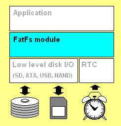
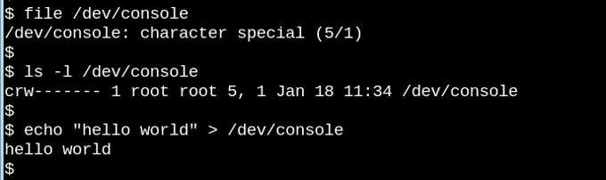
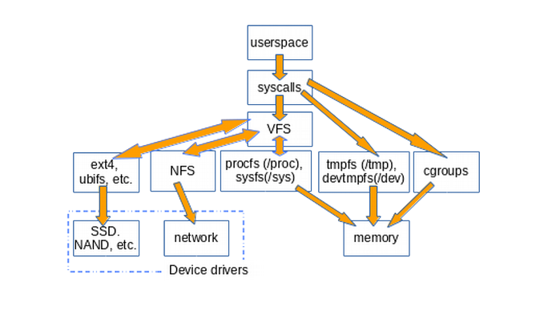
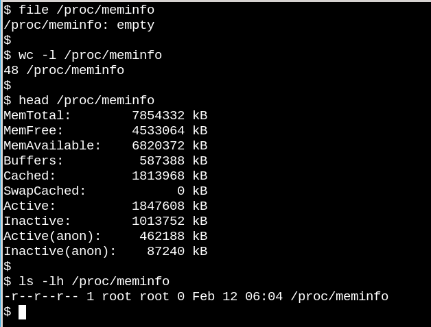
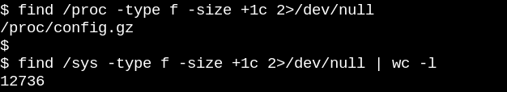
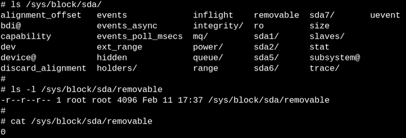
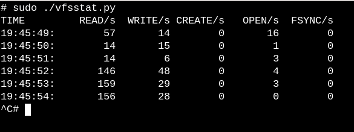
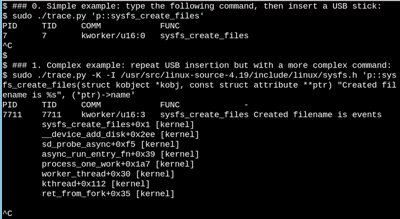
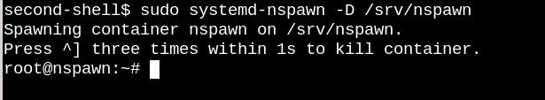
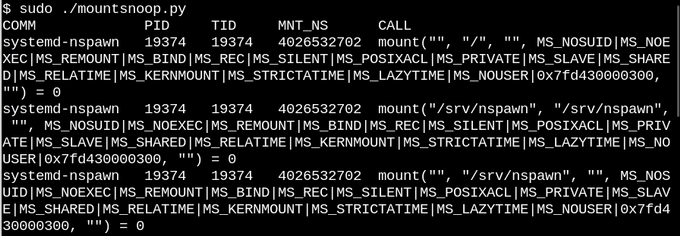

[[toc]]

# 文件系统学习笔记

## 虚拟机共享文件夹下无法创建软链接

因为 wsl2 不支持 eBPF 的一些最新特性，用 virtual box 装了个虚拟机 （感谢 virtual 不仅长期免费还支持了 Hyper-V，开虚拟机关 wsl2，开 wsl2 关虚拟机太痛苦了）。碰到了一个奇怪的现象，libbpf 的测试样例，在 wsl2 里编译得了跑不了，在 virtual box 里的虚拟机上是跑得了编译不了……人傻了，一看编译工具的版本也都一样呀，见了鬼了。

后来解压 github 下到的压缩文件后，才发现软连接全部失效。原来是因为我把文件都放到了 virtual box 里的虚拟机 Ubuntu 和宿主机 Windows 的共享文件夹下了。共享文件夹下会有权限问题，无法创建软链接。推测也可能是文件系统的原因所以禁止了？毕竟 windows 和 linux 创建软链接的方式不同。

::: tip Note

软链接是用 `ln -s` 创建的新的 iNode，可以当成指针去理解，指向链接的文件或目录；`ls` 后可以看到文件名带一个箭头指着被链接的文件；在 github上 也是用特殊图标标识的文件，打开文件内容只有一个指向的文件路径名，用神器 [github1s](https://github.com/conwnet/github1s) 打开也是这样，内容只有一个被指向的文件名；但是你在本地 VS Code 编辑器之类的方式查看，是会打开指向的文件的。硬链接只能链接文件，占用大量空间，共享 iNode，共享文件内容，实时同步更新内容。想查看 iNode，ls的时候加上 i 就行。

:::


## 文件系统

::: tip Note

HPFS 仅适用于 Windows NT 3.1，3.5 和 3.51。Windows NT 4.0 不支持也不能获取 HPFS 分区；同时，只有 Windows 98/95 和 Windows 2000 支持 FAT32 文件系统。

:::

### FAT 概述

FAT 是 Windows NT 上支持的最简单的文件系统。FAT 文件系统使用 file allocation table (FAT) 来组织，这个表在卷的最上端。为了保护这些卷，FAT 需要被拷贝两份以防一份损坏，根目录下的FAT 表必须存储在固定的区域，以便系统启动文件能够正确地定位它们。

使用 FAT 的磁盘是按簇（cluster）分划的，带下取决于卷（volume）的大小。簇的数量是 16 位的，同时必须是 2 的指数。当一个文件创建的时候，也就在目录下创建了一个条目，相应的包含了数据的第一个簇号也就创建了。FAT 表中的条目或者表示这是文件的最后一个簇，或者指向下一个簇，就像链表一样。

FAT 表的更新是很重要的，但它也是很耗时的。如果 FAT 表不经常更新，会导致文件的缺失。但是它又是十分耗时的，因为在更新的时候，硬盘的磁头必须重新放置到硬盘的逻辑 0 位置，毕竟 FAT 表是放置在这里的（FAT 应用的时候还只有机械硬盘？）。

FAT 文件结构是没有组织的，只需要提供文件第一次打开的位置就可以取得它。另外，FAT 支持只读、隐藏、系统文件和打包文件这几种标签。

下面这个表展示了 FAT 文件系统是如何组织一个卷的：


#### FAT 命名规则

FAT 使用传统的文件命名规则，所有的文件名必须是 ACII 字符。文件或目录的名字只能是八个字母长的，只有一个`.`，最多有三个字符的拓展名。文件名必须是字母或数字开头的。文件名不能包含下面的这些字符：

```
. " / \ [ ] : ; | = ,
```

如果这些字符被用到的了，可能会发生不可预料的错误。名字也不能有空格。

下列名称是保留词：

CON, AUX, COM1, COM2, COM3, COM4, LPT1, LPT2, LPT3, PRN, NUL

#### FAT 的优点

在 Windows NT 支持的各种文件系统上都不可能撤销删除操作。撤销删除功能尝试直接获取硬件，在 Windows NT 下是不可能做到的。然而，如果文件是存放在一个 FAT 分区，并且系统是在 MS-DOS 下启动的，文件可以被恢复。

FAT 文件系统在分区为 200 MB 的情况下表现最好，因为 FAT 的开销很小。

#### FAT 的缺点

当使用的硬盘或分区超过了 200 MB，那么不应该使用 FAT了。因为卷的大小增加了，FAT 的性能表现会显著下降。

也不能为 FAT 下的文件设置权限。

FAT 的分区大小限制是 4GB（在 Windows NT 下）或 2GB（在 MS-DOS 下）。

#### FAT32, FAT16, FAT12

下标展示了 FAT 系统的区别

| 文件系统 | FAT 表中每个簇的字节数 | 簇的限制                                           |
| :------: | :--------------------: | -------------------------------------------------- |
|  FAT12   |          1.5           | Fewer than 4087 clusters.                          |
|  FAT16   |           2            | Between 4087 and 65526 clusters, inclusive.        |
|  FAT32   |           4            | Between 65526 and 268,435,456 clusters, inclusive. |

### HPFS 概述

HPFS 文件系统最先是为 OS/2 1.2 研发的，用来支持市场上助教出现的更大的硬盘的读取。另外，逐渐增长的网络服务市场也呼唤着一种新的文件系统，以拓展文件的命名、组织、安全性。HPFS 维持了 FAT 的目录组织形式，但是加入了基于文件名的自动排序。文件名拓展到了 254 双字符。HPFS 也支持数据和特殊标签的文件组合，来增加支持其他命名规则的灵活性。 另外，分配的单元从一个簇变成了物理扇区（512 字节），减少了损失的硬盘空间。

使用 HPFS，相较 FAT，目录条目记录了更多的信息。标签信息包含了修改、创建、获取的日期和时间。HPFS 下的目录条目不再指向文件的第一个簇，而是指向 FNODE。FNODE 能够包含文件的数据，或指向文件数据的指针，或者其他指向文件数据的结构。

HPFS 尽可能地分配连续的空间给文件数据，这是为了增加做序列处理的速度。

HPFS 把硬盘分成了一系列 8MB 的段（band），一个文件总是尽可能地包含于一个段中。在这些段之间是 2K 的 allocation bitmaps，维护了段中的各个扇区的分配情况。分段增长了性能，因为在决定文件存放在哪里时，硬盘磁头不需要返回逻辑顶端（通常是柱面 0），而是最近的段 allocation bitmaps。

另外，HPFS 也包含了一些特殊数据：

#### Super Block

Super Block 位于逻辑扇区 16，包含了一个指向根目录 FNODE 的指针。使用 HPFS 最大的隐患是如果 Super Block 丢失了或者损坏掉了，分区文件就会丢失，尽管剩余的硬盘都是好的。可以通过将其他文件都拷贝到一个 16 号扇区良好的硬盘上，重建 Super Block。但是这个过程很麻烦。

#### Spare Block

Spare Block 位于逻辑扇区 17，包含有一个表，记录了 "hot fixes" 和空余的文件目录块。在 HPFS 下，当检测到坏的扇区，"hot fixes" 条目就被用来指向好的扇区，对坏掉的扇区进行替换。这个处理写入错误的技术也被称为 hot fixing，它把数据从一个扇区移到另一个，并将原先的扇区标记成坏掉的。这个行为对于任意进行硬盘读写的应用都是透明的（即这些应用都不知道硬盘是否有问题）。使用支持 hot fixing 的文件系统，在遇到扇区受损的情况，可以避免让用户收到类似 FAT 中的 “Abort, Retry, or Fail?” 这样的错误信息。

::: tip Note

Windows NT 上使用的 HPFS 并不支持 hot fixing。

:::

#### HPFS 的优点

HPFS 最适合 200-400 MB 的硬盘。

#### HPFS 的缺点

因为 HPFS 的开销，在卷的大小在 200MB 以下时，它并不是一个很好的选择。另外，当卷的大小大于 400MB 时，也会有性能的损耗。

### NTFS 概述

从用户的角度来看，NTFS 仍然是将文件有序地组织到目录下，就和 HPFS一样。然而，和 FAT 或 HPFS 不同，在 NTFS 中，磁盘上没有特殊的对象，也不依赖于底层的硬件，例如 512 字节的扇区。另外，在磁盘中也没有诸如 FAT 中的 FAT 表和 HPFS 中的 Super Block 这样的特殊的位置。

NTFS 的目标是提供：

- 可靠的服务，这在高端的系统或文件服务器中尤其重要
- 一个易于扩展功能的平台
- 支持 POSIX 
- 避免 FAT 和 HPFS 的劣势

下面对这些目标逐个进行分析，看 NTFS 是如何实现的

#### Reliability

为了确保 NTFS 的可靠性，主要考虑了三个因素：可恢复性，单扇区的错误消除和 hot fixing.

NTFS 是可恢复的文件系统，因为它记录了文件系统中所有的事务。当在 FAT 和 HPFS 上执行 CHKDSK 的时候，我们检测了目录、分配表、文件表中指针的一致性。在 NTFS 下，因为维护了一系列事务的历史数据，所以当想要恢复文件系统中的一致性时，只需要回滚这些事务到最后一个提交记录点就行了。

在 FAT 或 HPFS 下，如果一个文件系统中的特殊文件所在的扇区坏掉了，那么就会引发单扇区错误。NTFS 则可以通过两种方法避免这种问题：首先，不在磁盘上使用特殊的文件对象，而是追踪和保护磁盘上所有的对象。其次，在 NTFS 下，主文件表（Master File Table）有多个备份（具体数量取决于卷大小）。

和 OS/2 版本的 HPFS 相同，NTFS 支持 hot fixing.

#### Added functionality

Windows 各个层面上的设计目标之一自然是提供一个可扩展的平台，NTFS 也是如此。NTFS 提供了一个可扩展的平台，其他文件系统也可以使用。除此以外，NTFS 完全支持 Windows NT 安全模型，支持多种数据流，而不再是单文件、单数据流。最后，在 NTFS 中，用户能够在文件上添加它自己定义的标签。

#### POSIX support

NTFS 兼容于 POSIX.1，因为它支持 POSIX.1 的下列要求：

对大小写敏感：

在 POSIX 下，README.TXT，Readme.txt 和 readme.txt 是不同的文件

额外的时间戳：

它有一个额外的时间戳记录文件上次被访问的时间

硬链接：

硬链接是指两个不同的文件名、在不同的目录下，指向同一个数据。

#### Remove limitations

首先，NTFS 已经极大地增加了文件和卷的大小，以至于他们能够达到 2^64 字节。NTFS 也使用了 FAT 中的簇的概念，以避免 HPFS 的扇区大小固定不变的问题。因为系统始终是要考虑可移植性的，512 字节的扇区大小很大概率并不是适于分配。而把簇当做硬件资源分配单位更加灵活。最后，NTFS 中所有的文件名都是 Unicode 编码的，同时支持长文件名和传统的 “8.3文件名”（即 8 个字符名字、3 个字符文件类型拓展名）。

#### NTFS 的优点

NTFS 最适于用于卷大小在 400MB 以上的情况。因为在使用更大的卷大小的时候，NTFS 的性能不会下降。

在 NTFS 分区上，用户不需要去使用磁盘修复工具，因为 NTFS 在设计上就带有可恢复性。

#### NTFS 的缺点

卷大小在 400MB 以下的时候不推荐使用 NTFS，因为 NTFS 的空间开销巨大。NTFS 对 100MB 的分区就要占用 4MB。NTFS 文件系统中没有设计文件加密的方法。因此，用户可以在 MS-DOS 或其他操作系统下启动，使用底层的硬盘编辑功能来查看存储在 NTFS 卷上的数据。

#### NTFS 命名规则

文件和目录名最多能是 255 字符长的，包括任意拓展名。名字保留了大小写，但是不做区分。NTFS  文件名不能包含下列字符：

```
? " / \ < > * | :
```

在命令行中，只能创建最多为 253 字符的文件名。

::: tip Note

在任意文件系统中，下层的硬件限制都可能会施加额外的分区大小限制。例如，启动分区最大只能是 7.8GB，而分区表中也有 2TB 的限制。

:::

对于 Windows 上文件系统更进一步的讨论可以参见 Windows 官方文档：

- Windows NT Server "Concepts and Planning Guide," Chapter 5, section titled "Choosing a File System"
- Windows NT Workstation 4.0 Resource Kit, Chapter 18, "Choosing a File System"
- Windows NT Server 4.0 Resource Kit "Resource Guide," Chapter 3, section titled "Which File System to Use on Which Volumes"

## ReFS

该复原文件系统 (ReFS) 是 Microsoft 的最新文件系统，可最大程度提升数据可用性、跨各种工作负载高效扩展到大数据集，并通过损坏复原提供数据完整性。 据微软[官方文档](https://docs.microsoft.com/zh-cn/windows-server/storage/refs/refs-overview)：

| Feature          | ReFS                | NTFS                |
| :--------------- | :------------------ | :------------------ |
| 最大文件名称长度 | 255 个 Unicode 字符 | 255 个 Unicode 字符 |
| 最大路径名称长度 | 32K Unicode 字符    | 32K Unicode 字符    |
| 文件大小上限     | 35 PB (pb)          | 256 TB              |
| 最大卷大小       | 35 PB               | 256 TB              |

#### 主要优点

##### 复原

ReFS 引入了一项新功能，可以准确地检测到损坏并且还能够在保持联机状态的同时修复这些损坏，从而有助于增加你的数据的完整性和可用性：

- **完整性流** - ReFS 将校验和用于元数据和文件数据（可选），这使得 ReFS 能够可靠地检测到损坏。
- **存储空间集成** - 在与镜像或奇偶校验空间配合使用时，ReFS 可使用存储空间提供的备用数据副本自动修复检测到的损坏。 修复过程将本地化到损坏区域且联机执行，并且不会出现卷停机时间。
- **挽救数据** - 如果某个卷损坏并且损坏数据的备用副本不存在，则 ReFS 将从命名空间中删除损坏的数据。 ReFS 在处理大多数不可更正的损坏时可将卷保持在联机状态，但在极少数情况下，ReFS 需要将卷保持在脱机状态。
- **主动纠错** - 除了在读取和写入前对数据进行验证之外，ReFS 还引入了称为“清理器”的数据完整性扫描仪 。 此清理器会定期扫描卷，从而识别潜在损坏，然后主动触发损坏数据的修复。

##### 性能

除了提供复原能力改进之外，ReFS 还针对对性能极其敏感和虚拟化的工作负载引入新功能。 实时层优化、块克隆和稀疏 VDL 都是不断发展的 ReFS 功能的绝佳示例，它们专为支持各种动态工作负载而设计：

- **[镜像加速奇偶校验](https://docs.microsoft.com/zh-cn/windows-server/storage/refs/mirror-accelerated-parity)** - 镜像加速奇偶校验既可以提供高性能，也可为你的数据提供高效的容量存储。

  - 为了提供高性能和高效的容量存储，ReFS 会将卷划分为两个逻辑存储组，称为层。 这些层可具有自己的驱动器和复原类型，这使得能够针对性能或容量对每个层进行优化。 某些示例配置包括：

    | 性能层     | 容量层       |
    | :--------- | :----------- |
    | 镜像的 SSD | 镜像的 HDD   |
    | 镜像的 SSD | 奇偶校验 SSD |
    | 镜像的 SSD | 奇偶校验 HDD |

  - 在配置了这些层后，ReFS 就会使用它们为热数据提供快速存储，以及为冷数据提供节省空间的存储：

    - 所有写入都将在性能层中发生，并且在性能层中保留的大数据区块将高效地实时移到容量层中。
    - 如果使用混合部署 (将闪存驱动器和 HDD 驱动器混合) ， [则存储空间直通中的缓存](https://docs.microsoft.com/zh-cn/windows-server/storage/storage-spaces/understand-the-cache) 可帮助加快读取速度，同时降低虚拟化工作负荷的数据碎片特性的影响。 否则，如果使用的是双闪存部署，则读取也会出现在性能层中。

  - 对于服务器部署，镜像加速奇偶校验仅在[存储空间直通](https://docs.microsoft.com/zh-cn/windows-server/storage/storage-spaces/storage-spaces-direct-overview)上受支持。 建议仅将镜像加速奇偶校验用于存档和备份工作负荷。 对于虚拟化和其他高性能随机工作负载，我们建议使用三向镜像以获得更好的性能。

- **加快 VM 操作** - ReFS 引入了为改善虚拟化工作负载的性能而专门设计的新功能：

  - [块克隆](https://docs.microsoft.com/zh-cn/windows-server/storage/refs/block-cloning) - 块克隆可加快复制操作的速度，并且能够实现快速、低影响的 VM 检查点合并操作。
  - 稀疏 VDL - 稀疏 VDL 允许 ReFS 将文件快速清零，从而将创建固定 VHD 所需的时间从几十分钟减少到仅仅几秒钟。

- **可变群集大小** - ReFS 支持 4K 和 64K 的群集大小。 4K 是针对大多数部署的建议的群集大小，但 64K 群集适合于大型的、顺序 IO 工作负载。

##### 可伸缩性

ReFS 设计为支持非常大的数据集（数百万 TB 字节），而不会对性能有负面影响，并且与以前的文件相比实现了更好的扩展性。

## FatFs

FatFS 是一个为嵌入式系统开发的通用 FAT 文件系统模块（腾讯的 TencentOS-tiny 的文件系统就是在该模块外做了包装）。FatFs 是用 ANSI C 写的，和硬盘 I/O 层是分离的。因此，他和硬件架构是独立的。它可以不做任何改动地部署在低成本的微控制器中。



特性：

- 和 Windows 相兼容的 FAT 文件系统。
- 平台无关，容易移植。
- 代码和工作区域占的空间很小。
- 各种配置选项：
  - 支持多卷（物理驱动和分区）
  - 支持包括 DBCS 方式在内的多种字符编码（Windows 中的两类字符编码表：ANSI/OEM code pages，在不同地区使用不同编码表，同一个编码可能对应不同的字符。DBCS 全称双位元组字元，DBCS 和 Unicode 都会被用于字符编码，Unicode 的字元是16位的，在 C 中使用的是宽字符；DBCS 则是 8 位，但是某些元组需要和别的元组共同定义字元，即不定长。Windows 只在东亚地区提供 DBCS）。
  - 长文件名支持
  - RTOS 支持
  - 支持多种扇区大小
  - 支持只读特性、简洁API，支持 I/O buffer ……

API 接口参加官方文档：[ELM - FatFs Generic FAT File System Module (sourceforge.net)](http://irtos.sourceforge.net/FAT32_ChaN/doc/00index_e.html)

### 其他文件系统

Linux 下存在几十个文件系统类型：ext2，ext3，ext4，xfs，brtfs，zfs（使用命令 `man 5 fs` 可以取得全部文件系统的介绍）

ext2，ext3，ext4 是一系列的，其中 EXT 为扩展文件系统（Extended file system）。

- ext2 具有极快的速度和极小的CPU占用率，可用于硬盘和移动存储设备
- ext3 增加日志功能，可回溯追踪
- ext4 日志式文件系统，支持1EB（1024*1024TB），最大单文件16TB，支持连续写入可减少文件碎片。rhel6默认文件系统
- xfs 可以管理500T的硬盘。rhel7默认文件系统
- brtfs 文件系统针对固态盘做优化，
- zfs 是第一个 128 位文件系统

### 网络文件系统

NFS：全称即为网络文件系统，可以让类 Unix 的机器互相共享文件，作为文件服务器，基于 RPC Server。是一种分布式文件系统协议，它允许网络中的计算机之间通过TCP/IP网络共享资源。在NFS的应用中，本地NFS的客户端应用可以透明地读写位于远端NFS服务器上的文件，就像访问本地文件一样。

SMB：支持SMB协议的网络文件系统。SMB 是一种应用层网络传输协议，使网络上的机器能够共享计算机文件、打印机、串行端口和通讯等资源。它也提供认证的进程间通讯技能，主要应用于 Windows 上。

CIFS：全称 Common Internet File System，Windows 上用来实现网上邻居的协议。是在SMB的基础上发展，扩展到Internet上的协议。他和具体的OS无关，在 Unix上安装 Samba 后可使用 CIFS。它使程序可以访问远程 Internet 计算机上的文件并要求此计算机的服务。CIFS 使用客户/服务器模式。客户程序请求远在服务器上的服务器程序为它提供服务。服务器获得请求并返回响应。

Samba：可以让类 Unix 机器与 Windows 机器之间共享文件（与 SMB 和 CIFS 交互），基于 NetBIOS（Network Basic Input/Output System）协议。

基于网络文件系统，可以构建 NAS。NAS(Network Attached Storage)被定义为一种特殊的专用数据存储服务器，包括存储器件（例如磁盘阵列、CD/DVD驱动器、磁带驱动器或可移动的存储介质）和内嵌系统软件，可提供跨平台文件共享功能。NAS通常在一个LAN上占有自己的节点，无需应用服务器的干预，允许用户在网络上存取数据，在这种配置中，NAS集中管理和处理网络上的所有数据，将负载从应用或企业服务器上卸载下来，有效降低总拥有成本，保护用户投资。
NAS本身能够支持多种协议（如NFS、CIFS、FTP、HTTP等），而且能够支持各种操作系统。通过任何一台工作站，采用IE或Netscape浏览器就可以对NAS设备进行直观方便的管理。

## VFS

> Virtual filesystems are the magic abstraction that makes the "everything is a file" philosophy of Linux possible.

什么是文件系统呢？按照早期的 Linux 贡献者 [Robert Love](https://www.pearson.com/us/higher-education/program/Love-Linux-Kernel-Development-3rd-Edition/PGM202532.html) 所说，“文件系统就是数据结构化的存储。“ 然而，这种表述同样适用于 VFAT (Virtual File Allocation Table)，Git，和 [Cassandra](http://cassandra.apache.org/)（一种 [NoSQL 数据库](https://en.wikipedia.org/wiki/NoSQL)）。所以到底什么因素让文件系统与众不同？

### 文件系统基础

Linux 内核要求一个文件系统在具名的文件对象上实现 `open()`，`read()`，`write()` 这些方法。从面向对象的视角来说，内核将通用的文件系统视为一个抽象的接口，这三个函数是 "虚函数"，没有默认的定义。相应地，内核默认的文件系统实现叫做 virtual filesystem (VFS)。



如果我们能在一个对象上调用 `open()`，`read()` 和 `write()`，那它就是一个文件，如上图所示。

VFS 是类 Unix 系统中一个著名的论断的基础，即 “everything is a file”。考虑上面的例子中，`/dev/console` 设备的奇特表现。上图展示了一个虚拟的 tty 终端上的交互式的 Bash 会话。发送字符串给该虚拟控制台设备，会让这个字符串原封不动地出现在虚拟屏幕上。VFS 还有很多奇特甚至更加奇特的性质，例如：[seek in them](https://lwn.net/Articles/22355/)。

广为人知的文件系统比如  `ext4`、`NFS` 和 `/proc` 都用了一种称为 [file_operations](https://git.kernel.org/pub/scm/linux/kernel/git/torvalds/linux.git/tree/include/linux/fs.h) 的数据结构提供了上面提到的三个函数的实现。除此以外，一些文件系统也用面向对象的方式重载了 VFS 的函数。正如 Robert Love 指出的，VFS 的抽象机制使得 Linnux 用户可以无忧无虑地从别的操作系统或抽象实体（例如 `pipes` 管道）复制文件，而不用担心内部的数据格式。一个用户空间的进程可以使用系统调用，使用 `read()` 从一个文件系统中向内核数据结构中复制一个文件，然后再使用 `write()` 方法向另一个文件系统中输出数据。

VFS 基类相关的函数定义在内核代码中的文件 `fs/*.c` 中，而 `fs/` 目录下的子文件夹则是特定文件系统的实现。内核也包含了类似文件系统的实体例如 `cgroups`（`cgroups` 是Linux内核提供的一种可以限制单个进程或者多个进程所使用资源的机制，可以对 cpu，内存等资源实现精细化的控制）， `/dev` 和 `tmpfs`（tmpfs是类 Unix 系统上的一种基于内存的文件系统，用于缓存），因为他们和启动有关，因此都定义在 `init` 目录下。`cgroups`，`/dev` 和 `tmpfs` 并不直接调用之前提到的文件操作的三个函数，而是直接读写内存。

下面的图片大致介绍了用户空间是如何获取到挂载在 Linux 上的各种各样的文件系统的。图中没有画出来 `pipes`，`dmesg` 和 `POSIX clocks`，他们也实现了 `file_operations` 结构体，是通过 VFS 来获取的。



VFS 是一个系统调用和特定的 `file_operation` 实现如 `ext4` 、`procfs` 之间的夹层。而 `file_operations` 函数能够和设备驱动、内存、`tmpfs`、`devtmpfs` 和 `cgroups` 等交互。

VFS 的存在提升了代码的复用性，因为和文件系统相关的基础方法不需要为每个都实现一次了。当然这也意味着复用的代码如果有问题，所有相关的模块都会受到影响。

### 一个例子：/tmp

一个查阅 VFS 是如何在系统上实现的简单的方法是输入 `mount | grep -v sd | grep -v :/`，这个命令会列出所有挂载着的、不在磁盘上也不是网络文件系统（NFS）的文件系统，也就是说是 VFS 了。那么其中就会有 `/tmp`。一般情况下都不会把它放在真实的物理存储上。

为什么不建议放在真实的存储上呢？因为 `/tmp` 下的文件是临时的，在上面要创建 tmpfs，而存储设备比内存要慢。同时，相比内存，存储设备在频繁地读写下会更加容易受损。最后，`/tmp` 中的文件可能含有敏感数据，所以让他们在每次重启后消失是系统的一个特性。

不幸的是，一些 Linux 发行版的安装脚本仍然将 `/tmp` 默认创建到了存储上，按照 Arch Linux 的 [Arch Wiki](https://wiki.archlinux.org/index.php/Tmpfs)，就可以修复这个问题。但是分配给 tmpfs 的内存是不能拿来做别的事情的。换句话说，系统可能会因为用完了内存而崩溃。另一个建议：在编辑 `/etc/fstab` 文件时，记得输入一个换行来结尾，否则你的系统不会启动……

### 另一个例子：/proc and /sys

除了 `/tmp`，大多数 Linux 用户比较熟悉的 VFS 还有 `/proc` 和 `/sys`。（`/dev` 依赖于共享内存，因此没有实现相应的 `file_operations`）。

`procfs` 提供了内核瞬间状态和它控制着的用户空间进程的快照。在`/proc` 内，内核发布它提供的功能的相关信息，例如中断、共享内存和调度器等信息。另外，`/proc/sys` 是从用户空间获取通过 [sysctl command](http://man7.org/linux/man-pages/man8/sysctl.8.html) 进行设置的选项的地方。标号为 PID 的进程的状态和数据会在子文件夹 `proc/<PID>` 下记录。



`/proc/meminfo` 是一个空文件，然而它却包含着重要的信息。`/proc` 文件展示了 VFS 能和磁盘上的文件系统之间的差别。一方面，`/proc/meminfo` 包含了信息，另一方面它却是空文件，这是怎么做到的呢？

这个情况是使人回想起康奈尔大学物理学家 N. David Mermin 在1985年写的一篇著名的文章 [Is the moon there when nobody looks?Reality and the quantum theory](http://www-f1.ijs.si/~ramsak/km1/mermin.moon.pdf) 。事实上，在进程向 `/proc` 请求的时候，内核才收集了内存的相关信息，而没有人请求的时候，它里面其实是沙也没有的。正如这名物理学家说的，"It is a fundamental quantum doctrine that a measurement does not, in general, reveal a preexisting value of the measured property." 

于是 `procfs` 是空的这件事就显而易见了，因为那里的信息是动态的。而 `sysfs` 是不同的，我们看看 `/proc` 下和 `/sus` 下各有多少大于一字节的文件。



上图中，`procfs` 只有一个，看名字是和内核配置相关的文件，这是我们意料之中的事情，因为每次启动的时候都要生成它。另一方面，`/sys` 下则有很多文件，大多数都会消耗掉一页内存。通常而言，`sysfs` 文件只包含一串数字或字符串，和 `/proc/meminfo` 中的表状的数据不同。

`sysfs` 的目的是暴露出内核 **kobject** 的可读和可写特性给用户空间的应用。kobject 是用来搞引用计数的，当最后一个相关引用删除掉后，系统会回收相关资源。`/sys` 包含了内核中大多数可以[供用户使用的稳定 ABI](https://git.kernel.org/pub/scm/linux/kernel/git/torvalds/linux.git/tree/Documentation/ABI/stable)，也就是在任何情况下都[不可能出错](https://lkml.org/lkml/2012/12/23/75)。这并不意味着 `sysfs` 里的文件是静态的，这将会违背引用计数。

内核的稳定 ABI 限制了什么样的数据能够出现在 `/sys` 中，而不是任意时刻出现的任意文件。打印出 `sysfs` 中的文件能够帮助我们知晓各个设备、模块、文件系统的相关配置到底是什么样的。逻辑上 `procfs` 也是内核稳定 ABI 的一部分，尽管内核文档并没有明说。



`sysfs` 中的文件或者可读，或者可写，或者二者兼具。上图中文件 `/sys/block/sda/removable` 中的 0 表示 sda 上的硬盘不是 removable 的。

### 使用 eBPF 和 bcc 工具来监听 VFS 

最简单的了解内核是如何管理 `sysfs` 文件的方法就是实际地去观察它，其中最简洁的一种观察方式就是使用 [eBPF](/zh/blogs/20210329/)。内核源码告诉了读者内核能做什么，使用 eBPF 工具则展示出了内核实际上是怎么工作的。

幸运的是，通过 [bcc](https://github.com/iovisor/bcc) 使用 eBPF 是非常容易的，主要的发行版都带有它，也有一些相关文档如 [Brenden Gregg](http://brendangregg.com/ebpf.html)。bcc 脚本都是 Python 脚本，带一些 C， 所以很容易使用。

为了了解 VFS 是怎么工作的，可以尝试 bcc 脚本 [vfscount](https://github.com/iovisor/bcc/blob/master/tools/vfscount_example.txt) 或 [vfsstat](https://github.com/iovisor/bcc/blob/master/tools/vfsstat.py)。下图就显示了每秒都有很多调用 `vsf_open()` 之类函数的。



`vfsstat.py` 是 python 脚本，使用了一些 C 的代码统计 VFS 函数调用了多少次。下面看一个不怎么一般的例子，我们看看当 USB 设备接入的时候，会发生什么



上图中第一个例子中，每当 `sysfs_create_files()` 命令运行的时候，bcc 脚本 [trace.py](https://github.com/iovisor/bcc/blob/master/tools/trace_example.txt) 打印出新的消息。我们可以看到，作为 USB 接入的回应，会有一个 kworker 线程启动 `sysfs_create_files()`，但是它创建了什么文件呢？

第二个例子就展现了 eBPF 的威力。这个例子里，`trace.py` 通过 `-K` 选项打印了内核的回溯信息和 `sysfs_create_files()` 创建的文件名。单引号内的是 C 语言的源码，包含一个很容易被识别的模板字符串，Python 脚本会调用 LLVM 将它编译并在内核中的虚拟机执行。第二个命令里必须有完整的 `sysfs_create_files()` 函数签名，模板字符串才能取其中的参数。

bcc 的错误提示的可读性不错，如果是遗漏了 `-I` 参数，错误信息会是 "Failed to compile BPF text." 如果你了解 python 或 C，也可以很容易地拓展它。

当 USB 插入时，内核回溯信息显示出 PID 7711 是一个 kworker 线程，在 sysfs 中创建了一个名为 "events" 的文件。在移除 USB 的时候，events 文件也随之删除了，和引用计数的思想一致。

在 USB 接入的时候，使用 eBPF 观察 `sysfs_create_link()` ，会看到它创建不超过 48 个的符号链接（文中的图片不包含这个现象）。到底 events 文件的作用是什么呢？使用 [cscope](http://northstar-www.dartmouth.edu/doc/solaris-forte/manuals/c/user_guide/cscope.html) 可以发现函数 [__device_add_disk()](https://git.kernel.org/pub/scm/linux/kernel/git/torvalds/linux.git/tree/block/genhd.c#n665) 调用了 `disk_add_events()`，然后在 events 文件中可能会写入 "media_change" 或 "eject_request" 。这里，kernel's block layer 告知用户空间，USB 接入的存储设备到底还在不在。使用 bcc 明显比去读源码要快多了。

### VFS 的魔力：read-only root filesystem 赋能嵌入式设备

确实，没有人是通过拔电线来关闭服务器或桌面系统的。为什么呢？因为物理存储上挂载着的文件系统可能有待写入的文件，或者记录文件系统状态的数据结构可能不是同步。当这种情况发生的时候，系统管理员需要等待下次启动，并运行 [fsck filesystem-recovery tool](http://www.man7.org/linux/man-pages/man8/fsck.8.html)，最坏的情况下，将会丢失数据。

但是，也有许多 IoT 设备和嵌入式设备，例如路由器、恒温器、汽车都在运行 Linux。许多这类设备都缺乏用户界面，甚至没有办法优雅地关机。考虑用跨接引线启动的汽车，如果电池没电了，那么 [Linux-running head unit](https://wiki.automotivelinux.org/_media/eg-rhsa/agl_referencehardwarespec_v0.1.0_20171018.pdf) 就会时开时关。显然不可能有一个满场的 fsck 文件系统检测过程，这是怎么做到的呢？答案就是嵌入式设备依赖于 [a read-only root fileystem](https://elinux.org/images/1/1f/Read-only_rootfs.pdf) (ro-rootfs for short)。

ro-rootfs 是为什么嵌入式设备并不需要频繁地进行 fsck。ro-rootfs 还提供了许多其他优点，其中一个就是如果嵌入到 Linux 进程中，恶意软件不能写入信息到 `/usr` 或 `/lib`。另一个就是文件系统中的大部分文件都是不可变的，这对于远程设备是十分关键的，因为维护者他们的本地系统需要和远端现场一致的系统。而最重要的优点就是 ro-rootfs 强迫开发者在项目的设计阶段就决定下来什么是不能变的。开发和使用 ro-rootfs 可能是不方便的甚至是痛苦的，正如编程语言中的常量（[const variables in programming languages](https://www.meetup.com/ACCU-Bay-Area/events/drpmvfytlbqb/)）所表现的，但是它带来的好处确实可以弥补这部分不便。

创建一个只读的 rootfs 不需要嵌入式开发者的额外努力，这也就是 VFS 发挥作用的地方。Linux 需要目录 `/var` 下面的文件是可写入的，同时许多嵌入式应用会尝试在 `$HOME` 中去创建隐藏的配置文件（即`dot-files`），但是我们又可能会要求 rootfs 这部分是只读的。一个解决方案是提前生成这些配置文件，把他们写到 rootfs 中。对于 `/var`， 一个方法是把它挂载到独立的可写区域，让根目录 `/` 保持只读。使用 bind 或 overlay mounts 是另一种替代方法，具体见下一节的描述。

### VFS 的魔力：bind mounts 和 overlay mounts 及其在容器中的使用

命令 `man mount` 是学习 bind mounts 和 overlay mounts 的最好的场所。他们给了嵌入式开发者和系统管理员这样的特殊能力：在一个路径下创建文件系统，在应用中通过另一个路径把它提供给应用。对于嵌入式系统来说，隐含的就是可以在可以在不可写入的闪存设备上的 `/var` 目录下存储文件，但是在启动时候挂载一个 tmpfs 的路径到 `/var` 目录下，那么应用就可以按意愿在那里写入数据了。下次启动的时候，`/var` 里的改动会消失（也就是上次挂载 tmpfs 后的改动），只有原始的不可变的数据还在。 Overlay mounts 提供了一个 tmpfs 和底层文件系统之间的联合体，允许显示地改动 ro-rootfs 中已经存在的文件，bind mounts 则可以新建 tmpfs 空目录，在 ro-rootfs 文件目录下呈现出可写特性。虽然 overlayfs 是一个更合适的文件系统类型，但是在 [VFS namespace facility](https://git.kernel.org/pub/scm/linux/kernel/git/torvalds/linux.git/tree/Documentation/filesystems/sharedsubtree.txt) 实现中采用的是 bind mounts。

基于上面对二者的描述，不必惊异，[Linux containers](https://coreos.com/os/docs/latest/kernel-modules.html) 也使用了大量相关的特性。让我们用 bcc 的 `mountsnoop` 工具来看看 [systemd-nspawn](https://www.freedesktop.org/software/systemd/man/systemd-nspawn.html) 干了啥。



上图中，`system-nspawn` 启动了一个容器。让我们看看发生了什么：



在启动容器的时候执行 mountsnoop，会显示出容器运行时依赖于 bind mounts（图中只展示了开始的阶段）。

`systemd-nspawn` 在宿主机中选中的 procfs 和 sysfs 文件提供给容器它自己的 rootfs。除了 MS_BIND 标志设置了 bind-mounting，其他一些“mount”系统调用会触发的标志也决定了宿主命名空间和容器命名空间直接的关系。例如，bind mount 能够传播 `/proc` 和 `/sys` 中的改动到容器中或者隐藏起来，这取决于调用方式。

### Summary

Linux 内核源码太多了，很难理解，而且还有用户空间的英语和 glibc 等 C 库中的系统调用接口。一种阅读方法是重点理解面向用户的系统调用和主要内核接口，例如这里的 file_operations 表。file operations 是使得 "everything is a file" 的基础。源码根目录 `fs/` 下的内核 C 源码实现了虚拟文件系统 VFS，是存储设备和文件系统之间的夹层。通过 Linux 命名空间做 Bind 和 overlay mounts 是 VFS 的魔法操作，是实现容器和只读根目录的基础之一。结合阅读源码，eBPF 内核工具和它的 bcc 接口让窥探内核变得更加容易了。

### VFS in Linux Kernal

官方文档：[Overview of the Linux Virtual File System — The Linux Kernel documentation](https://www.kernel.org/doc/html/latest/filesystems/vfs.html)

## Reference 

[Overview of FAT, HPFS, and NTFS File Systems - Windows Client | Microsoft Docs](https://docs.microsoft.com/en-us/troubleshoot/windows-client/backup-and-storage/fat-hpfs-and-ntfs-file-systems)

[Virtual filesystems: Why we need them and how they work | Opensource.com](https://opensource.com/article/19/3/virtual-filesystems-linux)

[SMB CIFS Samba NFS NAS](https://blog.csdn.net/JCRunner/article/details/50252705?utm_medium=distribute.pc_relevant.none-task-blog-2%7Edefault%7EBlogCommendFromMachineLearnPai2%7Edefault-3.control&dist_request_id=1331969.108.16184948965581971&depth_1-utm_source=distribute.pc_relevant.none-task-blog-2%7Edefault%7EBlogCommendFromMachineLearnPai2%7Edefault-3.control)

其他有趣的文章

- [Linux commands cheat sheet](https://developers.redhat.com/cheat-sheets/linux-commands-cheat-sheet/?intcmp=70160000000h1jYAAQ&utm_source=intcallout&utm_campaign=linuxcontent)
- [Advanced Linux commands cheat sheet](https://developers.redhat.com/cheat-sheets/advanced-linux-commands/?intcmp=70160000000h1jYAAQ&utm_source=intcallout&utm_campaign=linuxcontent)
- [Linux networking cheat sheet](https://opensource.com/downloads/cheat-sheet-networking?intcmp=70160000000h1jYAAQ&utm_source=intcallout&utm_campaign=linuxcontent)
- [What are Linux containers?](https://opensource.com/resources/what-are-linux-containers?intcmp=70160000000h1jYAAQ&utm_source=intcallout&utm_campaign=linuxcontent)
- [Linux资源管理之cgroups简介](https://tech.meituan.com/2015/03/31/cgroups.html)
- [Linux中tmpfs](https://blog.csdn.net/qq_17416741/article/details/50921434)

网站

- [LWN.net](https://lwn.net/)
- [LKLM](https://lkml.org/)

- [opensource.com](https://opensource.com/tags/linux?intcmp=70160000000h1jYAAQ&utm_source=intcallout&utm_campaign=linuxcontent)