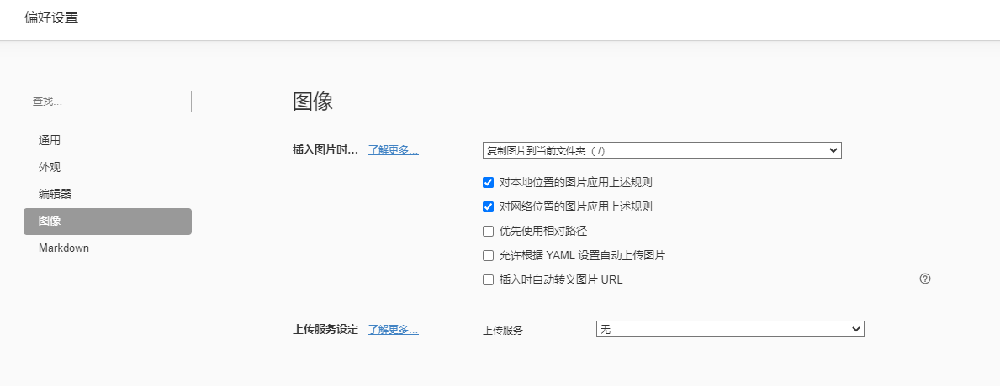

[[toc]]

# 在 Typora 中自动上传图片到云端

最近才看到 [Upload Images (typora.io)](https://support.typora.io/Upload-Image/) 新出的功能，在 Windows 端 0.9.84 的发行版之后，可以在粘贴图片的时候自动上传到云端。

之前在偏好设置中都是勾选的保存到本地，图床当然是好东西，但是不是自动上传的，导致最后部署博客的时候，这些资源也会被打包进去，博客越来越臃肿。

目前 Typora 会支持一些第三方图床平台，在 Typora 里激活相关选项后，这些第三方平台会把你的图片上传到他们的服务器或者第四方的云存储平台 = =，所以 Typora 说了，自行关注许可条件、隐私政策、可靠性、稳定性等问题。具体而言，当前支持的有：

- iPic (macOS)
- uPic (macOS)
- PicGo.app (macOS / Windows / Linux, Simplified Chinese language only)
- PicGo (Command Line) (Windows / Linux)
- Custom (macOS / Windows / Linux)

最后选用了 PicGo 搭配阿里云 OSS 的方式。

