[[toc]]

转载自 [RDMA](https://www.zhihu.com/column/rdmatechnology) 知乎专栏。

# 概述

## 1. DMA和RDMA概念

## 1.1 DMA

DMA(直接内存访问)是一种能力，允许在计算机主板上的设备直接把数据发送到内存中去，数据搬运不需要CPU的参与。

传统内存访问需要通过CPU进行数据copy来移动数据，通过CPU将内存中的Buffer1移动到Buffer2中。DMA模式：可以同DMA Engine之间通过硬件将数据从Buffer1移动到Buffer2,而不需要操作系统CPU的参与，大大降低了CPU Copy的开销。

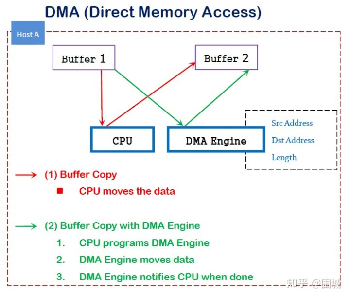


## 1.2 RDMA

RDMA是一种概念，在两个或者多个计算机进行通讯的时候使用DMA， 从一个主机的内存直接访问另一个主机的内存。

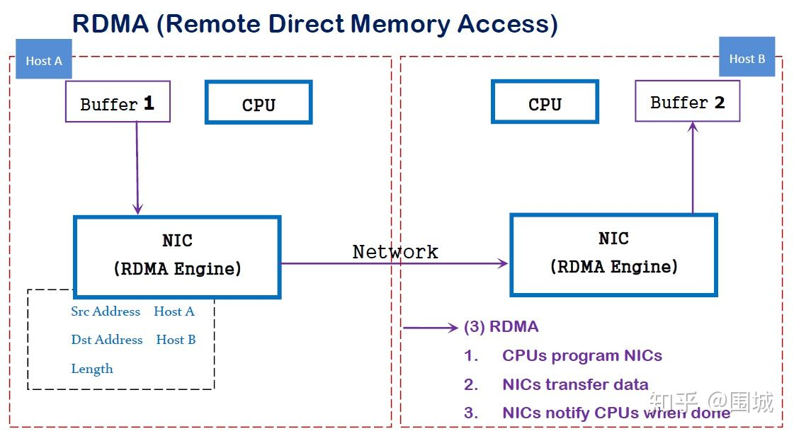


RDMA是一种host-offload, host-bypass技术，允许应用程序(包括存储)在它们的内存空间之间直接做数据传输。具有RDMA引擎的以太网卡(RNIC)--而不是host--负责管理源和目标之间的可靠连接。使用RNIC的应用程序之间使用专注的QP和CQ进行通讯：

1. 每一个应用程序可以有很多QP和CQ
2. 每一个QP包括一个SQ和RQ
3. 每一个CQ可以跟多个SQ或者RQ相关联

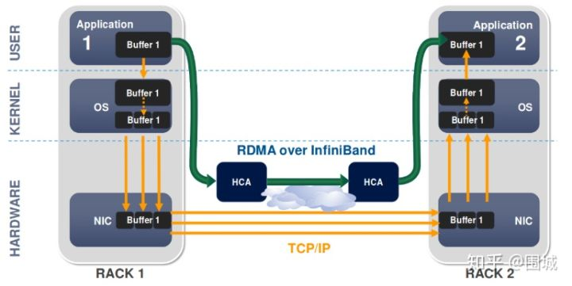


## 2. RDMA的优势

传统的TCP/IP技术在数据包处理过程中，要经过操作系统及其他软件层，需要占用大量的服务器资源和内存总线带宽，数据在系统内存、处理器缓存和网络控制器缓存之间来回进行复制移动，给服务器的CPU和内存造成了沉重负担。尤其是网络带宽、处理器速度与内存带宽三者的严重"不匹配性"，更加剧了网络延迟效应。

RDMA是一种新的直接内存访问技术，RDMA让计算机可以直接存取其他计算机的内存，而不需要经过处理器的处理。RDMA将数据从一个系统快速移动到远程系统的内存中，而不对操作系统造成任何影响。

在实现上，RDMA实际上是一种智能网卡与软件架构充分优化的远端内存直接高速访问技术，通过将RDMA协议固化于硬件(即网卡)上，以及支持Zero-copy和Kernel bypass这两种途径来达到其高性能的远程直接数据存取的目标。 使用RDMA的优势如下：

- 零拷贝(Zero-copy) - 应用程序能够直接执行数据传输，在不涉及到网络软件栈的情况下。数据能够被直接发送到缓冲区或者能够直接从缓冲区里接收，而不需要被复制到网络层。
- 内核旁路(Kernel bypass) - 应用程序可以直接在用户态执行数据传输，不需要在内核态与用户态之间做上下文切换。
- 不需要CPU干预(No CPU involvement) - 应用程序可以访问远程主机内存而不消耗远程主机中的任何CPU。远程主机内存能够被读取而不需要远程主机上的进程（或CPU)参与。远程主机的CPU的缓存(cache)不会被访问的内存内容所填充。
- 消息基于事务(Message based transactions) - 数据被处理为离散消息而不是流，消除了应用程序将流切割为不同消息/事务的需求。
- 支持分散/聚合条目(Scatter/gather entries support) - RDMA原生态支持分散/聚合。也就是说，读取多个内存缓冲区然后作为一个流发出去或者接收一个流然后写入到多个内存缓冲区里去。

在具体的远程内存读写中，RDMA操作用于读写操作的远程虚拟内存地址包含在RDMA消息中传送，远程应用程序要做的只是在其本地网卡中注册相应的内存缓冲区。远程节点的CPU除在连接建立、注册调用等之外，在整个RDMA数据传输过程中并不提供服务，因此没有带来任何负载。

## 3. RDMA 三种不同的硬件实现

RDMA作为一种host-offload, host-bypass技术，使低延迟、高带宽的直接的内存到内存的数据通信成为了可能。目前支持RDMA的网络协议有：

1. InfiniBand(IB): 从一开始就支持RDMA的新一代网络协议。由于这是一种新的网络技术，因此需要支持该技术的网卡和交换机。
2. RDMA过融合以太网(RoCE): 即RDMA over Ethernet, 允许通过以太网执行RDMA的网络协议。这允许在标准以太网基础架构(交换机)上使用RDMA，只不过网卡必须是支持RoCE的特殊的NIC。RoCEv1 是数据链路层的协议，只支持同一广播域内的节点通信；RoCEv2 基于 UDP，同时支持 IPv4 和 IPv6，默认使用 4791 端口。RoCEv2 正在成为事实标准。
3. 互联网广域RDMA协议(iWARP): 即RDMA over TCP, 允许通过TCP执行RDMA的网络协议。这允许在标准以太网基础架构(交换机)上使用RDMA，只不过网卡要求是支持iWARP(如果使用CPU offload的话)的NIC。否则，所有iWARP栈都可以在软件中实现，但是失去了大部分的RDMA性能优势。

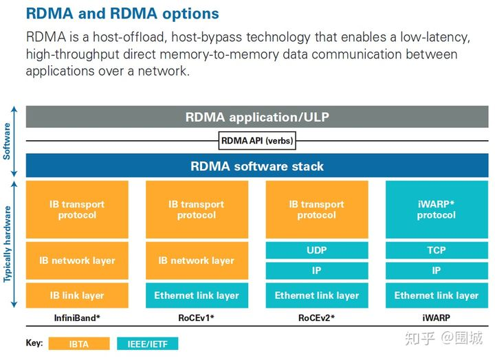


在三种主流的RDMA技术中，可以划分为两大阵营。一个是IB技术, 另一个是支持RDMA的以太网技术(RoCE和iWARP)。其中, IBTA力挺的技术自然是IB和RoCE, Mellanox公司（一个以色列人搞的小公司）是这方面的急先锋。而iWARP则是IEEE/IETF力挺的技术，主要是Chelsio公司在推进。RoCE和iWARP的争论，请参考Mellanox和Chelsio这两家公司发布的白皮书。

在存储领域，支持RDMA的技术早就存在，比如SRP(SCSI RDMA Protocol)和iSER(iSCSI Extensions for RDMA)。 如今兴起的NVMe over Fabrics如果使用的不是FC网络的话，本质上就是NVMe over RDMA。 换句话说，NVMe over InfiniBand, NVMe over RoCE和NVMe over iWARP都是NVMe over RDMA。

## 4. RDMA基本术语

## 4.1 Fabric

```
A local-area RDMA network is usually referred to as a fabric.
```

所谓Fabric，就是支持RDMA的局域网(LAN)。

## 4.2 CA(Channel Adapter)

```
A channel adapter is the hardware component that connects a system to the fabric.
```

CA是Channel Adapter(通道适配器)的缩写。那么，CA就是将系统连接到Fabric的硬件组件。 在IBTA中，一个CA就是IB子网中的一个终端结点(End Node)。分为两种类型，一种是HCA, 另一种叫做TCA, 它们合称为xCA。其中， HCA(Host Channel Adapter)是支持"verbs"接口的CA, TCA(Target Channel Adapter)可以理解为"weak CA", 不需要像HCA一样支持很多功能。 而在IEEE/IETF中，CA的概念被实体化为RNIC（RDMA Network Interface Card）, iWARP就把一个CA称之为一个RNIC。

**简言之，在IBTA阵营中，CA即HCA或TCA； 而在iWARP阵营中，CA就是RNIC。 总之，无论是HCA、 TCA还是RNIC，它们都是CA, 它们的基本功能本质上都是生产或消费数据包(packet)**

## 4.3 Verbs

在RDMA的持续演进中，有一个组织叫做OpenFabric Alliance所做的贡献可谓功不可没。 Verbs这个词不好翻译，大致可以理解为访问RDMA硬件的“一组标准动作”。 每一个Verb可以理解为一个Function。

## 5. 核心概念

## 5.1 Memory Registration(MR) | 内存注册

RDMA 就是用来对内存进行数据传输。那么怎样才能对内存进行传输，很简单，注册。 因为RDMA硬件对用来做数据传输的内存是有特殊要求的。

- 在数据传输过程中，应用程序不能修改数据所在的内存。
- 操作系统不能对数据所在的内存进行page out操作 -- 物理地址和虚拟地址的映射必须是固定不变的。

注意无论是DMA或者RDMA都要求物理地址连续，这是由DMA引擎所决定的。 那么怎么进行内存注册呢？

- 创建两个key (local和remote)指向需要操作的内存区域
- 注册的keys是数据传输请求的一部分

注册一个Memory Region之后，这个时候这个Memory Region也就有了它自己的属性：

- context : RDMA操作上下文
- addr : MR被注册的Buffer地址
- length : MR被注册的Buffer长度
- lkey：MR被注册的本地key
- rkey：MR被注册的远程key

对Memrory Registration：Memory Registration只是RDMA中对内存保护的一种措施，只有将要操作的内存注册到RDMA Memory Region中，这快操作的内存就交给RDMA 保护域来操作了。这个时候我们就可以对这快内存进行操作，至于操作的起始地址、操作Buffer的长度，可以根据程序的具体需求进行操作。我们只要保证接受方的Buffer 接受的长度大于等于发送的Buffer长度。

## 5.2 Queues | 队列

RDMA一共支持三种队列，发送队列(SQ)和接收队列(RQ)，完成队列(CQ)。其中，SQ和RQ通常成对创建，被称为Queue Pairs(QP)。

RDMA是基于消息的传输协议，数据传输都是异步操作。 RDMA操作其实很简单，可以理解为：

1. Host提交工作请求(WR)到工作队列(WQ): 工作队列包括发送队列(SQ)和接收队列(RQ)。工作队列的每一个元素叫做WQE, 也就是WR。
2. Host从完成队列(CQ）中获取工作完成(WC): 完成队列里的每一个叫做CQE, 也就是WC。
3. 具有RDMA引擎的硬件(hardware)就是一个队列元素处理器。 RDMA硬件不断地从工作队列(WQ)中去取工作请求(WR)来执行，执行完了就给完成队列(CQ)中放置工作完成(WC)。从生产者-消费者的角度理解就是：
4. Host生产WR, 把WR放到WQ中去
5. RDMA硬件消费WR
6. RDMA硬件生产WC, 把WC放到CQ中去
7. Host消费WC

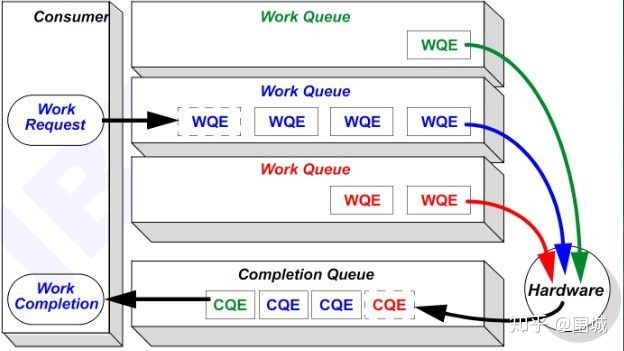


## 6. RDMA数据传输

## 6.1 RDMA Send | RDMA发送(/接收)操作 （Send/Recv）

跟TCP/IP的send/recv是类似的，不同的是RDMA是基于消息的数据传输协议（而不是基于字节流的传输协议），所有数据包的组装都在RDMA硬件上完成的，也就是说OSI模型中的下面4层(传输层，网络层，数据链路层，物理层)都在RDMA硬件上完成。

## 6.2 RDMA Read | RDMA读操作 (Pull)

RDMA读操作本质上就是Pull操作, 把远程系统内存里的数据拉回到本地系统的内存里。

## 6.3 RDMA Write | RDMA写操作 (Push)

RDMA写操作本质上就是Push操作，把本地系统内存里的数据推送到远程系统的内存里。

## 6.4 RDMA Write with Immediate Data | 支持立即数的RDMA写操作

支持立即数的RDMA写操作本质上就是给远程系统Push(推送)带外(OOB)数据, 这跟TCP里的带外数据是类似的。

可选地，immediate 4字节值可以与数据缓冲器一起发送。 该值作为接收通知的一部分呈现给接收者，并且不包含在数据缓冲器中。

# RDMA Send/Receive 操作

## 1. 前言

RDMA指的是远程直接内存访问，这是一种通过网络在两个应用程序之间搬运缓冲区里的数据的方法。RDMA与传统的网络接口不同，因为它绕过了操作系统。这允许实现了RDMA的程序具有如下特点：

- 绝对的最低时延
- 最高的吞吐量
- 最小的CPU足迹 （也就是说，需要CPU参与的地方被最小化）

## 2. RDMA Verbs操作

使用RDMA, 我们需要有一张实现了RDMA引擎的网卡。我们把这种卡称之为HCA(主机通道适配器)。 适配器创建一个贯穿PCIe总线的从RDMA引擎到应用程序内存的通道。一个好的HCA将在导线上执行的RDMA协议所需要的全部逻辑都在硬件上予以实现。这包括分组，重组以及流量控制和可靠性保证。因此，从应用程序的角度看，只负责处理所有缓冲区即可。


在RDMA中我们使用内核态驱动建立一个数据通道。我们称之为命令通道（Command Channel）。使用命令通道，我们能够建立一个数据通道（Data Channel），该通道允许我们在搬运数据的时候完全绕过内核。一旦建立了这种数据通道，我们就能直接读写数据缓冲区。

建立数据通道的API是一种称之为"verbs"的API。"verbs" API是由一个叫做OFED的Linux开源项目维护的。在站点[http://www.openfabrics.org](https://link.zhihu.com/?target=http%3A//www.openfabrics.org)上，为Windows WinOF提供了一个等价的项目。"verbs" API跟你用过的socket编程API是不一样的。但是，一旦你掌握了一些概念后，就会变得非常容易，而且在设计你的程序的时候更简单。

## 2. Queue Pairs

RDMA操作开始于“搞”内存。当你在对内存进行操作的时候，就是告诉内核这段内存名花有主了，主人就是你的应用程序。于是，你告诉HCA，就在这段内存上寻址，**赶紧准备开辟一条从HCA卡到这段内存的通道**。我们将这一动作称之为注册一个内存区域(MR)。一旦MR注册完毕，我们就可以使用这段内存来做任何RDMA操作。在下面的图中，我们可以看到注册的内存区域(MR)和被通信队列所使用的位于内存区域之内的缓冲区(buffer)。

RDMA Memory Registration

```cpp
struct ibv_mr {
    struct ibv_context     *context;
    struct ibv_pd          *pd;
    void                   *addr;
    size_t                  length;
    uint32_t                handle;
    uint32_t                lkey;
    uint32_t                rkey;
};
```


RDMA硬件不断地从工作队列(WQ)中去取工作请求(WR)来执行，执行完了就给完成队列(CQ)中放置工作完成通知(WC)。这个WC意思就是Work Completion。表示这个WR RDMA请求已经被处理完成，可以从这个Completion Queue从取出来，表示这个RDMA请求已经被处理完毕。

RDMA通信基于三条队列(SQ, RQ和CQ)组成的集合。 其中， 发送队列(SQ)和接收队列(RQ)负责调度工作，他们总是成对被创建，称之为队列对(QP)。当放置在工作队列上的指令被完成的时候，完成队列(CQ)用来发送通知。

当用户把指令放置到工作队列的时候，就意味着告诉HCA那些缓冲区需要被发送或者用来接受数据。这些指令是一些小的结构体，称之为工作请求(WR)或者工作队列元素(WQE)。 WQE的发音为"WOOKIE"，就像星球大战里的猛兽。一个WQE主要包含一个指向某个缓冲区的指针。一个放置在发送队列（SQ）里的WQE中包含一个指向待发送的消息的指针。一个放置在接受队列里的WQE里的指针指向一段缓冲区，该缓冲区用来存放待接受的消息。

下面我们来看一下RDMA中的Work Request（SendWR和ReceWR）

RDMA Send Work Request请求

```cpp
struct ibv_send_wr {
    uint64_t                wr_id;
    struct ibv_send_wr     *next;
    struct ibv_sge         *sg_list;
    int                     num_sge;
    enum ibv_wr_opcode      opcode;
    int                     send_flags;
    uint32_t                imm_data;       /* in network byte order */
    union {
            struct {
                    uint64_t        remote_addr;
                    uint32_t        rkey;
            } rdma;
            struct {
                    uint64_t        remote_addr;
                    uint64_t        compare_add;
                    uint64_t        swap;
                    uint32_t        rkey;
            } atomic;
            struct {
                    struct ibv_ah  *ah;
                    uint32_t        remote_qpn;
                    uint32_t        remote_qkey;
            } ud;
    } wr;
};
```

RDMA Receive Work Request请求

```cpp
struct ibv_recv_wr {
    uint64_t                wr_id;
    struct ibv_recv_wr     *next;
    struct ibv_sge         *sg_list;
    int                     num_sge;
};
```

RDMA是一种异步传输机制。因此我们可以一次性在工作队列里放置好多个发送或接收WQE。HCA将尽可能快地按顺序处理这些WQE。当一个WQE被处理了，那么数据就被搬运了。 一旦传输完成，HCA就创建一个完成队列元素(CQE)并放置到完成队列(CQ)中去。 相应地，CQE的发音为"COOKIE"。

RDMA Complete Queue Element

```cpp 
struct ibv_wc { 
    uint64_t wr_id; 
    enum ibv_wc_status status; 
    enum ibv_wc_opcode opcode; 
    uint32_t vendor_err; 
    uint32_t byte_len; 
    uint32_t imm_data; /* in network byte order */ 
    uint32_t qp_num; 
    uint32_t src_qp; 
    int wc_flags; 
    uint16_t pkey_index; 
    uint16_t slid; 
    uint8_t sl; 
    uint8_t dlid_path_bits; 
};
```

## 3. RDMA Send/Receive

让我们看个简单的例子。在这个例子中，我们将把一个缓冲区里的数据从系统A的内存中搬到系统B的内存中去。这就是我们所说的消息传递语义学。接下来我们要讲的一种操作为SEND，是RDMA中最基础的操作类型。

## 3.1 第一步

第1步：系统A和B都创建了他们各自的QP的完成队列(CQ), 并为即将进行的RDMA传输注册了相应的内存区域(MR)。 系统A识别了一段缓冲区，该缓冲区的数据将被搬运到系统B上。系统B分配了一段空的缓冲区，用来存放来自系统A发送的数据。

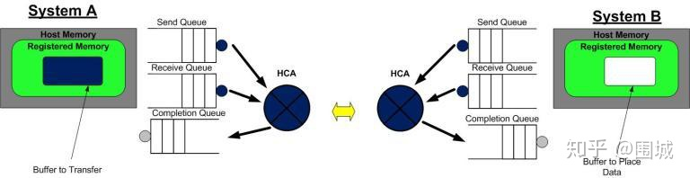


## 3.2 第二步

第二步：系统B创建一个WQE并放置到它的接收队列(RQ)中。这个WQE包含了一个指针，该指针指向的内存缓冲区用来存放接收到的数据。系统A也创建一个WQE并放置到它的发送队列(SQ)中去，该WQE中的指针执行一段内存缓冲区，该缓冲区的数据将要被传送。

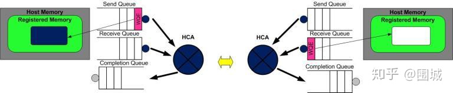


## 3.3 第三步

第三步：系统A上的HCA总是在硬件上干活，看看发送队列里有没有WQE。HCA将消费掉来自系统A的WQE, 然后将内存区域里的数据变成数据流发送给系统B。当数据流开始到达系统B的时候，系统B上的HCA就消费来自系统B的WQE，然后将数据放到该放的缓冲区上去。在高速通道上传输的数据流完全绕过了操作系统内核。

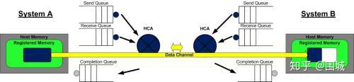


## 3.4 第四步

第四步：当数据搬运完成的时候，HCA会创建一个CQE。 这个CQE被放置到完成队列(CQ)中，表明数据传输已经完成。HCA每消费掉一个WQE, 都会生成一个CQE。因此，在系统A的完成队列中放置一个CQE,意味着对应的WQE的发送操作已经完成。同理，在系统B的完成队列中也会放置一个CQE，表明对应的WQE的接收操作已经完成。如果发生错误，HCA依然会创建一个CQE。在CQE中，包含了一个用来记录传输状态的字段。


我们刚刚举例说明的是一个RDMA Send操作。在IB或RoCE中，传送一个小缓冲区里的数据耗费的总时间大约在1.3µs。通过同时创建很多WQE, 就能在1秒内传输存放在数百万个缓冲区里的数据。

## 4. 总结

在这博客中，我们学习了如何使用RDMA verbs API。同时也介绍了队列的概念，而队列概念是RDMA编程的基础。最后，我们演示了RDMA send操作，展现了缓冲区的数据是如何在从一个系统搬运到另一个系统上去的。

# 理解 RDMA SGL

## 1. 前言

在使用RDMA操作之前，我们需要了解一些RDMA API中的一些需要的值。其中在ibv_send_wr我们需要一个sg_list的数组，sg_list是用来存放ibv_sge元素，那么什么是SGL以及什么是sge呢？对于一个使用RDMA进行开发的程序员来说，我们需要了解这一系列细节。

## 2. SGE简介

在NVMe over PCIe中，I/O命令支持SGL(Scatter Gather List 分散聚合表)和PRP(Physical Region Page 物理(内存)区域页), 而管理命令只支持PRP;而在NVMe over Fabrics中，无论是管理命令还是I/O命令都只支持SGL。

RDMA编程中，SGL(Scatter/Gather List)是最基本的数据组织形式。 SGL是一个数组，该数组中的元素被称之为SGE(Scatter/Gather Element)，**每一个SGE就是一个Data Segment(数据段)**。RDMA支持Scatter/Gather操作，具体来讲就是RDMA可以支持一个连续的Buffer空间，进行Scatter分散到多个目的主机的不连续的Buffer空间。Gather指的就是多个不连续的Buffer空间，可以Gather到目的主机的一段连续的Buffer空间。

下面我们就来看一下ibv_sge的定义：

```cpp
struct ibv_sge {
        uint64_t        addr;
        uint32_t        length;
        uint32_t        lkey;
};
```

- addr: 数据段所在的虚拟内存的起始地址 (Virtual Address of the Data Segment (i.e. Buffer))
- length: 数据段长度(Length of the Data Segment)
- lkey: 该数据段对应的L_Key (Key of the local Memory Region)

## 2. ivc_post_send接口

而在数据传输中，发送/接收使用的Verbs API为：

- ibv_post_send() - post a list of work requests (WRs) to a send queue 将一个WR列表放置到发送队列中 ibv_post_recv() - post a list of work requests (WRs) to a receive queue 将一个WR列表放置到接收队列中

下面以ibv_post_send()为例，说明SGL是如何被放置到RDMA硬件的线缆(Wire)上的。

ibv_post_send()的函数原型

```cpp
#include <infiniband/verbs.h>

int ibv_post_send(struct ibv_qp *qp, 
                  struct ibv_send_wr *wr,
                  struct ibv_send_wr **bad_wr);
```

ibv_post_send（）将以send_wr开头的工作请求（WR）的列表发布到Queue Pair的Send Queue。 它会在第一次失败时停止处理此列表中的WR（可以在发布请求时立即检测到），并通过bad_wr返回此失败的WR。

参数wr是一个ibv_send_wr结构，如中所定义。

## 3. ibv_send_wr结构

```cpp
struct ibv_send_wr {
        uint64_t                wr_id;                  /* User defined WR ID */
        struct ibv_send_wr     *next;                   /* Pointer to next WR in list, NULL if last WR */
        struct ibv_sge         *sg_list;                /* Pointer to the s/g array */
        int                     num_sge;                /* Size of the s/g array */
        enum ibv_wr_opcode      opcode;                 /* Operation type */
        int                     send_flags;             /* Flags of the WR properties */
        uint32_t                imm_data;               /* Immediate data (in network byte order) */
        union {
                struct {
                        uint64_t        remote_addr;    /* Start address of remote memory buffer */
                        uint32_t        rkey;           /* Key of the remote Memory Region */
                } rdma;
                struct {
                        uint64_t        remote_addr;    /* Start address of remote memory buffer */
                        uint64_t        compare_add;    /* Compare operand */
                        uint64_t        swap;           /* Swap operand */
                        uint32_t        rkey;           /* Key of the remote Memory Region */
                } atomic;
                struct {
                        struct ibv_ah  *ah;             /* Address handle (AH) for the remote node address */
                        uint32_t        remote_qpn;     /* QP number of the destination QP */
                        uint32_t        remote_qkey;    /* Q_Key number of the destination QP */
                } ud;
        } wr;
};
```

在调用ibv_post_send()之前，必须填充好数据结构wr。 wr是一个链表，每一个结点包含了一个sg_list(i.e. SGL: 由一个或多个SGE构成的数组), sg_list的长度为num_sge。

## 4. RDMA 提交WR流程

下面图解一下SGL和WR链表的对应关系，并说明一个SGL (struct ibv_sge *sg_list)里包含的多个数据段是如何被RDMA硬件聚合成一个连续的数据段的。

## 4.1 第一步：创建SGL

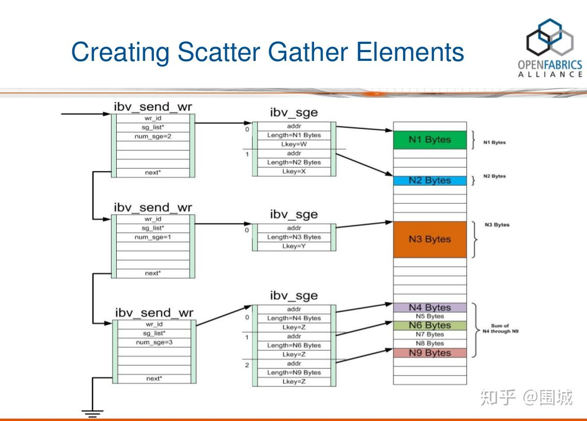


从上图中，我们可以看到wr链表中的每一个结点都包含了一个SGL，SGL是一个数组，包含一个或多个SGE。通过ibv_post_send提交一个RDMA SEND 请求。这个WR请求中，包括一个sg_list的元素。它是一个SGE链表，SGE指向具体需要发送数据的Buffer。

## 4.2 第二步：使用PD进行内存保护

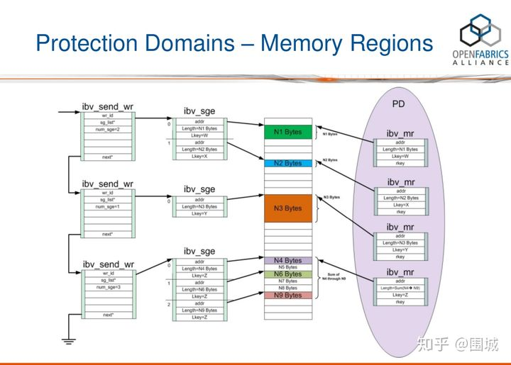


我们在发送一段内存地址的时候，我们需要将这段内存地址通过Memory Registration注册到RDMA中。也就是说注册到PD内存保护域当中。一个SGL至少被一个MR保护, 多个MR存在同一个PD中。如图所示一段内存MR可以保护多个SGE元素。

## 4.3 调用ibv_post_send()将SGL发送到wire上去

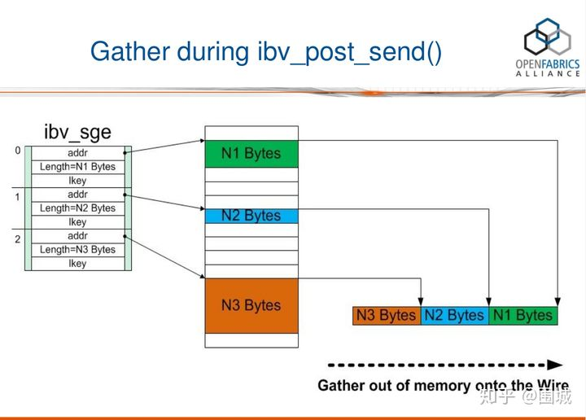


在上图中，一个SGL数组包含了3个SGE, 长度分别为N1, N2, N3字节。我们可以看到，这3个buffer并不连续，它们Scatter(分散)在内存中的各个地方。RDMA硬件读取到SGL后，进行Gather(聚合)操作，于是在RDMA硬件的Wire上看到的就是N3+N2+N1个连续的字节。换句话说，通过使用SGL, 我们可以把分散(Scatter)在内存中的多个数据段(不连续)交给RDMA硬件去聚合(Gather)成连续的数据段。

## 附录一： OFED Verbs

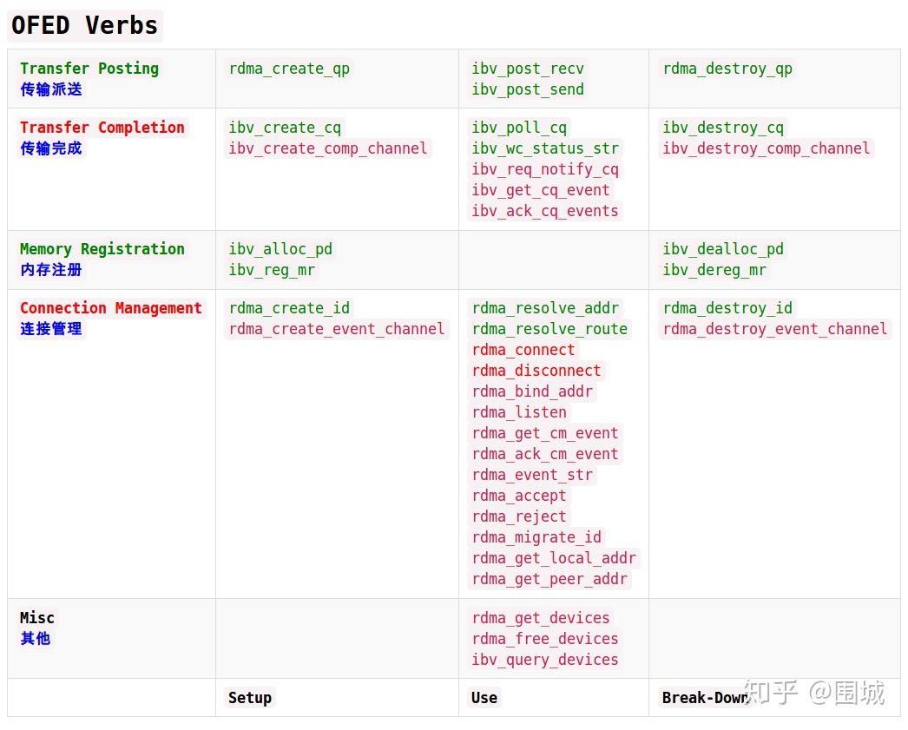

# 论文

## ATC21: MigrOS: Transparent Live-Migration Support for Containerised RDMA Applications

这篇文章提出容器化和 RDMA 本身是冲突的，容器化为应用提供了独立于宿主机的运行时，RDMA 则会让应用和宿主机之间的联系更加紧密。这种冲突导致容器在重启或迁移时，无法恢复被中断的 RDMA 应用。这篇文章修改了 RoCEv2 协议，增加了两个状态，增强了 IB verbs API，从而支持 RDMA 应用的中断、恢复。然后使用 [CRIU](https://github.com/checkpoint-restore/criu) 调用他们修改过的 IB verbs API，达到恢复的目的（CRIU 是一个保存进程状态、重启进程的工具）。这篇文章非常详细地介绍了 RoCEv2，拿来学习也是很有用的。
