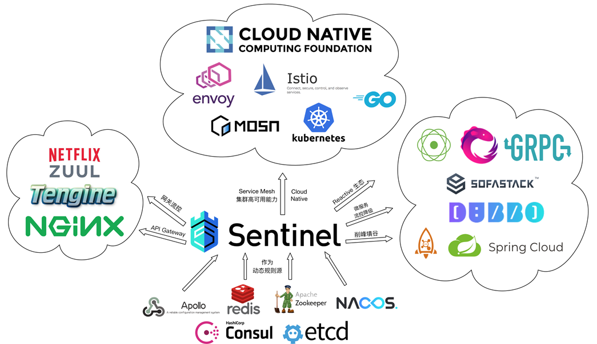
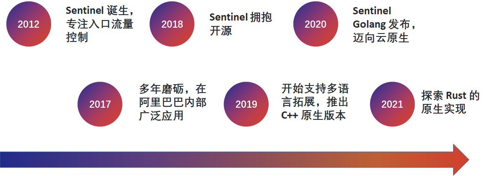
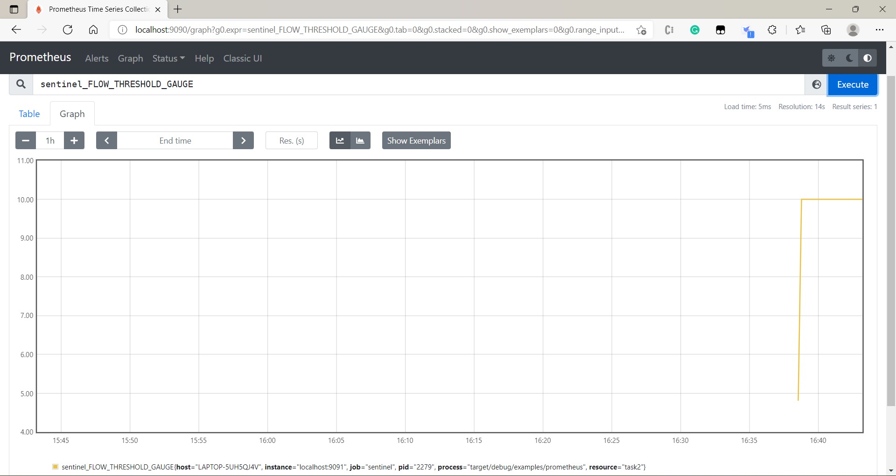

[[toc]]

# Sentinel Rust 的使用

Sentinel 是一个面向分布式服务架构的流量控制组件，它可以提升服务的稳定性。在 Sentinel 中，应用程序提供的服务或其调用的相关服务均可被视为资源，受到 Sentinel 的保护。围绕这些资源的实时状态，可以流量控制规则、熔断降级规则以及系统保护规则来避免请求大量堆积造成的系统瘫痪。Sentinel 可以被广泛地应用在各种应用场景下，与云原生也有着紧密的结合。

<center></center>
<center><b>Sentinel 的生态</b></center>

Sentinel 有着多年的发展历史，最初专注于入口流量控制，经过多年打磨后开源，并逐步提供多语言原生支持。
<center></center>
<center><b>Sentinel 的发展史</b></center>


本项目参考已有的 Java 与 Golang 版本，采用 Rust 开发 Sentinel 的原生版本，使用 Rust Attribute Macro 提供低侵入式的规则定义方法，支持使用 Prometheus 进行可视化监控，支持使用 etcd、Consul 等动态加载规则。 


<center></center>
<center><b>Sentinel & Rust</b></center>


项目托管于 GitHub，链接：[Sentinel-Rust](https://github.com/sentinel-group/sentinel-rust)。在项目 [WiKi](https://github.com/sentinel-group/sentinel-rust/wiki/%E4%BD%BF%E7%94%A8%E6%8C%87%E5%8D%97) 中提供了详细的文档，同时提供了大量的[示例程序](https://github.com/sentinel-group/sentinel-rust/tree/main/examples)供参考。另外，可以在本地运行 `cargo doc` 生成 API 文档。

## Sentinel 介绍

Sentinel Rust 的设计采用了[责任链](https://refactoringguru.cn/design-patterns/chain-of-responsibility)的模式，用户指定的各类规则会自动通过 `base::SlotChain` 上的插槽 (Slot) 进行检测。用户使用 Sentinel Rust (后文均用 Sentinel 表示 Sentinel Rust) ，主要需要以下几步：

1. 在项目配置中添加依赖，对 Sentinel 的运行环境进行相关配置并初始化。
2. 埋点（定义资源），确定系统中有哪些资源需要防护。
3. 配置规则，为每个资源配置具体的规则，规则的配置方法可参考各个模块的使用文档。
4. 编写资源防护的入口和出口代码。


<center></center>
<center><b>责任链模式检测规则</b></center>


## 使用示例

首先需要在项目中添加 Sentinel 依赖，向 `Cargo.toml` 中添加

```toml
[dependencies]
sentinel-rs = { version = "0.1.0", path = "path_to_sentinel" }
```

由于目前 sentinel 尚未发布，需要下载源码后，手动设置路径。如果需要使用 sentinel 的过程宏等可选特性，可以参考[可选特性列表](https://github.com/sentinel-group/sentinel-rust/wiki/%E4%BD%BF%E7%94%A8%E6%8C%87%E5%8D%97#%E6%B7%BB%E5%8A%A0%E4%BE%9D%E8%B5%96)。


### 通用配置及初始化

使用 Sentinel 需要在应用启动时对 Sentinel 运行环境进行相关配置并触发初始化。`api` 下提供如下函数：

- `init_default()`：从环境变量指定的配置文件以及环境变量中读取相应配置来初始化 Sentinel，若环境变量不存在则使用默认值。
- `init_with_config_file(config_path: &mut String)`：从给定的 YAML 文件中读取相应配置来初始化 Sentinel。
- `init_with_config(config_entity: ConfigEntity)`: 用户硬编码配置对象`ConfigEntity`来初始化 Sentinel。

通用配置项加载策略和配置项请参考通用配置章节

示例代码：

```rust
use sentinel_rs::{init_default, logging};
init_default().unwrap_or_else(|err| logging::error!("{:?}", err));
```

**注意**：必须成功调用 Sentinel 的初始化函数以后再调用埋点 API。

### 埋点(定义资源)

使用 Sentinel 的 Entry API 将业务逻辑封装起来，这一步称为“埋点”。每个埋点都有一个资源名称（resource），代表触发了这个资源的调用或访问。

埋点 API 位于 `api` 中，通过构造 `EntryBuilder`，调用它的方法 `build()` 创建 Entry。 `EntryBuilder` 提供了链式的传参方式，未传入的参数将使用默认构造。

若该次调用被拒绝，则 `build()` 会返回 `Result` 代表被 Sentinel 限流。BlockError 提供了限流原因以及触发的规则等信息，可以方便开发者获取相关信息进行记录和处理。

### 规则配置

#### API 硬编码方式

Sentinel 支持原始的硬编码方式加载规则，可以通过各个模块的 `load_rules(rules)` 或 `append_rules(rules)` 函数加载规则，前者会覆盖之前的规则设置，后者只会向设置中追加规则。目前的版本中，这也是对单一资源加载多条规则的唯一手段。以流控规则为例：

```rust
flow::load_rules(vec![Arc::new(flow::Rule {
    resource: "example".into(),
    threshold: 10.0,
    calculate_strategy: flow::CalculateStrategy::Direct,
    control_strategy: flow::ControlStrategy::Reject,
    ..Default::default()
})]);
```

#### 标签宏硬编码方式

Sentinel 提供了易用的标签宏，可以帮助用户快速上手规则配置，我们为不同策略提供了丰富的标签宏使用 [示例](https://github1s.com/sentinel-group/sentinel-rust/tree/main/examples/)，也可以阅读后续文档了解。下面以流控规则为例

```rust
#[flow(threshold=10.0, calculate_strategy=Direct)]
pub fn task() -> u32 {}
```

在上面的例子中，标签宏会修改 `task` 函数签名，返回 `Result<u32, String>`。接着，它将自动向规则列表中追加规则，调用 `EntryBuilder` 创建 Sentinel Entry，检查指定的规则。如果该任务成功执行，会返回 `Ok(u32)` 类型的返回值；否则会返回 `Err(String)` 类型的限流原因和触发限流的参数。

需要注意，当前的标签宏实现，仅支持在 Resource 上指定单一规则。

#### 动态数据源

由 Sentinel 提供动态数据源接口进行扩展，用户可以动态地配置规则，参考使用 [etcd](https://github1s.com/sentinel-group/sentinel-rust/blob/main/examples/datasources/etcdv3.rs) 和 [Consul](https://github1s.com/sentinel-group/sentinel-rust/blob/main/examples/datasources/consul.rs) 进行配置的示例。

### 流量控制示例

流量控制 (Flow Control) 模块，基于令牌桶 (Token Bucket) 的思想，监控资源 (Resource) 的统计指标，然后根据 Token 计算策略来计算资源的可用 Token (也就是流量的阈值)，然后根据流量控制策略对请求进行控制，避免被瞬时的流量高峰冲垮，从而保障应用的高可用性。

Sentinel 通过定义流控规则来实现对 Resource 的流量控制。Sentinel 内部会在加载流控规则（`flow::Rule`）时候，将每个规则转换成流量控制器 (`flow::TrafficShapingController`)。 每个流量控制器实例都会有自己独立的统计结构，这里统计结构是一个滑动窗口。Sentinel 内部会尽可能复用 Resource 级别的全局滑动窗口，如果流控规则的统计设置没法复用 Resource 的全局统计结构，那么Sentinel会为流量控制器创建一个全新的私有的滑动窗口，然后通过 `flow::StandaloneStatSlot` 这个统计 Slot 来维护统计指标。

Sentinel 的流量控制组件对 Resource 的检查结果要么通过，要么会 block，对于 block 的流量相当于拒绝。

下面展示两个例子，第一个例子通过 API 加载流控规则；第二个例子通过标签宏追加规则。

#### API 加载流控规则

```rust
use sentinel_rs::utils::sleep_for_ms;
use sentinel_rs::{base, flow, EntryBuilder};
use std::sync::Arc;

fn main() {
    // Init sentienl configurations
    sentinel_rs::init_default().unwrap_or_else(|err| sentinel_rs::logging::error!("{:?}", err));
    let resource_name = String::from("direct_reject_flow_control_example");

    // Load sentinel rules
    flow::load_rules(vec![Arc::new(flow::Rule {
        resource: resource_name.clone(),
        threshold: 10.0,
        calculate_strategy: flow::CalculateStrategy::Direct,
        control_strategy: flow::ControlStrategy::Reject,
        ..Default::default()
    })]);
    let mut handlers = Vec::new();
    for _ in 0..20 {
        let res_name = resource_name.clone();
        handlers.push(std::thread::spawn(move || {
            loop {
                let entry_builder = EntryBuilder::new(res_name.clone())
                    .with_traffic_type(base::TrafficType::Inbound);
                if let Ok(entry) = entry_builder.build() {
                    // Passed, wrap the logic here.
                    task();
                    // Be sure the entry is exited finally.
                    entry.borrow().exit()
                } else {
                    // Blocked. We could get the block reason from the BlockError.
                    sleep_for_ms(rand::random::<u64>() % 10);
                }
            }
        }));
    }
    for h in handlers {
        h.join().expect("Couldn't join on the associated thread");
    }
}


fn task() {
    println!("{}: passed", sentinel_rs::utils::curr_time_millis());
    sleep_for_ms(10);
}
```

执行 `cargo run --example hello_world`，QPS 会被限制在 10。

#### 标签宏追加流控规则

```rust
use sentinel_macros::flow;
use sentinel_rs::utils::sleep_for_ms;

fn main() {
    // Init sentienl configurations
    sentinel_rs::init_default().unwrap_or_else(|err| sentinel_rs::logging::error!("{:?}", err));

    let mut handlers = Vec::new();
    for _ in 0..20 {
        handlers.push(std::thread::spawn(move || {
            loop {
                task().unwrap_or_else(|_| {
                    // blocked
                    sleep_for_ms(10);
                });
            }
        }));
    }
    for h in handlers {
        h.join().expect("Couldn't join on the associated thread");
    }
}

#[flow(
    traffic_type = "Outbound",
    calculate_strategy = "Direct",
    threshold = 10.0
)]
fn task() {
    println!("{}: passed", sentinel_rs::utils::curr_time_millis());
    sleep_for_ms(10);
}
```

执行 `cargo run --example macro`，QPS 会被限制在 10。

### Prometheus 监控

分别执行
```bash
prometheus --config.file=./sentinel-rust/examples/exporter/prometheus/prometheus.yml
```
和
```bash
cargo run --example prometheus --features="full exporter"
```


<center></center>
<center><b>Prometheus 监控</b></center>

### K8S 动态添加流控规则

本地测试时分别执行
```bash
prometheus --config.file=./sentinel-rust/examples/exporter/prometheus/prometheus.yml
```
和
```bash
cargo run --example k8s --features="full ds_k8s async" -- --nocapture
```
将会看到动态加载的流控规则。执行
```bash
kubectl api-resources
```
```bash
kubectl get flowresources -A
```
可以查询到相应的 sentinel flow rule resources：
```
NAME           APIVERSION                            NAMESPACED   KIND
flowresources  rust.datasource.sentinel.io/v1alpha1  true         FlowResource
```

```
NAMESPACE     NAME     AGE
default       flow-1   40s
```


### 更多示例
项目中的 `example` 目录提供了大量示例程序和参数设置参考。

## Sentinel-Rust 相关资源

[使用指南](https://github.com/sentinel-group/sentinel-rust/wiki)
[ API 文档](https://docs.rs/sentinel-core/latest/sentinel_core/)
[示例代码](https://github.com/sentinel-group/sentinel-rust/tree/main/examples)

