[[toc]]

# 工业物联网通讯笔记


# EtherCAT

[专有缩写](D:/aiit/ethercat/ethercat_esc_datasheet_sec1_technology_2i3.pdf)

思路：使用已有的网络连接透明传输构造EtherCAT帧的报文段。

## IGH EtherCAT 开源主站安装及测试

参考 [知乎专栏](https://zhuanlan.zhihu.com/p/150957429)

安装好后可以看到一系列参数
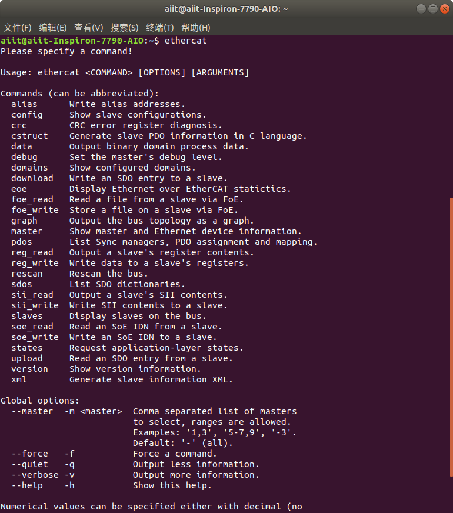

如果开机没自动起来需要手动`/etc/init.d/ethercat start`。

## 基于 EtherCAT 的应用
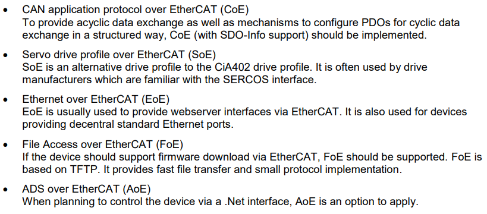


## 常见 ESC 设备
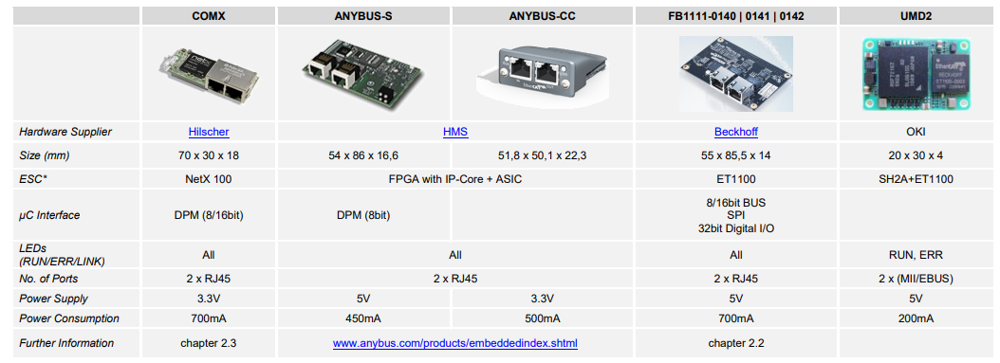


## EtherCAT 主从环形架构
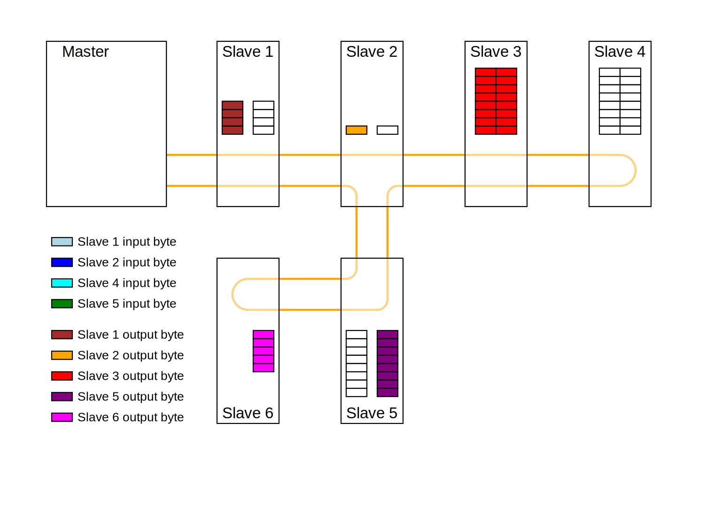


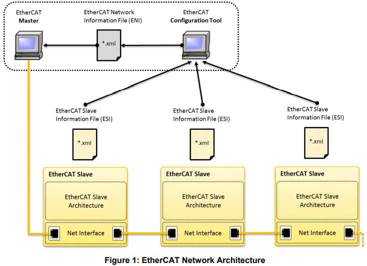


## 帧结构

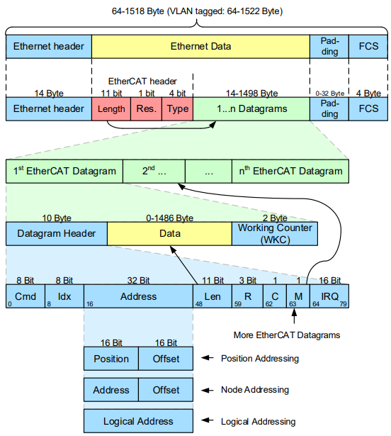


## 状态机

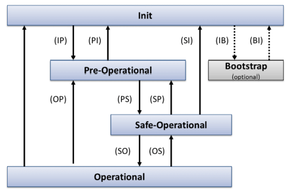

下方介绍的 SOES 库在 `esc.h` 中定义了状态和状态的转移：
```C
#define ESCinit                  0x01
#define ESCpreop                 0x02
#define ESCboot                  0x03
#define ESCsafeop                0x04
#define ESCop                    0x08
#define ESCerror                 0x10

#define INIT_TO_INIT             0x11
#define INIT_TO_PREOP            0x21
#define INIT_TO_BOOT             0x31
#define INIT_TO_SAFEOP           0x41
#define INIT_TO_OP               0x81
#define PREOP_TO_INIT            0x12
#define PREOP_TO_PREOP           0x22
#define PREOP_TO_BOOT            0x32
#define PREOP_TO_SAFEOP          0x42
#define PREOP_TO_OP              0x82
#define BOOT_TO_INIT             0x13
#define BOOT_TO_PREOP            0x23
#define BOOT_TO_BOOT             0x33
#define BOOT_TO_SAFEOP           0x43
#define BOOT_TO_OP               0x83
#define SAFEOP_TO_INIT           0x14
#define SAFEOP_TO_PREOP          0x24
#define SAFEOP_TO_BOOT           0x34
#define SAFEOP_TO_SAFEOP         0x44
#define SAFEOP_TO_OP             0x84
#define OP_TO_INIT               0x18
#define OP_TO_PREOP              0x28
#define OP_TO_BOOT               0x38
#define OP_TO_SAFEOP             0x48
#define OP_TO_OP                 0x88
```

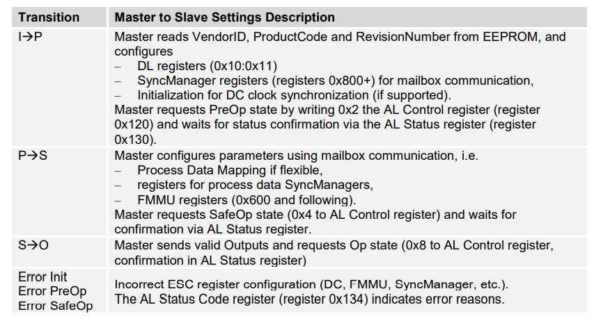


## EtherCAT 取址

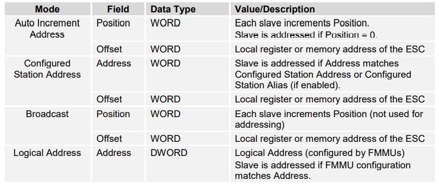
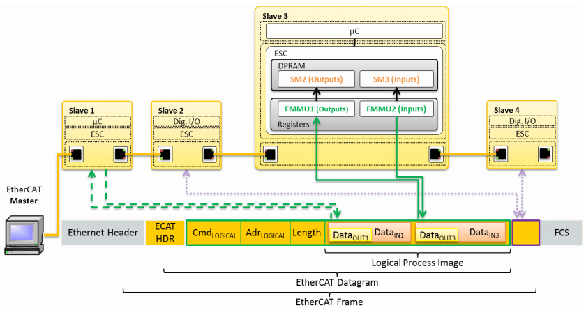

# SOES
开源 EtherCAT Slave 实现，对应有 SOEM 是 EtherCAT Master 实现。
通过配置文件配置 ESC，之后通过 `ESC_read` 和 `ESC_write` 与 ESC 交互数据，由 ESC 负责接收发送。这两个函数是硬件相关的，需要针对硬件实现（参考 `hal/linux-lan9252` 对 lan9252 的实现，`rt-kernel-xmc4/esc_hw.h` 中 `esc_registers` 定义，把指针 `esc_registers_t * ecat0` 指向了 `ECAT0_BASE`，即寄存器的起始地址）。 

## SOES 库工作内容

- ESC（EtherCAT Slave Controller）硬件初始化
  - ESC 重置
  - ESC 初始化，init SPI
  - 等待 ESC 初始化成功（轮询 ESC 的 DL 寄存器）
- 软件初始化
  - 重置 Slave 状态（覆写 ESC AL 状态寄存器）
  - 重置错误信息 （清除 ESC AL 错误码寄存器）
  - 中止之前的应用层程序（可能有 SyncManager 在 block，等待接收EtherCAT 包）
- 应用
  - 应用层事件（ALevent）处理，ALevent 携带了 ALControl 或 SyncManagers 的更改信息。ALControl 是用来控制状态改变的，SyncManagers 是用来将 EtherCAT 的改动写入到本地内存中的。
  - ESC_state 用来处理状态，例如状态变化、错误处理、告知接收到信息。
  - Mailbox handler，提供应用层协议使用的 mailboxes。
  - 在 mailbox 中，也会检查是否需要使用特定协议的 handler 来处理接收/发送的数据。


## SOES 库设计
### `ecat_slv.c` 实现 slave API
#### 全局变量
- 定义全局变量 `_ESCvar` 类型（定义在 `esc.h` 中）的 `ESCvar`，负责存储 ESC 状态信息。
- 全局变量 `MBX` 是 Mailbox，存储 `MBXBUFFERS * MAX(MBXSIZE,MBXSIZEBOOT)` 规模的 `uint8_t` 数据；`_MBXcontrol` 则是 Mailbox 对应的 Controller。
- 全局变量 `_SMmap` 类型的 `SMmap2` 和 `SMmap3` 分别映射输出、输入的 SM（SyncManager）。

#### 初始化
`ecat_slv_init` 接收 `esc_cfg_t` 类型的设置选项进行初始化。

#### 应用处理
`ecat_slv` 是一个需要周期性调用的函数，它内部会调用 ecat_slv_poll 和 DIG_process。前者 poll EtherCAT event，检查状态机，检查 SM，检查 Mailbox，如果收到数据就根据编译选项依次检查是否为 CoE（CAN over EtherCAT）、EoE（EtherNet over EtherCAT）、FoE （File over EtherCAT），最后检查是否为 XoE（错误的报文）应用，视需要处理 eeprom；后者更新局部变量，读入收到的 EtherCAT 帧，写出发送帧。

#### 应用相关
`DIG_process` 会阅读、修改 `ESCvar`。首先检查是否处于可以修改 Output 信息的的状态下，即 Operational state。
##### Output：ESC 视角的 Ouput，即用户态的接收
- 如果我们在 OP 状态下，我们能够阅读 3-buffer SM 中被映射到输出的 SM 中的 PDO（Process Data Objects）数据, 默认的是 SyncManager2。我们阅读 SM2 的 ESC RAM 地址，存储到本地。我们将会读入 RXPDOsize bytes 的数据来触发一个完整的 SM 读操作。 
- 在局部变量被更新后，我们将本地的 PDO 变量传递到用户应用中。
- 这个函数也包含了 watchdog 机制的实现，如果触发了它，会关闭输出，状态机改变到 Safe Operational。会更新 AlError 信息，告知 Master 发生了错误。

##### Input：ESC 视角的 Input，即用户态的发送
- 和输出类似，是反过来的，但是更加简单。即使是在 Safe Operational 状态下也会继续更新输入信息。
- 首先阅读用户应用数据，写入到本地的 PDO 变量中。在局部变量刷新后，把他们写入到 Input 对应的 SM，一般是 SyncManager3。这样就可以使用用户应用数据更新 ESC 的 RAM了。

### 特别需要注意
在实现应用的时候，必须自己定义回调函数 `cb_get_inputs` 和 `cb_get_outputs`，这两者声明在 `ecat_slv.h` 中，会在 `DIG_process` 中获取输入和输出时分别触发。

`esc_cfg_t` 设置项中也有定义不同的hook，是可选的。

### `eep.c`
ESI EEPROM 模拟模块。

### `esc_coe.c`

### `esc_eoe.c`
ESI EEPROM 模拟模块。

### `esc_foe.c`
ESI EEPROM 模拟模块。

### `eep.c`
ESI EEPROM 模拟模块。

### `esc.c`
全局变量：
`ESC_MBX1_sma` sm address？（参考`ESC_write (ESC_MBX1_sma, MBh, ESC_MBXHSIZE + length);`）
`ESC_MBX1_sml` sm length?
`ESC_MBX1_sme` sm end?
`ESC_MBX1_smc` sm controller?

函数：
`ESC_xoeprocess` 负责处理错误的帧。
`ESC_read` 写 ESC 寄存器。
`ESC_write` 写 ESC 寄存器。
`ESC_ALeventmaskread` 读 ALeventMask 寄存器。
`ESC_ALeventmaskwrite` 写 ALeventMask 寄存器。

`ESC_outreqbuffer` 从全局的`MBXcontrol`中寻找请求发送到 outbox 的mailbox 的下标。
`ESC_mbxprocess` 是实现 mailbox protocol 的，负责 mailbox 的读、发送、重传、mailbox full event 处理。
`ESC_writembx`将 `esc_slv.c` 中的全局变量 MBX 中 `ESC_outreqbuffer` 查询到的 mailbox 发送出去。

mailbox 的状态：
* 0 : idle
* 1 : claimed for inbox
* 2 : claimed for outbox
* 3 : request post outbox
* 4 : outbox posted not send
* 5 : backup outbox
* 6 : mailbox needs to be transmitted again
分别对应宏
```C
#define MBXstate_idle                   0x00
#define MBXstate_inclaim                0x01
#define MBXstate_outclaim               0x02
#define MBXstate_outreq                 0x03
#define MBXstate_outpost                0x04
#define MBXstate_backup                 0x05
#define MBXstate_again                  0x06
```

### `options.h`
默认的宏定义。用户程序可以通过定义 `ecat_options.h` 覆盖他们。


## SOES 样例
目录下的 `rtl_slave_demo` 是一个简短的led亮灯示例。在这个例子中，SOES 相关 API 的应用例子封装在了 `void soes (void *arg)` 函数中通过一个线程执行，另一个线程去读取 ESCvar.ALstatus 状态和 ESCvar.ALerror 错误码，根据状态机的状态和错误码来点亮 LED，设定闪烁频次。

`rtl_lwip_eoe` 是一个基于 lwip 的 EtherNet over EtherCAT 示例。`mbox_fetch_tmo/mbox_post_tmo` 是带 timeout（tmo）的 mailbox fetch/post API。 

## SOES 中的一些数据规定

### SII-PDO 和 ESI-PDO
为了通过总线获取 SII-EEPROM（Slave Information Interface）和 ESI（EtherCAT Slave Information, 存储在 SII-EEPROM），规定了相关数据结构。其中：必须的参数，mandatory 用 M 代表；可选的参数，optional 用 O 代表。

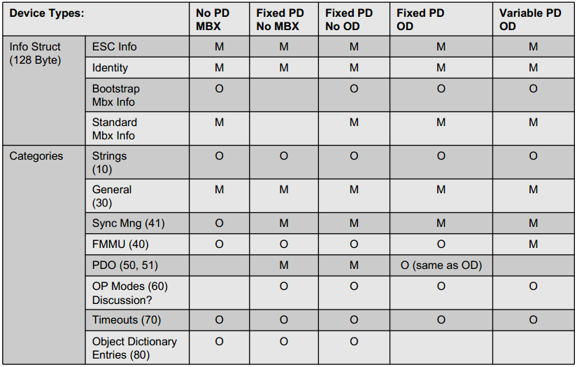


## OD 
同时，对于比较复杂的 Slave 还可以定义可选的 Object Dictionary（OD）。可以在 CoE 中使用它，它遵循 CANopen DS301。

- 0x0000 - 0x0FFF, Data Type Area
- 0x1000 - 0x1FFF, Communication Area
  - RxPDO , 0x1600 - 0x17FF
  - TxPDO , 0x1A00 - 0x1BFF
- 0x2000 - 0x5FFF, Manufacture specific area
- 0x6000 - 0x6FFF, Input area
- 0x7000 - 0x7FFF, Output area
- 0x8000 - 0x8FFF, Configuration area
- 0x9000 - 0x9FFF, Information area
- 0xA000 - 0xAFFF, Diagnosis Area
- 0xB000 - 0xBFFF, Service Transfer Area
- 0xC000 - 0xEFFF, Reserved Area
- 0xF000 - 0xFFFF, Device Area

### SM 事件类型
 - 0, Unused
 - 1, MailBox Receive, master to slave 
 - 2, MailBox Send, slave to master 
 - 3, Processdata output, master to slave
 - 4, Processdata input, slave to master
   
## 实现

HFA21 支持硬件offloading，上层透明。用透传来写的话，只需要在 UDP datagram 里去构造 EtherCAT 包，当然这样没有 ECS，而且在传输层之上，当作应用层协议来写了，也就不具备快速的on-the-fly能力了。

为了方便做解析，这么写的（具体定义参考上面 EtherCAT 帧结构的图解）
```C
#include <stdint.h>

// gcc6 以上支持强制指定大小端（big-endian、little-endian、default）
#define BIG_ENDIAN __attribute__((packed, scalar_storage_order("big-endian")))
#define ETHERCAT_PORT 34980 // 0x88A4

typedef BIG_ENDIAN struct
{
    uint16_t type : 4;
    uint16_t res : 1;
    uint16_t length : 11;
} EcatHeader, *EcatHeaderPtr;

typedef BIG_ENDIAN union
{
    BIG_ENDIAN struct
    {
        uint16_t position;
        uint16_t offset;
    } position; // Position Addressing
    BIG_ENDIAN struct
    {
        uint16_t address;
        uint16_t offset;
    } node; // Node Addressing
    uint32_t logical;
} EcatAddress, *EcatAddressPtr;

typedef struct
{
    uint8_t cmd;
    uint8_t idx;
    EcatAddress address;
    BIG_ENDIAN union
    {
        BIG_ENDIAN struct
        {
            uint16_t length : 11;
            uint16_t r : 3;
            uint16_t c : 1;
            uint16_t m : 1; // followed by more datagrams or not
        } s;
        uint16_t u; // for easy parse
    } suffix;
    uint16_t irq : 16;
} EcatDataHeader, *EcatDataHeaderPtr;

typedef struct
{
    EcatDataHeader header; // 10 bytes
    uint8_t *data;         // 0-1486 bytes
    uint16_t work_counter; // 2bytes
} EcatDatagram, *EcatDatagramPtr;

typedef struct
{
    EcatHeader header;
    EcatDatagram datagram;
} EcatData, *EcatDataPtr;
```

用 union 来包裹位域，否则要挨个解析，即依次将相同的数字赋值给占用不同位域的变量，而用了union只需要赋值给对应的 `EcatDataHeader.suffix.u`。整个强制指定为符合网络序的大端，否则需要手动处理主机序的转换。
比如，假设收到的帧中， `EcatDataHeader.suffix` 对应的值是0x12345678。
当前可以这么赋值：
```C
EcatDataHeader header;
uint16_t suffix = 0x1234;
header.suffix.u = suffix;
printf("%x,%x,%x,%x", header.suffix.s.length, header.suffix.s.r,header.suffix.s.c,header.suffix.s.m);
```
但是如果
```C
typedef struct
{
    uint8_t cmd;
    uint8_t idx;
    EcatAddress address;
    uint16_t length : 11;
    uint16_t r : 3;
    uint16_t c : 1;
    uint16_t m : 1; // followed by more datagrams or not
    uint16_t irq : 16;
} EcatDataHeader, *EcatDataHeaderPtr;

EcatDataHeader header;
uint16_t suffix = 0x1234;
header.length = suffix;
header.r = suffix;
header.c = suffix;
header.m = suffix;
printf("%x,%x,%x,%x", header.length, header.r,header.c,header.m);
```
此时还会有大小端的问题，需要用 `htonl` 等转换。

# S7 库

关于 S7，有几篇不错的博客：

[The Siemens S7 Communication - Part 1 General Structure](http://gmiru.com/article/s7comm/)
[The Siemens S7 Communication - Part 2 Job Requests and Ack Data](http://gmiru.com/article/s7comm-part2/)
[上面两篇博客的翻译](https://www.jianshu.com/p/0e9f74d683b4)
[对 ReadSZL 的详解](http://blog.nsfocus.net/s7comm-readszl-0427/)，SZL 是系统状态列表（德语：System-ZustandsListen，英语：System Status Lists），用于描述PLC的当前状态，只能读取不能修改。

注意在 wireshark 中可以用 `s7comm` 或 `tcp.port == 102` 来过滤 S7 的包，但是前者只能在展示时起效，后者可以在过滤时起效。

该库是 Siemens 给自家 PLC 写的通讯库，使用时需要指定 IP、port、Rack，Slot。

具体地：

建立连接是用的TSnap7Peer的PeerConnect函数，调用了TIsoTcpSocket的 isoConnect。

s7_isotcp.cpp
里面定义了TIsoTcpSocket的构造函数，设置的Timeout是3000，tcp port是用的102端口。（Rack默认是0，Slot默认是2，我们的设备Slot需要设置成1。）。

发送过去的载荷是在TIsoTcpSocket 的 BuildControlPDU 里构造的 FControlPDU。

Client 的具体的 Operation 都是通过 TSnap7Job 结构体代理的，定义在 s7_micro_client 中。在PerformOperation() 被调用后，就会填充它。

填充方法是，比如TSnap7MicroClient::opGetOrderCode()中，在opReadSZL()中写入到TS7Buffer opData里将 void* 的TSnap7Job::pData 转换成目标类型的.。然后再从这个 TS7Buffer 里读取出来复制到TSnap7Job::pData的各个成员里。

opReadMultiVars/opWriteMultiVars 会自动忽略掉Area不是DB的 DBNumber。把请求的DBNumber都填充到ReqParams里，随着首部PS7ReqHeader TSnap7Peer::PDUH_out 作为PDU的数据单元。

opDBGet/opDBFill 调用了 opReadArea/opWriteArea。

所有的operation都是通过PerformOperation()去管理的，而每个operation中，都是通过TIsoTcpSocket::isoExchangeBuffer来完成的发送和接收，这个函数可以接收data来修改发送出去的PDU.payload，如果接收了空指针（一半都会传入0），则会使用默认的 PDU.payload。

接收到的数据会存储到ResData中，并复制到Target结束（Target是Job.pData偏移后 byte 类型的指针）。

主要类的继承关系：

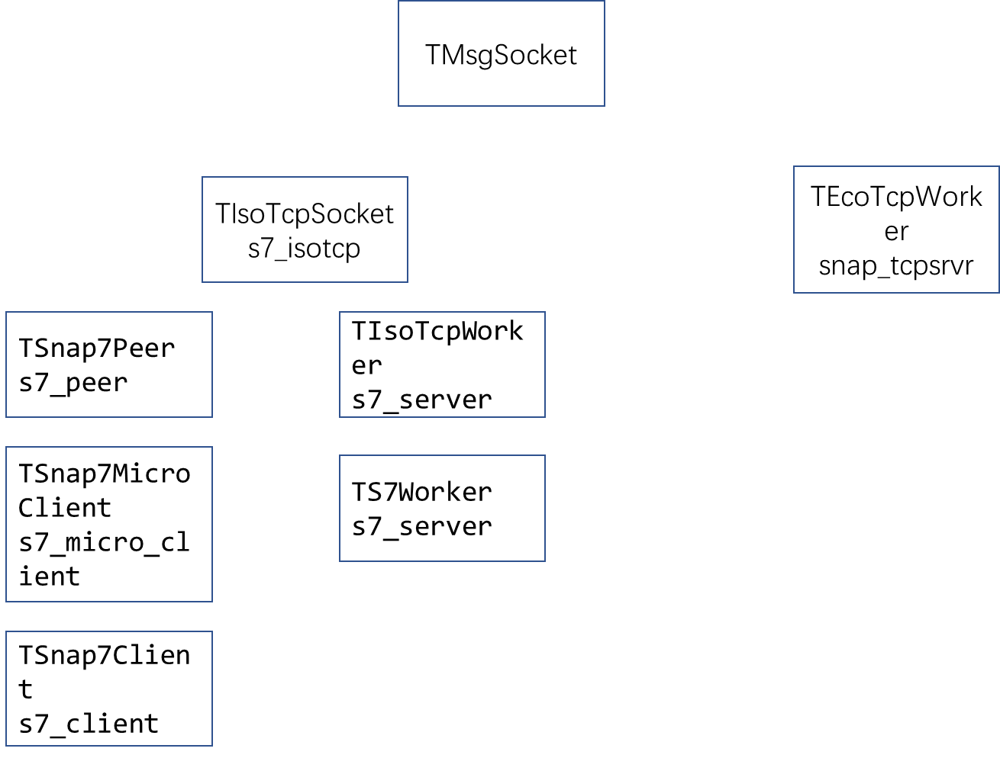

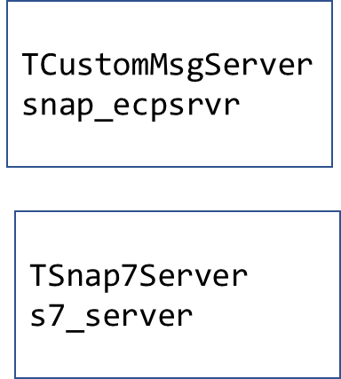

测试情况：

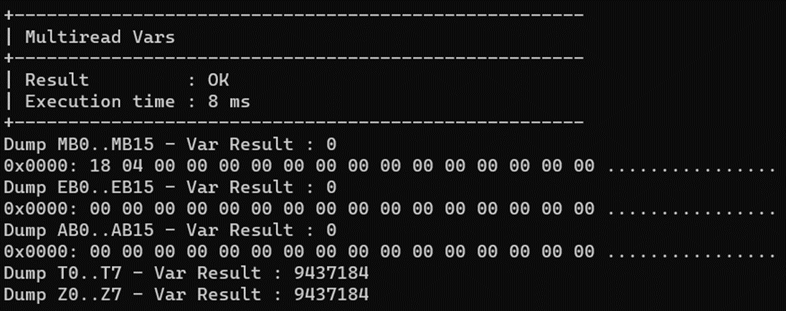
