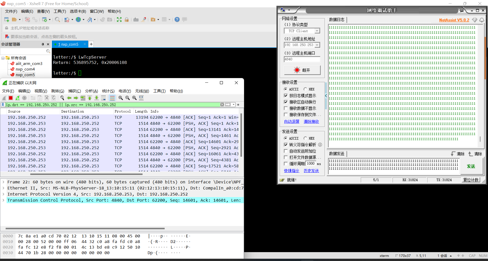

[[toc]]

# Wireshark 是怎么抓包的？

## 现象

之前在测试 [XiUOS](https://www.gitlink.org.cn/xuos/xiuos) 网络框架的时候，将开发板和 PC 直连，在开发板架起 TCP 服务端，PC 上开了 Wireshark，截了一张图



可以看到 Wireshark 抓到了一个长度为 `13194` 的一个帧，远超了 TCP PDU 最大长度。顿时感觉很奇怪，看了一下自己的网卡设置，也没有开启巨型帧，为什么会看到这么大的一个帧呢？

## 问题分析

基于一则类似的 [讨论](https://osqa-ask.wireshark.org/questions/24699/tcp-packet-length-was-much-greater-than-mtu/)

> 这是因为系统启用了 TCP Large Segment Offload（缩写为 TSO 或 LSO）。操作系统将大于 MTU 的数据包传递给网络适配器，而网络适配器驱动程序负责分解这些数据包，以匹配 MTU。TSO 是一种增强性能的可选特性，可以将其关闭，在这种情况下，操作系统将不再生成过大的帧。

也就是说，这是因为抓包时抓到的是系统提供给网卡的巨型帧，在网卡层面才会进行分拆处理。

## Wireshark 具体实现

基于另一则关于 Wireshark 是如何抓包的 [讨论](https://osqa-ask.wireshark.org/questions/22956/where-exactly-wireshark-does-captures-packets/)。

通常这种抓包的框架都是作用于在网卡驱动和内核高层的协议栈（如 TCP/IP）之间的。Wireshark 在 Linux 下使用的是 libpcap，相关 slides 见 [libpcap: An Architecture and Optimization Methodology for Packet Capture](https://sharkfestus.wireshark.org/sharkfest.11/presentations/McCanne-Sharkfest'11_Keynote_Address.pdf)。之前学习 eBPF 的时候了解到 tcpdump 是基于 BPF 的。事实上，tcpdump 也是基于 libpcap 开发的，libpcap 是单独抽离出的一个库，封装了 BPF 相关调用。

Windows 版本是基于 WinPcap 开发的，WinPcap 的 [QA](https://www.winpcap.org/misc/faq.htm#Q-26) 里也谈到了具体的实现：

> 问：WinPcap如何与Windows网络连接？它是否会降低TCP/IP堆栈和应用程序的速度？
> 答：在Windows内核中，WinPcap作为协议驱动程序运行。它与 TCP/IP 处于同一层级。和 TCP/IP 协议栈一样，它从底层网卡驱动程序接收数据包，但只有在基于 WinPcap 的工具正在捕获数据包时才会进行接收。这意味着，当安装了 WinPcap 但未进行捕获时，对系统的影响不存在。注意，开机后第一个网络流量捕获应用程序监听适配器时，WinPcap 驱动程序才会被加载到内核中。当 WinPcap 运行时，它不会直接与 TCP/IP 进行交互。然而，尤其是在高网络负载下，WinPcap 活动（尤其是软件中断级别的活动）将影响 TCP/IP 响应。

WinPcap 的设计和实现可以见论文 [An Architecture for High Performance Network Analysis](https://www.winpcap.org/docs/iscc01-wpcap.pdf)（开坑有空详细读一下）。


## 附录

### 解析 `pcnpag` 文件

使用 Python 解析 `pcnpag` 文件、进行数据分析时参考的资料

- IETF 对 pcapng 的规范：[PCAP Next Generation (pcapng) Capture File Format](https://www.ietf.org/staging/draft-tuexen-opsawg-pcapng-02.html)

- Python 解析 pcapng 文件：[rshk/python-pcapng: Pure-Python library to parse the pcap-ng format used by newer versions of dumpcap & similar tools](https://github.com/rshk/python-pcapng)

#### 例子

下面是在实验中写的一段加载 `pcnpag` 文件并计算吞吐量、包数的 Python 脚本。这里默认该文件中记录的是已经在 Wireshark 里经过过滤后导出的特定分组，所以直接对整个文件进行了计算

```python
from pcapng import FileScanner
from pcapng.blocks import InterfaceStatistics, EnhancedPacket
import pcapng.structs as ps

SECOND = 1e6 # 一秒钟
UNIT = 4*1e6 # 单位时间，大于一秒钟，计算吞吐量的窗口
UNIT_NUM = UNIT/SECOND

def load(filename):
    curr = 0
    packet = 0
    throughput = []
    with open(filename, "rb") as f:
        scanner = FileScanner(f).__iter__()
        section_header = next(scanner)
        interface_description = next(scanner)
        interface_statistics = None
        for block in scanner:
            if type(block) is EnhancedPacket and block.packet_len>80:
                packet += 1
                volume += block.packet_len
                timestamp = (block.timestamp_high<<32)+block.timestamp_low
                curr_temp = int(timestamp/SECOND)
                if curr == curr_temp:
                    throughput[-1] += block.packet_len
                else:
                    throughput.append(block.packet_len)
                    curr = curr_temp
            else: # InterfaceStatistics
                interface_statistics = block
    throughput = [t*8/UNIT_NUM/1000 for t in throughput] # get kbps
    return throughput, packet
```

