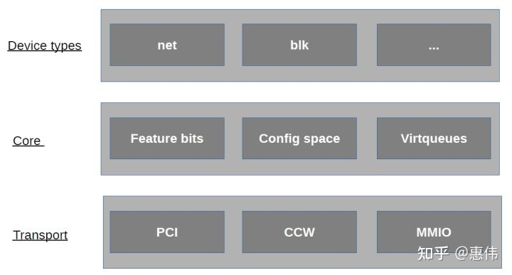

[[toc]]

最近在看一些虚拟化相关的东西，转载下一则专栏中 [虚拟化笔记](https://www.zhihu.com/column/huiweics) 的文章，侵删

在知乎上看到的文章，然后发现曹钦翔老师也关注了作者= =

# [virtio详细介绍和1.1新功能](https://zhuanlan.zhihu.com/p/361918197)

virtio是一种实践出来的技术，并且最终标准化，virtio是一种通用的虚拟化设备模拟标准，得到了大部分guest操作系统和hypervisor的支持，方便guest操作系统和hypervisor之间任意互相匹配。virtio出现之前hypervisor各有各的IO设备模拟方案，并在guest操作系统中大量合入驱动代码，导致一片混乱，后来xen中出来了部分virtio思想，在kvm中实现并且发扬光大，发表了论文《virtio: Towards a De-Facto Standard For Virtual I/O Devices》，论文促使virtio形成了正式标准。virtio标准最早是0.9.5版本(Virtio PCI Card Specification Version 0.9.5)，于2012年形成了draft，并没有正式发布，继续发展，2016年发布了1.0版本(Virtual I/O Device (VIRTIO) Version 1.0)，2019年发布了1.1版本(Virtual I/O Device (VIRTIO) Version 1.1)。

## virtio详细介绍

virtio分为driver和device，driver部分运行于guest操作系统中，device部分运行于hypervisor中，driver和device是生产者和消费者模式动作，driver生产内存，device消费内存。不同virtio版本之间是互相兼容的，driver和device版本不同也可以互相运转。

## 基本要素



- device status field

driver发现了device，driver可以正常驱动device，driver或者device出错了，driver或者device要进行reset。

- device feature bit

driver和device协商feature以便于不同virtio版本之间兼容。

- notification

driver和device互通通知对方，driver生产好的内存要通知device去消费，device消费完了要通知driver回收内存。

driver通知deivce用doorbell机制，在kvm中是写寄存器，kvm进行拦截再通知vhost。

device通知driver用中断机制，在kvm中是中断注入。

- config space

典型的如virtio-net-device的MAC地址/MTU/最大支持队列数等。

- virtqueue

每个virtqueue分成这三部分，descriptor/available/used，descriptor/available/used就是三个大数组，descriptor数组内容存放真正东西，available和used数组内容存放descriptor数组的下标。driver生产内存，把生产的内存地址和长度写在descriptor，然后把descriptor数据下标写到available数组中，通知device，device消费内存，消费完再把descriptor的数据下标定到used数组中，通知driver进行内存回收。

chained descriptor，几个desciptor项连在一起，适用于scater-gather。

indirect descriptor，主descriptor中一项指向另一个descriptor数组。

一般设备的virtqueue基本可以分三类rx virtqueue/tx virtqueue/ctrl virtqueue，rx virtqueue和tx virtqueue用于进行IO，driver通过ctrl virtqueue控制device。

```
/* Virtio ring descriptors: 16 bytes.  These can chain together via "next". */
struct vring_desc {
    /* Address (guest-physical). */
    __virtio64 addr;
    /* Length. */
    __virtio32 len;
    /* The flags as indicated above. */
    __virtio16 flags;
    /* We chain unused descriptors via this, too */
    __virtio16 next;
};
 
struct vring_avail {
    __virtio16 flags;
    __virtio16 idx;
    __virtio16 ring[];
};
 
/* uint32_t is used here for ids for padding reasons. */
struct vring_used_elem {
    /* Index of start of used descriptor chain. */
    __virtio32 id;
    /* Total length of the descriptor chain which was used (written to) */
    __virtio32 len;
};
 
typedef struct vring_used_elem __attribute__((aligned(VRING_USED_ALIGN_SIZE)))
    vring_used_elem_t;
 
struct vring_used {
    __virtio16 flags;
    __virtio16 idx;
    vring_used_elem_t ring[];
};
```

used和avaible不一样是因为rx时，device给driver写数据，device写多少长度数据要给driver反回去。

## 初始化

device准备，driver发现device，状态更新和feature协商，driver分配virtqueue，把virtqueue地址告诉device。

## 承载

首先virtio设备是IO设备，IO设备得以某种方式和CPU内存联结在一起，IO设备还得以某种方式和内存交互数据，IO设备还得提供一种机制让CPU控制IO设备。

virtio标准中有三种承载机制，分别是pci,mmio和channel i/o，pci是最通用的计算机bus，qemu和kvm能很好的模拟pci bus，mmio主要用于嵌入式设备，这些设备没有pci bus，channel i/o用于一些IBM机器，很少见。这里以最常见的pci来说，它的作用就是让driver正常发现device，让driver有方法控制device，如写pci配置空间，写pci bar空间。

```
typedef struct VirtIOPCIRegion {
    MemoryRegion mr;
    uint32_t offset;
    uint32_t size;
    uint32_t type;
} VirtIOPCIRegion;
 
typedef struct VirtIOPCIQueue {
  uint16_t num;
  bool enabled;
  uint32_t desc[2];
  uint32_t avail[2];
  uint32_t used[2];
} VirtIOPCIQueue;
 
struct VirtIOPCIProxy {
    PCIDevice pci_dev;
    MemoryRegion bar;
    union {
        struct {
            VirtIOPCIRegion common;
            VirtIOPCIRegion isr;
            VirtIOPCIRegion device;
            VirtIOPCIRegion notify;
            VirtIOPCIRegion notify_pio;
        };
        VirtIOPCIRegion regs[5];
    };
    MemoryRegion modern_bar;
    MemoryRegion io_bar;
    uint32_t legacy_io_bar_idx;
    uint32_t msix_bar_idx;
    uint32_t modern_io_bar_idx;
    uint32_t modern_mem_bar_idx;
    int config_cap;
    uint32_t flags;
    bool disable_modern;
    bool ignore_backend_features;
    OnOffAuto disable_legacy;
    uint32_t class_code;
    uint32_t nvectors;
    uint32_t dfselect;
    uint32_t gfselect;
    uint32_t guest_features[2];
    VirtIOPCIQueue vqs[VIRTIO_QUEUE_MAX];
 
    VirtIOIRQFD *vector_irqfd;
    int nvqs_with_notifiers;
    VirtioBusState bus;
};
```

VirtIOPCIProxy存储virtio信息，kvm给guest注册了很多memory region，driver写这些memory region，kvm拦截，把写的值放在VirtIOPCIProxy中。

```
static void virtio_pci_modern_regions_init(VirtIOPCIProxy *proxy,
                                           const char *vdev_name)
{
    static const MemoryRegionOps common_ops = {
        .read = virtio_pci_common_read,
        .write = virtio_pci_common_write,
        .impl = {
            .min_access_size = 1,
            .max_access_size = 4,
        },
        .endianness = DEVICE_LITTLE_ENDIAN,
    };
    g_string_printf(name, "virtio-pci-common-%s", vdev_name);
    memory_region_init_io(&proxy->common.mr, OBJECT(proxy),
                          &common_ops,
                          proxy,
                          name->str,
                          proxy->common.size);
}
static void virtio_pci_common_write(void *opaque, hwaddr addr,
                                    uint64_t val, unsigned size)
{
    VirtIOPCIProxy *proxy = opaque;
    VirtIODevice *vdev = virtio_bus_get_device(&proxy->bus);
 
    switch (addr) {
    case VIRTIO_PCI_COMMON_DFSELECT:
        proxy->dfselect = val;
        break;
    case VIRTIO_PCI_COMMON_GFSELECT:
        proxy->gfselect = val;
        break;
    
    default:
        break;
    }
}
```

## 设备分类

virtio分为很多设备类型virtio-net/virtio-blk/virtio-scsi等等，virtqueue实现通用部分，每种设备再实现具体功能部分，可以扩展feature部分，在virtqueue传输的数据中定义自己功能相关标准等。

## 举例分析

以qemu中实现的virtio-net-pci举例来说

首先它是一个virtio-net类型设备，其次它承载在pci上，所以VirtIONetPCI就把两者结合起来了。

```
struct VirtIONetPCI {
    VirtIOPCIProxy parent_obj;
    VirtIONet vdev;
};
```

virtqueue实现了数据共享，它并不关心到底是网络还是存储数据，所以要在它的buf最前面加上设备类型自己的元数据头，virtio-net-pci用了virtio_net_hdr。

```
/* This header comes first in the scatter-gather list.
 * For legacy virtio, if VIRTIO_F_ANY_LAYOUT is not negotiated, it must
 * be the first element of the scatter-gather list.  If you don't
 * specify GSO or CSUM features, you can simply ignore the header. */
struct virtio_net_hdr {
    /* See VIRTIO_NET_HDR_F_* */
    uint8_t flags;
    /* See VIRTIO_NET_HDR_GSO_* */
    uint8_t gso_type;
    __virtio16 hdr_len;     /* Ethernet + IP + tcp/udp hdrs */
    __virtio16 gso_size;        /* Bytes to append to hdr_len per frame */
    __virtio16 csum_start;  /* Position to start checksumming from */
    __virtio16 csum_offset; /* Offset after that to place checksum */
};
```

再看virtio-net-pci ctrl virtqueue传输的数据内容，基本就是打开网卡混杂模式/修改MAC/virtqueue个数/配置rss/配置offload等。

```
/*
 * Control virtqueue data structures
 *
 * The control virtqueue expects a header in the first sg entry
 * and an ack/status response in the last entry.  Data for the
 * command goes in between.
 */
struct virtio_net_ctrl_hdr {
    uint8_t class;
    uint8_t cmd;
} QEMU_PACKED;
```

## virtio1.1新功能

virtio 1.0存在的问题第一是性能不高，第二是硬件不太好实现。

driver和device运行在不同的cpu，driver和device共享内存，存在不同cpu之间互相通知进行cache刷新的问题，virtio1.0 virtqueue分成三个数组，三个数组分布在不同的cacheline上需要多次cache刷新，所以virtio 1.1引入了packed ring，把virtio 1.0中的三个数组合并成一个，这样大大减少了cache刷新的次数。具体做法就是packed virtqueue把available和used当成descriptor中flag字段两个bit，driver本地存放一个driver_local_bit，把available_bit=driver_local_bit和used_bit=!driver_local_bit，device本地存放一个device_local_bit，消费完内存后used_bit=device_local_bit。

通知是有开销的，virtio1.1 batch和in-order减少driver和device互相通知对方的次数，batch就是driver一次多生产几块内存，再通知device，in-order就是device按driver生产内存的顺序消费内存，消费完后只通知driver最后一块内存可以回收了，因为严格按顺序消费的，driver由此可知前面的内存也已经消费完了。

```
struct vring_packed_desc {
    /* Buffer Address. */
    uint64_t addr;
    /* Buffer Length. */
    uint32_t len;
    /* Buffer ID. */
    uint16_t id;
    /* The flags depending on descriptor type. */
    uint16_t flags;
};
```

硬件实现也一样，driver写descriptor发现一次pci传输，写available数组又要发现一次pci传输，如果把descriptor和available数组合并只要一次pci传输即可。

## 实现情况

linux 4.18 virtio-net driver已经能支持virtio 1.1了，但vhost-net不支持virtio 1.1。

qemu master实现了virtio 1.1。

dpdk virtio pmd和vhost-user都支持virtio 1.1。

## 总结

virtio标准还会继续发展，功能会越来越多，设备类型会越来越多，如virtio GPU和virtio vIOMMU，GPU最难虚拟化，目前用的是mdev，没有IOMMU，virtio设备可以修改任意guest内存，有vIOMMU更安全，vIOMMU也可以用vt-d实现，virtio device emulation可以在qemu/kernel/dpdk中实现，virtio技术百花齐放，创新不断，是做虚拟化必须研究的技术。总结virtio的目标就是统一IO设备，虚拟机看到的所有的外设都是virtio类型，只需要安装virtio类型的驱动即可，如果硬件也能实现virtio，那么裸金属也一样了，虚拟机和裸金属互相热迁移，一个镜像走天下。