[[toc]]

最近吃饭的时候看了 CNCF 20 的两个 Webinar，都是和 eBPF、Envoy 相关的，两年前的视频但是还是很有意思的。连带讨论时间还是挺长的，都在一个小时左右，记录下重点内容。

# [Comparing eBPF and Istio/Envoy for Monitoring Microservice Interactions](https://www.youtube.com/watch?v=Wocn6DK3FfM)

演讲者来自 Flowmill，一家观测性初创公司，好像已经被 Splunk 收购了。

首先是使用 service mesh 的一些好处：流量管理、安全性、可观测性

接着介绍了 Envoy  的 sidecar 架构

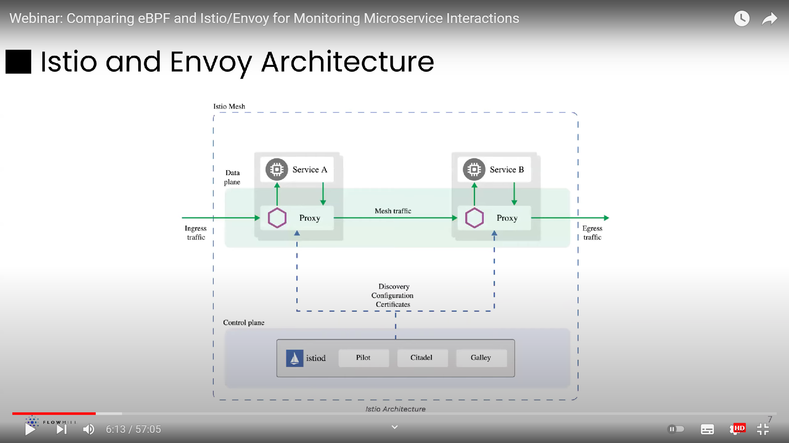

为什么他们会选择使用 eBPF 做可观测性

Envoy/Istio 是为应用层设计的，所以下层的 metrics 并不全面。

演讲者还用 [GoogleCloudPlatform/microservices-demo](https://github.com/GoogleCloudPlatform/microservices-demo) 跑了个 benchmark，然后发现监控的开销降低了不少。这里信息其实不是很完善，所以提问环节也有人质疑了这个开销，问到了有没有可能是因为 envoy/istio 加了 tls 支持，加密解密带来的。回复是没有去具体考虑什么组件带来了开销，是直接使用的默认配置，想要表现开箱即用的情况下二者的差距。

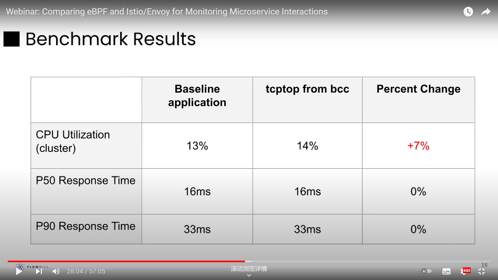

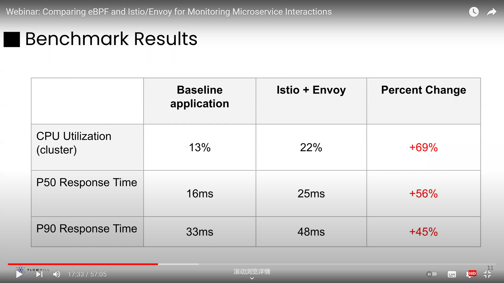

最后总结下，在项目中使用两者的取舍

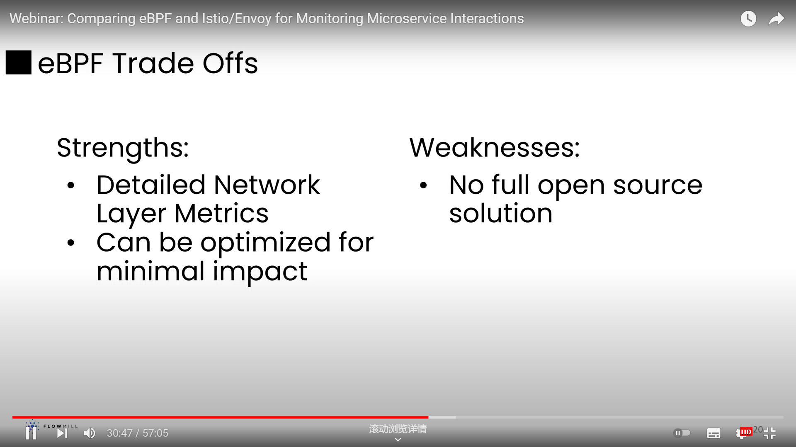

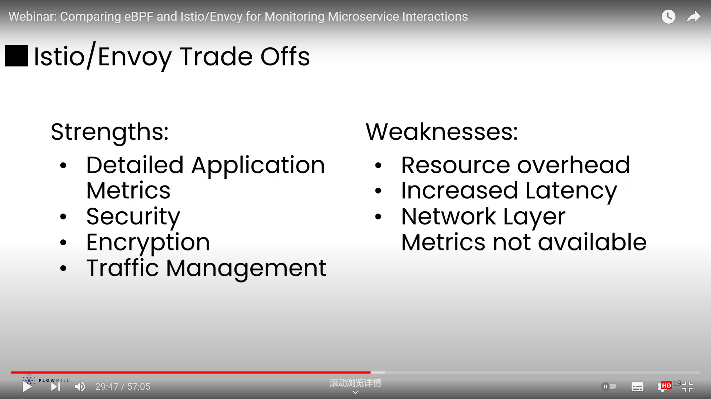

# [How Cilium uses BPF to Supercharge Kubernetes Networking & Security](https://www.youtube.com/watch?v=sodtj1RPjlY)

这个感觉更好看一些，是来自 SUSE 的工程师介绍他们为什么会选用 Cilium 做 K8S 中的网络控制，Cilium 的公司 Isovalent 的创始人也来做了个报告。

> 引用自博客 [Cilium eBPF实现机制源码分析](https://zhuanlan.zhihu.com/p/446660758)，写得很好
>
> Cilium是由革命性内核技术eBPF驱动，用于提供、保护和观察容器工作负载（云原生）之间的网络连接的网络组件。 Cilium使用eBPF的强大功能来加速网络，并在Kubernetes中提供安全性和可观测性。现在 Cilium将eBPF的优势带到了Service Mesh的世界。Cilium服务网格使用eBPF来管理连接，实现了服务网格必备的流量管理、安全性和可观测性。

首先 SUSE 工程师说一下大背景，下面是他们使用 K8S 后的架构，控制面要提供 DNS-Aware 的管理方式

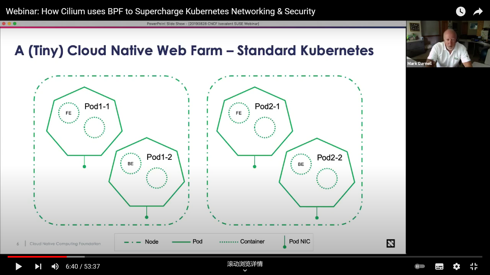

接着是说用 iptables 有什么问题，与之相对 cilium 有什么好处：

- 规则一条条写起来很麻烦，而且容易写错
- 如果 ip 是动态的时候，添加规则就更加麻烦了，特别是在实例重启之后

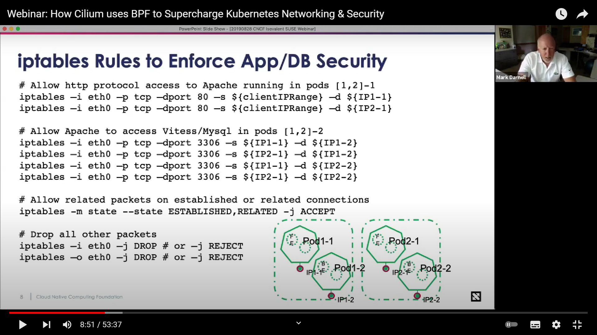

- 性能差，链表存储规则，过滤一次太慢了，特别是你规则很多的时候
- 得为集群中每个实例设置相同规则的时候拓展性很差

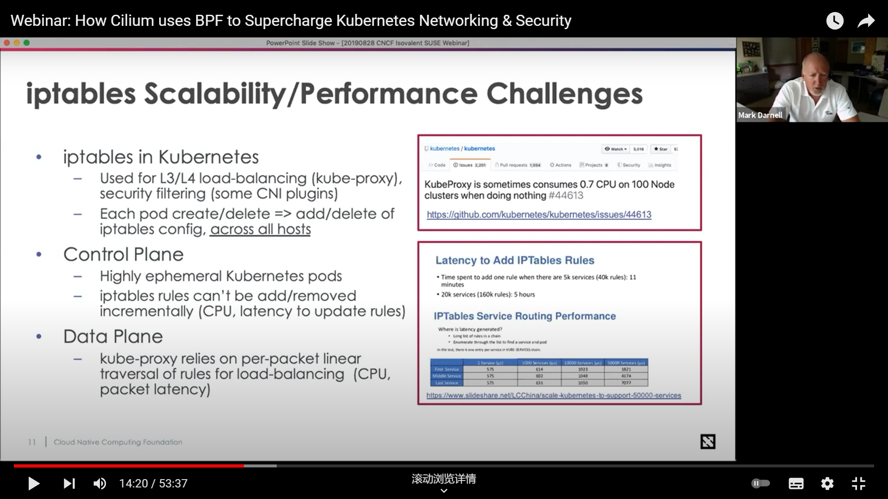

与之相比，Cilium 要好很多，它为你做了很多脏活累活儿，还可以支持 DNS-Aware 的管理方式

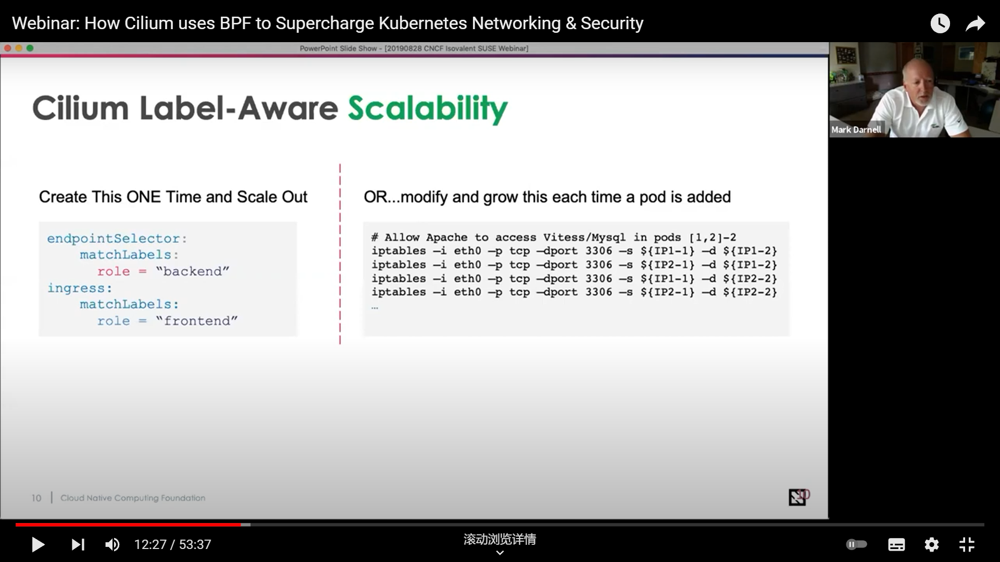

同时它的拓展性很好，毕竟 BPF Map 都是哈希表，规则的查询插入都快很多

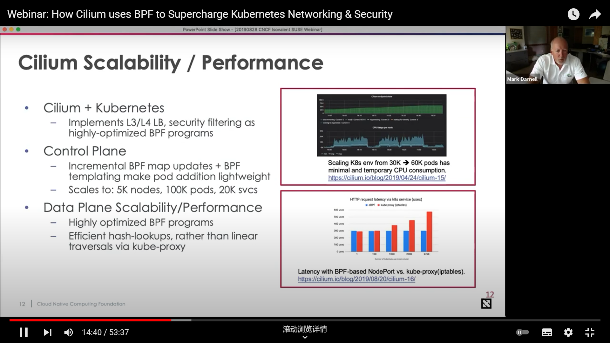

下面就是具体解释这种优势的来源：减少了 Envoy sidecar架构下的开销。事实上 Cilium 提出了更加激进的做法：彻底推翻了现有服务网格代理中常见的 sidecar 范式，想要把服务网格代理迁移到内核层面，具体可以参考这篇博客： [How eBPF will solve Service Mesh - Goodbye Sidecars ](https://isovalent.com/blog/post/2021-12-08-ebpf-servicemesh)。对此也不乏质疑之声，另有一篇文章讨论这种争议：[eBPF 和 Wasm：探索服务网格数据平面的未来](https://zhuanlan.zhihu.com/p/456214160)。

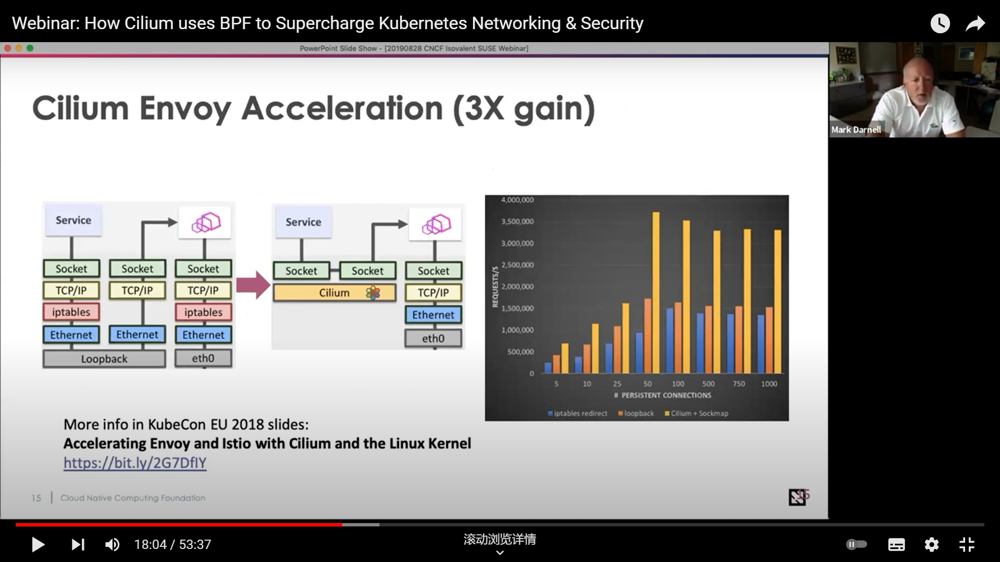

Cilium 替你干了很多事：多个 cluster 间可以方便地实现全局路由

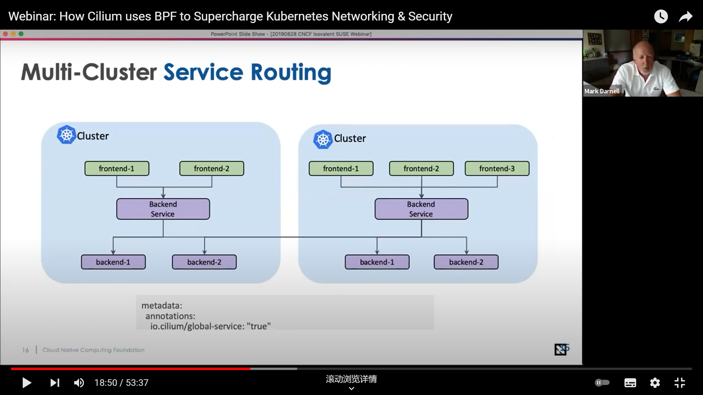

Cilium 替你干了很多事：可以方便地进行安全通讯

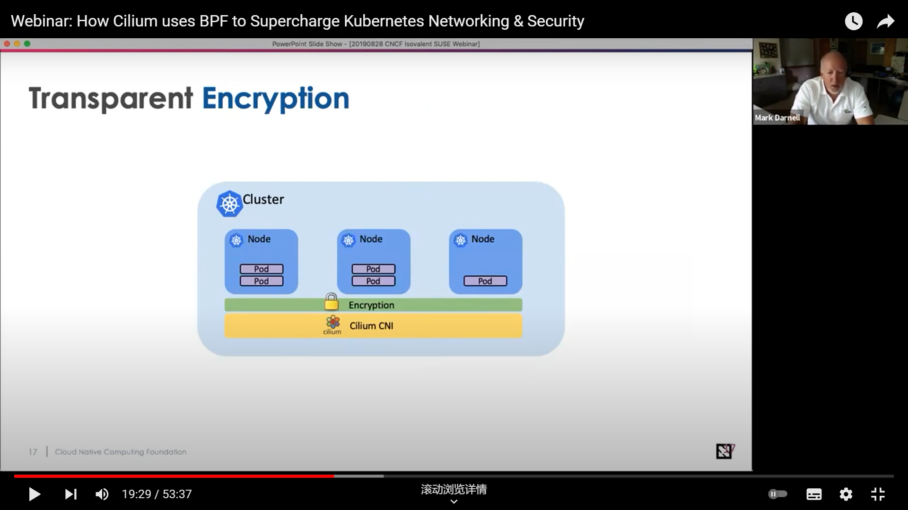

Cilium 替你干了很多事：可以方便地指定各类应用层协议的规则

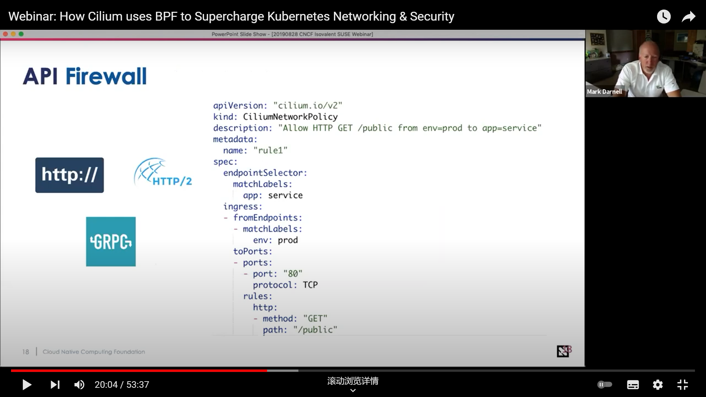

Cilium 替你干了很多事：可以方便地管理消息队列、数据库

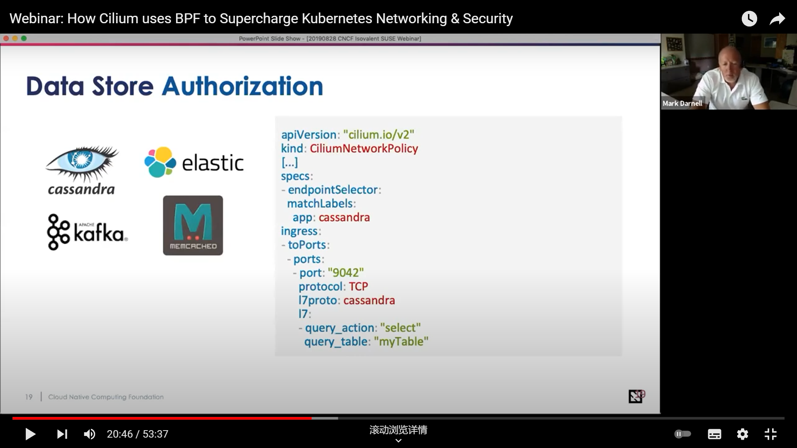

Isovalent 创始人讲的就比较基础的 ebpf 相关内容了，这里不再记录。但是提到了一个很有趣的内容，[BPF templating](https://github.com/cilium/cilium/projects/34)，但是好像目前还没有实现。

题外话：Isovalent 关于 Cilium 的工作做的很棒，而且他们的 eBPF 教学文档写得很详细，也一直在维护 golang 的 ebpf 包 :thumbsup:。