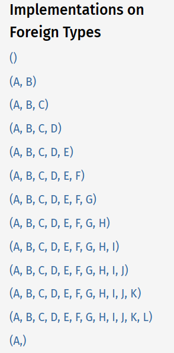

[[toc]]

# The design of actix-web handler

Recently I just finished my master thesis and was working on the [sentinel](https://github.com/sentinel-group/sentinel-rust/) middleware for [actix-web](https://github.com/actix/actix-web). It is a powerful, pragmatic, and extremely fast web framework for Rust.

An interesting API of actix-web attracts me: [`App::service`](https://docs.rs/actix-web/4.2.1/actix_web/struct.App.html#method.service), which dispatches routes to respective handlers. Here is an example

```rust
use actix_web::{web, http, App};
use serde::Deserialize;

#[derive(Deserialize)]
struct Info {
    username: String,
}

/// extract path info using serde
async fn index1(info: web::Path<Info>) -> String {
    format!("Welcome {}!", info.username)
}
/// use multiple extractors for one handler function
async fn index2(
    path: web::Path<Info>,
    query: web::Query<HashMap<String, String>>,
    body: web::Json<Info>
) -> String {
    format!("Welcome {}!", path.username)
}

let app = App::new()
	.service(web::resource("/{username}/index1.html") // <- define path parameters
        .route(web::get().to(index1)))        // <- register handler
    .service(web::resource("/{username}/index2.html")
        .route(web::get().to(index2)));
```

<center>ELEGANT! VERY ELEGANT!</center>

<div align=center></div>

Personally, I think this API is very elegant. But how is it implemented? It looks as if  "variadic" arguments are derived magically in the generic. But we all know that the rust does not support this feature in its generics.

Let's first read the signature of [actix_web::Route](https://docs.rs/actix-web/4.2.1/actix_web/struct.Route.html), which registers handlers in the above example. 

```rust
pub fn to<F, Args>(self, handler: F) -> Self
where
    F: Handler<Args>,
    Args: FromRequest + 'static,
    F::Output: Responder + 'static,
```

Well, it is the [`actix_web::Handler`](https://docs.rs/actix-web/4.2.1/actix_web/trait.Handler.html) and [`actix_web::FromRequest`](https://docs.rs/actix-web/4.2.1/actix_web/trait.FromRequest.html) that provides this flexibility in deed. 

:joy: Guess what? The developers of `actix-web` had already foreseen that we would be curious about its handler. And the following is transcribed from its doc.

> ## [How Do Handlers Receive Variable Numbers Of Arguments](https://docs.rs/actix-web/latest/actix_web/trait.Handler.html#how-do-handlers-receive-variable-numbers-of-arguments)
>
> Rest assured there is no macro magic here; it’s just traits.
>
> The first thing to note is that [`FromRequest`](https://docs.rs/actix-web/latest/actix_web/trait.FromRequest.html) is implemented for tuples (up to 12 in length).
>
> Secondly, the `Handler` trait is implemented for functions (up to an arity of 12) in a way that aligns their parameter positions with a corresponding tuple of types (becoming the `Args` type parameter for this trait).
>
> Thanks to Rust’s type system, Actix Web can infer the function parameter types. During the extraction step, the parameter types are described as a tuple type, [`from_request`](https://docs.rs/actix-web/latest/actix_web/trait.FromRequest.html#tymethod.from_request) is run on that tuple, and the `Handler::call` implementation for that particular function arity destructures the tuple into its component types and calls your handler function with them.
>
> In pseudo-code the process looks something like this:
> ```rust
> async fn my_handler(body: String, state: web::Data<MyState>) -> impl Responder {
>  ...
>  }	
> // the function params above described as a tuple, names do not matter, only position
> type InferredMyHandlerArgs = (String, web::Data<MyState>);
> 
> // create tuple of arguments to be passed to handler
> let args = InferredMyHandlerArgs::from_request(&request, &payload).await;
> 
> // call handler with argument tuple
> let response = Handler::call(&my_handler, args).await;
> 
> // which is effectively...
> 
> let (body, state) = args;
> let response = my_handler(body, state).await;
> ```
> 
> This is the source code for the 2-parameter implementation of `Handler` to help illustrate the bounds of the handler call after argument extraction:
> 
> ```rust
> impl<Func, Arg1, Arg2, Fut> Handler<(Arg1, Arg2)> for Func
> where
>     Func: Fn(Arg1, Arg2) -> Fut + Clone + 'static,
>     Fut: Future,
> {
>     type Output = Fut::Output;
>     type Future = Fut;
> 
>     fn call(&self, (arg1, arg2): (Arg1, Arg2)) -> Self::Future {
>         (self)(arg1, arg2)
>     }
> }
> ```
> 

That is, the parameters are packed into a tuple to make the API neat, while inside the `actix-web`, the tuple is parsed by `FromRequest` and passed to the handler caller `Handler::call`, which unpacked the tuple and pass arguments to the real handler. The `Handler` trait is implemented on tuples with different sizes by the macro `factory_tuple`, and it's hided in the doc.

```rust
// actix-web/src/handler.rs
macro_rules! factory_tuple ({ $($param:ident)* } => {
    impl<Func, Fut, $($param,)*> Handler<($($param,)*)> for Func
    where
        Func: Fn($($param),*) -> Fut + Clone + 'static,
        Fut: Future,
    {
        type Output = Fut::Output;
        type Future = Fut;

        #[inline]
        #[allow(non_snake_case)]
        fn call(&self, ($($param,)*): ($($param,)*)) -> Self::Future {
            (self)($($param,)*)
        }
    }
});
```

Similarly , a familiar tower in the page of  [`FromRequest`](https://docs.rs/actix-web/latest/actix_web/trait.FromRequest.html) :satisfied: 



And it is based on this macro

```rust
// actix-web/src/extract.rs
macro_rules! tuple_from_req {
    ($fut: ident; $($T: ident),*) => {
        /// FromRequest implementation for tuple
        #[allow(unused_parens)]
        impl<$($T: FromRequest + 'static),+> FromRequest for ($($T,)+)
        {
            type Error = Error;
            type Future = $fut<$($T),+>;

            fn from_request(req: &HttpRequest, payload: &mut Payload) -> Self::Future {
                $fut {
                    $(
                        $T: ExtractFuture::Future {
                            fut: $T::from_request(req, payload)
                        },
                    )+
                }
            }
        }

        pin_project! {
            pub struct $fut<$($T: FromRequest),+> {
                $(
                    #[pin]
                    $T: ExtractFuture<$T::Future, $T>,
                )+
            }
        }

        impl<$($T: FromRequest),+> Future for $fut<$($T),+>
        {
            type Output = Result<($($T,)+), Error>;

            fn poll(self: Pin<&mut Self>, cx: &mut Context<'_>) -> Poll<Self::Output> {
                let mut this = self.project();

                let mut ready = true;
                $(
                    match this.$T.as_mut().project() {
                        ExtractProj::Future { fut } => match fut.poll(cx) {
                            Poll::Ready(Ok(output)) => {
                                let _ = this.$T.as_mut().project_replace(ExtractFuture::Done { output });
                            },
                            Poll::Ready(Err(e)) => return Poll::Ready(Err(e.into())),
                            Poll::Pending => ready = false,
                        },
                        ExtractProj::Done { .. } => {},
                        ExtractProj::Empty => unreachable!("FromRequest polled after finished"),
                    }
                )+

                if ready {
                    Poll::Ready(Ok(
                        ($(
                            match this.$T.project_replace(ExtractFuture::Empty) {
                                ExtractReplaceProj::Done { output } => output,
                                _ => unreachable!("FromRequest polled after finished"),
                            },
                            )+)
                    ))
                } else {
                    Poll::Pending
                }
            }
        }
    };
}

pin_project! {
    #[project = ExtractProj]
    #[project_replace = ExtractReplaceProj]
    enum ExtractFuture<Fut, Res> {
        Future {
            #[pin]
            fut: Fut
        },
        Done {
            output: Res,
        },
        Empty
    }
}
```


## Sentinel-Rust Resources

[Tutorial](https://github.com/sentinel-group/sentinel-rust/wiki)
[ API Doc](https://docs.rs/sentinel-core/latest/sentinel_core/)
[Example Codes](https://github.com/sentinel-group/sentinel-rust/tree/main/examples)
