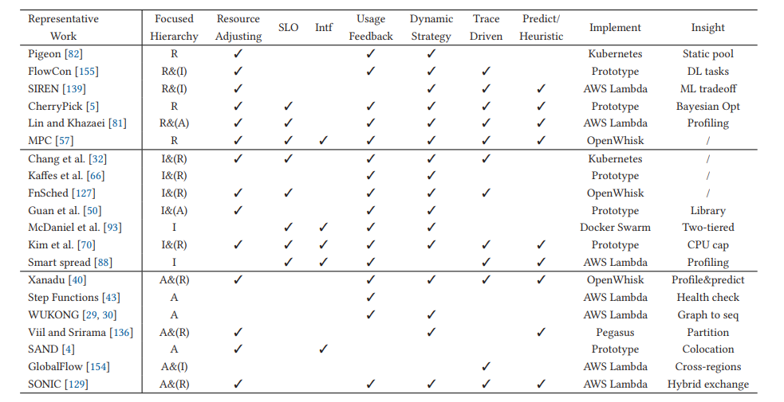

[[toc]]

# The Serverless Computing Survey 笔记

读了陈全老师组的《The Serverless Computing Survey: A Technical Primer for Design Architecture》，这篇文章 2022 年发在 eurosys。

这篇综述从四个角度介绍了 Serverless Computing：Virtualization, Encapsule, System Orchestration, and System Coordination。

## 概述

Serverless Computing 的一个狭隘定义是也就是 FaaS，函数计算即服务，一个更为普适的定义是 FaaS+BaaS（Backend-as-a-Service）。FaaS 的模型负责函数的隔离和触发，BaaS 则是 FaaS 背后整个基础架构的抽象。作者认为，这样的系统应该具有如下特性：

- Auto Scaling
- Flexible Scheduling
- Event-Driven
- Transparent Development
- Pay-as-you-go

并在下图中，提出了四层架构：Virtualization layer、Encapsule layer、System Orchestration layer、System Coordination layer。

## Virtualization layer

目前常见的沙箱机制可以分为四类：传统虚拟机、容器、安全容器、Unikernel，一些关键属性如下表所示。

这里由于考虑的是 FaaS 场景，重点关注了启动时间和隔离性，最终给出了下面这个图。

容器由于它出色的启动时间和通用性，在过去支配了无服务计算，但是以 Kata Container 为代表的安全容器也逐渐在特定领域的无服务计算。

## Encapsule Layer

冷启动可能发生在某个函数无法获取到一个正在运行的容器或有突发的大量启动时，为此需要一些预热的技术，其中代表性的工作如下（C/R 代表 checkpoint支持，如用于可重复构建的 CRIU 工具）。

具体而言，有两类预热方法：one-to-one 和 one-to-all，前者一般是池化特化的函数实例，后者则是通用的模板实例需要在被调度后进一步特化。前者面临的挑战主要是预热数量和周期难以预测、预热多种实例的内存开销；后者的挑战主要是通用模板镜像往往体积较大、预先导入了运行大量无关的库、用户隐私泄露风险。

## Orchestration Layer

下图描述了负载均衡器和资源管理组件在该层的应用，可以分为三层，resource-level（R）、instance-level（I）、application-level（A）。

系统调度层最近的一些工作。

### Resource Level

CPU 和内存是无服务计算的基本调度资源，调度的一个原则是不要过量提供给用户这些资源。为了遵守这个原则，常见的方法是根据历史数据推算。近年的一些工作将 SLA 计入到资源调度的考量，来保障稳定性和可靠性。

### Instance Level

主流的方法是用负载均衡，一般是两类：基于哈希的或者是基于多目标优化的。

但是负载均衡策略因为会在实例间贡献资源，可能会导致互相干扰：导致性能下降或违背 QoS 目标。

### Application Level

在应用层面上，负载均衡可以分为两类：spread 策略和 bin-pack 策略。前者会将一个应用的函数实例分散到所有的物理节点上；后者会尝试将单个应用的函数实例调度到同一个节点上。二者的区别就在于数据一致性/本地性。

应用层面上有两种触发模式和两种工作流程模型，如下图所示。

### 安全隐患

- 微服务可能有超额的数据输入导致应用违反了实例的内存限制。
- 恶意攻击，如 DDoS（Distributed Denial-of-Service）引发微服务的雪崩、DoW（Denial-of-Wallet）在 pay-as-you-go 模式下增加用户成本甚至耗尽资金中断服务。
- 调用链路安全保障，需要确保调用方的合法性。

## Coordination Layer 的 BaaS 组件

上图展示了六个关键的组件/服务：

- 存储

  单次无服务触发的过程中，有三个阶段需要数据库：鉴权、函数执行、日志。

  这里主要的问题是 I/O 容易成为服务性能的瓶颈，需要设计具有弹性的、数据本地化的存储服务。

- 队列

  在系统的不同组件间传递消息，如 Apache Kafka。

  基于队列的机制可能会降低系统的性能和可用性。

- API 网关

  无服务计算中，实例按需启动，不绑定静态地址。

- 触发器

  触发器和绑定的规则一起组成了可检测事件的探针，可以避免硬编码获取其他服务。

  除了触发事件驱动的函数，触发器也可以提供一个声明式的方式将数据和代码连接起来（例如存储服务）。

  最常见的四类触发器是：HTTP 请求、队列、计时器、事件。

  事件驱动的系统的一个代表性项目是 Triggerflow，它会在工作流的每个阶段设置一个触发器。

- 数据缓存

  为了保障服务的稳定性，避免负载激增、达到并发上限，常见的方法是使用多级缓存。

  - 镜像缓存：按需加载镜像、镜像分层共享。
  - 状态缓存：让无服务应用具有状态，可结合活动数据库。
  - checkpoint 缓存，让函数具备容错能力。除了基于 C/R 的方法，还有基于日志的容错方式。

- DevOps 工具

  - CI (Continuous Integration)

  - CD (Continuous Delivery)：滚动升级、红黑（蓝绿）部署、金丝雀部署

  - CM (Continuous Monitoring)

## 性能评估

原文第六章

不同运行时、语言、内存限制下的冷启动延迟如下图所示，因此常常配置 256 MB 的内存限制，因为边际效用最高。

作者也补充了 一些其他观测：如 LLC (Last-Level Cache) 方面，增大缓存不会带来冷启动性能的显著提升，只有在小于 2 MB 的情况下会有很大的性能损失。 在容器化的场景下，页表管理会给 TLB 带来沉重的压力，有些项目如 2020 年 ISCA 上的 BabelFish 会尝试在容器间共享地址转换。 

四个云厂商对比。其中，CCI 是 Concurrent Invocation。

## 其他方面的限制和挑战

原文第七章

### Encapsule Layer 的无服务化

无服务计算的一个显著特征是短暂的生命周期，并不保证每次请求会被同一个实例处理，它本身的无状态特征限制了它的应用场景。然而，通过一些外部的存储为它提供状态又会有诸如隐私风险等问题。

### Orchestration Layer 的内存碎片

在多租场景下，可能有大量容器同时运行，并且他们会面临冷启动的问题。在这种情况下，海量的 sidecar 可能会占用大量内存导致无服务计算的容器难以实现密布，降低了资源的利用率。同时会有实例内部由于过量分配产生的内存碎片，和实例间由于调度产生的内存碎片。

### Coordination Layer 的 API 和基准程序的云厂商锁定

可移植性差，容易和云厂商绑定，例如各个厂商独立的 BaaS 接口。

没有真正复杂的跨平台的开源基准程序。

## 无服务计算的研究方向

原文第八章

### 应用层面的优化

应用层优化包含两部分工作流支持增强和工作流调度。

工作流支持增强指函数实例之间需要能相互联通。这需要支持新的存储方式来为函数间通信赋能；需要更好的同步机制，在允许并行触发的同时保障服务质量。

新的调度策略应该考虑到上面提到的函数实例间的联通性，例如 caller-callee 关系、数据本地性。这段特别提到了 FaaS 现在是把数据发送到代码侧，而不是代码发送到数据侧，记得 Google 去年在 MLSys 发的 Pathways 里面好像也提过训练这个问题。

### 冷启动优化方案的鲁棒性

有一些通过预测来优化冷启动的方法，但是为每个函数都收集足够的数据做预测不现实，需要更加鲁棒的方法。

### 加速器的无服务化

现在的 FaaS 大多没有包含专用的加速器，例如 GPU、FPGA，即使有也是以独占的形式售卖，和 FaaS 本身的理念背道而驰。因为本身这方面的虚拟化，特别是极致的伸缩没有成熟方案。这导致了两个问题：加速器售卖和使用都不够方便，缺乏伸缩性；无服务计算能够支持的应用场景受限。作者认为有三个可行的研究方向：

- 调度策略，加速器作为一种资源参与调度。
- 虚拟化方法，怎么提供伸缩性。其实这方面有一些很好的工作，如 gVirtus 虚拟化 GPU、FreeFlow 虚拟化 RDMA， 这些方案都在拦截服务调用构建虚拟设备做代理转发。
- 批处理。加速器对 I/O 敏感，需要在批处理提升 I/O 效率和批处理带来的延迟之间做取舍。
