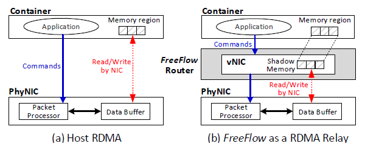
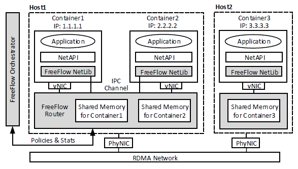
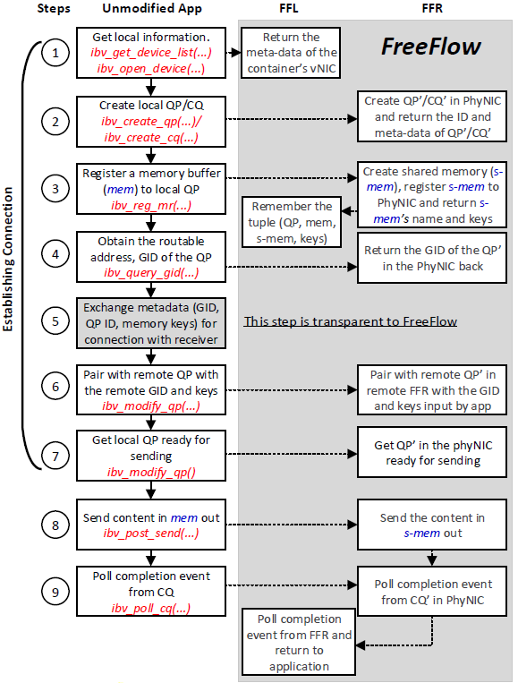
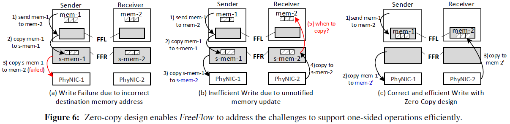
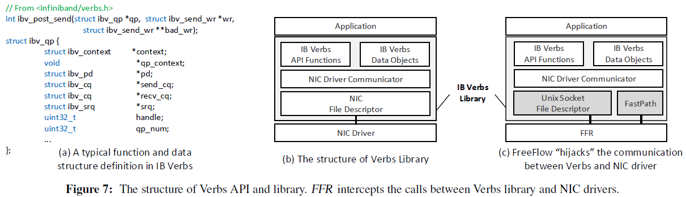
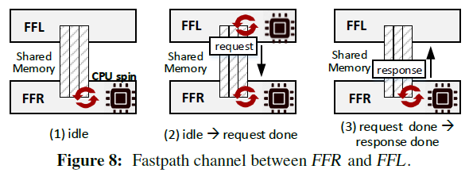

[[toc]]

# FreeFlow 笔记

FreeFlow 是 NSDI 18 上非常经典的 RDMA 虚拟化的文章。

## 论文阅读

本文的动机是RDMA与硬件和主机的高度绑定与容器化带来的隔离性和可迁移性是背道而驰的。因此文章提出了一个 software switch，类似 OvS 在传统TCP/IP 中的角色，在控制面实现隔离和可迁移、在数据面做QoS和流量统计等。

### 概览

原文第三章。

FreeFlow 拦截了应用于硬件之间的通讯。FreeFlow 只允许网卡读写受控的 Shadow Memory，然后负责将它拷贝给应用，从而实现隔离。容器内的应用内存和 FreeFlow 中的 Shadow Memory 可以是同一块物理内存，从而实现零拷贝降低开销。

FreeFlow 进行虚拟化的部分是 IB Verbs API，在虚拟网卡中创建虚拟的 SQ 和 RQ，与物理网卡上的 QP 和 CQ 交互。

**设计中的挑战有两点：透明化（应用不感知不修改）、不影响性能，分别在第四和第五章的设计中解决。**

FreeFlow 的设计如上图灰色部分所示，包含 
- FreeFlow network library (FFL)，模仿标准RDMA库，从而实现对应用的透明性。
- FreeFlow software router (FFR)，在每个主机上部署一个实例，代理所有容器的 RDMA 通讯。它和各个容器共享内存，并对他们进行隔离。FFL负责同步容器的私有内存和 FFR 中的共享内存。FFR还负责数据面的 QoS 策略、与 FFO 一起管理 IP 分配。
- FreeFlow network orchestrator (FFO)，负责控制面如 IP 管理、Acess Control，也用来管理全局内存映射。

### 透明地支持 RDMA 操作

原文第四章，这章讲 FreeFlow 虚拟化的实现方法，需要覆盖 RDMA 通讯的各个流程和操作。

RDMA 操作包含单向的 READ/WRITE 和双向的 SEND/RECV。困难点在于单向的操作中 RDMA 网卡可以静默地修改 FFR 中的内存或文件描述符，除非 FFR 持续轮询它们的状态，因此很难在物理网卡和容器内的虚拟网卡之间保持同步。这里的解决思路是容器本身是进程，FFL 和 FFR 可以共享内存和文件描述符。但是在透明化方面又会引入新的问题，容器内的应用不能直接在 IPC 共享内存中分配，所以需要透明地实现共享。

#### 建立连接

两侧的 RDMA 端点需要建连才能通信，在双方网卡中创建 QP，注册内存缓冲区。下图讲解了通过 Verbs 建连的过程，左边是原生的应用触发的各个调用，晦涩区域则是陷入 FreeFlow 执行的操作，会在两侧的 FFR 之间建连。

图中的步骤具体而言：

1. 应用遍历网卡寻找支持 RDMA Verbs 的设备。FFL 会拦截这些调用然后返回容器中的虚拟 RDMA 网卡。
2. 应用在它拿到的虚拟网卡中创建 QP 和 CQ，FFR 会在物理网卡中创建对应的 QP' 和 CQ'。在 FFR 创建完队列后，FFL 会将 QP-ID 和其它队列的元信息转发给应用。
3. 应用为 QP 注册内存（mem）。FFR 会在 IPC 共享内存空间内相应地分配一块内存（s-mem），大小与 mem 相同，同时会把 s-mem 注册给物理网卡的 QP'。FFR 会返回它用来创建 s-mem 的 ID（一个主机上的 IPC 内存中的唯一的名字）。有了这个 ID，FFL 可以将 s-mem 映射到它自己的虚拟内存空间。
4. 应用查询本地 QP 的地址（也即 RDMA 中的 GID）。该地址信息将会共享给另一侧，来将本地的 QP 和远端的 QP 配对起来。最后，FFR 会将 QP' 的真实的 GID 返回给容器内的应用。
5. 应用和远端交换 GID 和 QP-ID。应用可以通过诸如 TCP/IP 或 RMDA-CM 等信道完成这一步的操作。FreeFlow 不感知这一步的操作。
6. 应用使用接受方的 GID，将本地 QP 和远端容器的 QP 配对起来。FFL 会将该 GID 转发给 FFR，FFR 把该 GID 配对给 QP'。
7. 应用修改本地的 QP 到准备好发送或接收的状态。FFR 会对应修改 QP' 的状态。

由于额外的 FFL 和 FFR 的调用，FreeFlow 会增加建连的延迟，但是这些开销是一次性的，连接也可以复用。（而且本地函数调用的开销和建连过程中的网络通信的延迟相比，并不是很显著。）

#### 双向的操作

发送或接收方都需要执行两个步骤，第一步是使用 QP 来发送或接收数据，第二步是使用 CQ 去得到完成提醒。上面步骤图中的第 8-9 步描述了这个过程。这两步的具体内容如下：

8. 应用触发了 SEND 调用，提供了指向 mem 的指针。FFL 首先将数据从 mem 拷贝到 s-mem，然后 FFR 触发他自己的 SEND 调用将 s-mem 发送给远端的 FFR。我们通过应用后续章节会提到的零拷贝的技术避免从 mem 到 s-mem 的内存拷贝操作。注意远端路由此时已经触发了一个 RECV 调用。

9. 应用 poll CQ 或等待之前操作完成的提醒。FFR 也会在对应的 QP' 和 CQ' 上进行 polling 或等待。 

后续的SEND 操作是继续重复这两步；RECV 操作类似，只是 s-mem 和 mem 的数据接收过程是反过来的。

可以看出来在 FreeFlow 中，FFL 和 FFR 相对容器内的应用都是透明的。

#### 单向的操作

在单向操作中，客户端不仅需要服务端的 GID，还需要远端内存缓冲区的地址，和获取该内存的秘钥。这个交换信息的步骤在上述流程的第 5 步进行，在第 8 步中 FreeFlow 可以获得它们。

但是，和双向的操作相比，单向的操作更难去透明地实现，主要是面临下面两个问题。

首先，目标地址 mem 是在远端容器的虚拟内存中。然而，本地的 FFR 并不知道在对端它对应的 s-mem。例如，在图 6-(a) 中，当发送方尝试在 mem-2 中写入 mem-1 中的数据，它会在第 3) 步失败，因为接收端的 FFR 无法获取目标内存地址 mem-2。

为了解决这个问题，FreeFlow 在 FFO 中构建了一个键值存储，FFR 可以据此了解到应用虚拟内存空间中的 mem 指针到 FFR 虚拟内存空间中的 s-mem 指针的映射。当应用注册内存到它的虚拟网卡时，更新这个映射表会增加上面建连步骤的第3步的延迟。然而，数据面的性能不会收到影响，因为 FFR 可以在本地缓存这些映射。

其次，即使我们知道了远端的内存映射，WRITE 和 READ 操作也可以在不通知远端 CPU 的情况下直接修改或拷贝远端内存，所以 FFR 没法及时更新数据。例如在图 6-(b) 中，发送者找到了 s-mem-2 的正确地址，发送了数据给它。然而，在 s-mem-2 中数据可以被获取到的时候，并不会有相关的提醒让接收端的 FFR 知道什么时候该把数据从 s-mem-2 拷贝到 mem-2。一个解决该问题的方法是持续地同步 s-mem-2 和 mem-2。但是这会消耗 CPU 和内存带宽。

为了解决这个问题，作者在 FreeFlow 中设计了一个基于零拷贝的机制。大致上，是让 mem 和 s-mem 映射到相同的物理内存上，因此 FFR 不需要进行任何拷贝，容器内的应用就可以得到数据。图 6-(c) 解释了该设计。通过避免内存拷贝，FreeFlow 的性能也就提高了。

这里的关键是让应用程序直接分配和使用共享内存与 FFR 进行数据传输。对此，FreeFlow 提供了两个选项：
- 提供新的 API 来分配共享内存：FreeFlow 创建了两个新的 Verbs 函数，ibv _malloc 和 ibv_free，让应用程序将内存创建和删除委托给 FreeFlow。这允许 FFL 直接在共享内存区域中分配这些缓冲区（与FFR共享），从而避免拷贝。该选项的缺点是需要修改应用程序代码，尽管修改应该只会发生在创建数据缓冲区的那几行代码。
- 将应用程序的虚拟内存地址重新映射到共享内存：当应用程序将虚拟内存地址 va 作为数据缓冲区注册到私有内存时，（例如前面的建连步骤 3），FFL 会将 va 映射到的物理内存释放，并从 FFR 中分配一块共享的物理内存映射到 va。在 Linux 中，此操作仅在 va 是内存页的起始地址时有效。为了让应用程序总是在页的起始地址分配内存，FFL 拦截了 C 语言中的 malloc 之类的调用，并使其始终返回页对齐的内存地址。虽然此选项可以在不修改应用程序代码的情况下实现零拷贝，但它会强制应用程序中的所有内存分配进行页对齐，这会导致主机上的内存使用效率降低（造成更多的内存碎片）。

在实践中，FreeFlow 建议采用第一个选项，因为它更简洁高效。但是，由于许多 RDMA 应用程序已经实现了页对齐来获得更好的性能（如RDMA-Spark），我们可以在不拦截 malloc 的情况下直接使用第二个选项。

#### 基于事件的操作

从 CQ 中获取信息有两种方式。一种是让应用周期地 poll CQ，检查是否有完成的操作。另一种是事件驱动的，由应用创建一个事件管道，然后将 CQ 加入管道。当有操作完成时，可以通过管道中的文件描述符触发相应的事件。

在 FreeFlow 中，由于原始文件描述符是由物理网卡创建的，FFR需要将文件描述符传递给 FFL，否则后者无法感知与文件操作符相关的事件。由于 FFL 和 FFR本质上是共享同一个内核的两个进程，FreeFlow 借助进程间文件描述符传递的方法，实现了 FFR 传递给 FFL 的事件管道。

### FFL 和 FFR 之间的信道

原文第五章，这章主要是是 FreeFlow 中的性能优化，讲如何实现接近于原生的性能。

由于 FreeFlow 通过 FFL 拦截每个 Verbs 调用，并提供 FFR 转发给物理网卡。因此，需要在 FFL 和 FFR 之间建立高效的信道，来提升 RDMA 性能、减少系统资源消耗。在本章中，我们提出了两种信道设计，分别专注于优化 RDMA 性能或资源消耗（意味着会分别增大资源消耗或降低性能），需要根据应用需求做取舍。

#### 通过文件描述符转发 Verbs

**使用 RPC 在 FFL 和 FFR 之间传递 Verbs**：FFL 将 API 名称和参数传递给 FFR，FFR 适当修改参数后执行 API 并将 API 调用的结果返回给 FFL。然而，由于 Verbs 调用的参数的数据结构十分复杂，该方法在 FreeFlow 中并不适用。如图 7-(a) 所示，一个典型的函数调用（如 ibv_post_send）的参数（qp，wr）和返回值（bad_wr）都是指向复杂数据结构的指针。FFL 和 FFR 是两个不同的进程，所以 FFL 中的指针在 FFR 中无效。

也许有人会想到“深拷贝”，即溯源到复杂的参数和返回值的数据结构，并在 FFL 和 FFR 之间传递完整的数据对象。然而，这种方法有两个严重的缺点。首先，Verbs 中的数据结构层级非常深（嵌套了多层的指针），这样的深拷贝会损害性能。其次，FreeFlow 不可能预知并重载用户自定义的数据结构的深拷贝。

为了解决这个问题，我们利用了当前 Verbs 库的结构。如图 7-(b) 所示，Verbs 库由三层组成。顶层是最复杂的层，如上所述那样难以处理。但是，当涉及与网卡文件描述符进行通信的中间层时，Verbs 库必须准备一个足够简单（无指针）的数据结构，使网卡硬件可以处理。

因此，我们转发对网卡文件描述符的请求，而不是转发 Verbs 的原始函数调用。如图 7-(c) 所示，我们用一个一端连接 FFR 的 Unix 套接字的文件描述符来替换容器中的网卡文件描述符。这样，FFR 可以获取应用程序发送的命令和提供的参数。FFR 会将在容器中对虚拟队列的操作映射到在物理网卡中对实际队列的相应操作。然后，它将来自物理网卡的回复转换为虚拟网卡对虚拟队列的回复，并通过 Unix 套接字将新的回复返回给 FFL。FFL 中的网卡驱动程序通信层将正常处理该回复，但不会知道 Unix 套接字文件描述符背后的操作。

虽然这种基于 Unix 套接字的方法只消耗很少的 CPU 资源，但套接字通信的固有延迟，该方法会产生额外的延迟。实验表明，在商用服务器中，Unix 套接字（以及有信号量保护的共享内存）的往返时间很容易超过 5μs。因此，图 7-(c) 中的 Unix 套接字通信通道可能成为延迟敏感应用的性能瓶颈。

对于需要低延迟通信的应用，我们将在下一节中介绍快速路径的设计，它通过用 CPU 资源来换取通信延迟的优化。

#### FFL 与 FFR 之间的快速路径

为了加速 FFR 和 FFL 之间的通信，我们设计了一个与上节的 Unix 套接字并行的快速路径。如图 8 所示，FFL 和 FFR 共同拥有一块专用的共享内存。使用快速路径，FFR 在 CPU 的一个核上自旋，并持续检查是否有来自 FFL 的新请求被写入共享内存。一旦检测到请求，FFR 将立即执行它，同时 FFL 开始在 CPU 的一个核上自旋以检查是否响应已经就绪。在读取到响应后，FFL 将停止它的 CPU 自旋。

在实验中，快速路径可以显著减少延迟。但代价就是用于读取请求和响应的自旋所花费的 CPU 开销。为了限制快速路径带来的 CPU 开销，FreeFlow 提出了两个设计：

- 对于所有在同一主机上的连接了 FFL 的快速路径通道，FFR 都在同一个 CPU 核上自旋。

-快速路径仅用于数据通路上的非阻塞功能，使得 FFL 上等待响应的 CPU 的自旋时间会很短（几微秒）。

总的来说，快速路径在每个主机上仅占据一个 CPU 内核，来显著缩短消息传递的延迟（原文第 8.1.2 节实验）。 另外，如果 FFO 知道主机上没有对延迟敏感的应用（根据运行的容器镜像），它可以禁用快速路径和 CPU 自旋。

### 实现

原文第六章。

修改了 libibverbs、librdmacm、libmlx4 实现 FFL，大概 4000 行 C 代码。用 C++ 写了一个 2000 左右的 FFR。FFO 部分用的 ZooKeeper。

控制面策略示例，为了性能限制 QP 数量；数据面策略示例，rate limiter

### 讨论

原文第七章。

FreeFlow 会带来额外的 CPU 开销，使用一个核心管理 FFL 和 FFR 之间的控制信息，支持低延迟的 IPC 通道。

安全性问题：容器内应用是否可以通过 IPC 通道访问到别的容器的地址空间。FFR 为每对 QP 创建专用的共享内存，容器只能访问到自己的 QP 的共享内存。memory key 可能泄露导致通讯被窃听，但是这是单向 RDMA operation 本身的问题。

FFR 不区分 FreeFlow 和普通的 RDMA 设备，因此，可以和普通的设备兼容。

FreeFlow 不支持热迁移，但是可以离线迁移，重启后 IP 没有变，对端仍然可以访问到它重建连接。

实验中 FreeFlow 部署在裸金属上，但是同样适用于基于 SR-IOV 获取 RDMA 网卡的 VM。

拥塞控制依赖于物理网卡。

### 相关工作

Mellonox 在使用 MACVLAN 拆分物理设备成虚拟设备，依赖 VLAN 分发数据。但是它同样有可迁移的问题，迁移 IP 需要更新硬件中的 VLAN 路由。

也有一些基于可编程硬件如 Smart NIC 和 FPGA 的方案，但是 FreeFlow 可以直接用于现有商用设备。

HyV 和 VMM-bypass I/O 的设计和 FreeFlow 类似，但是有性能问题。VMware 的半虚拟化 vRDMA 设备专用与它自己的 hypervisor 和 VM，和这里容器场景不同。

