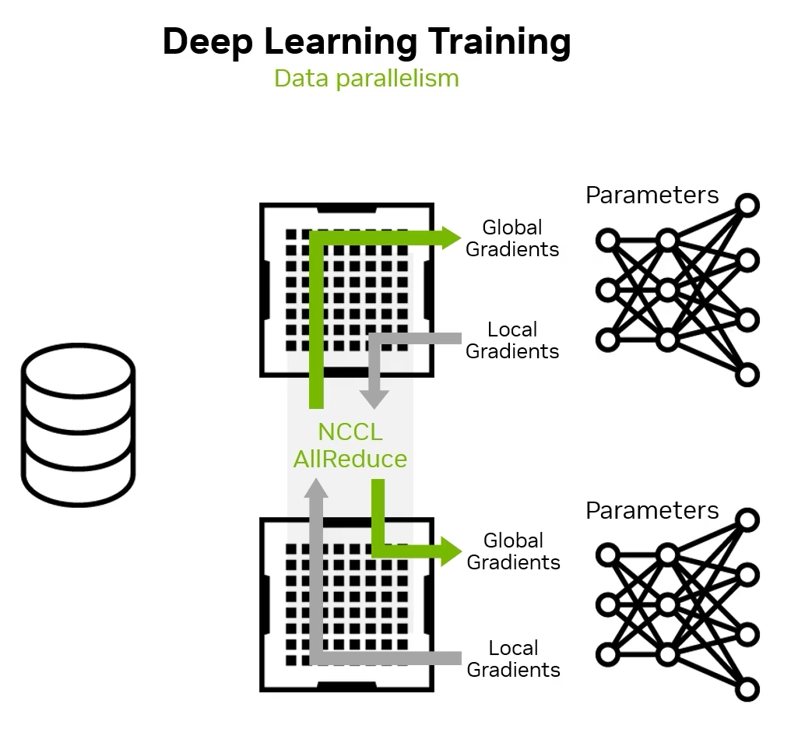
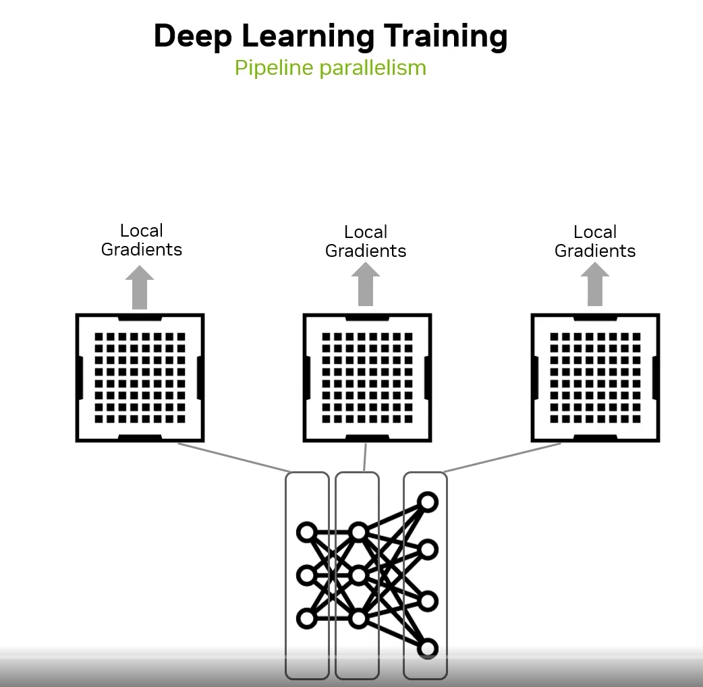
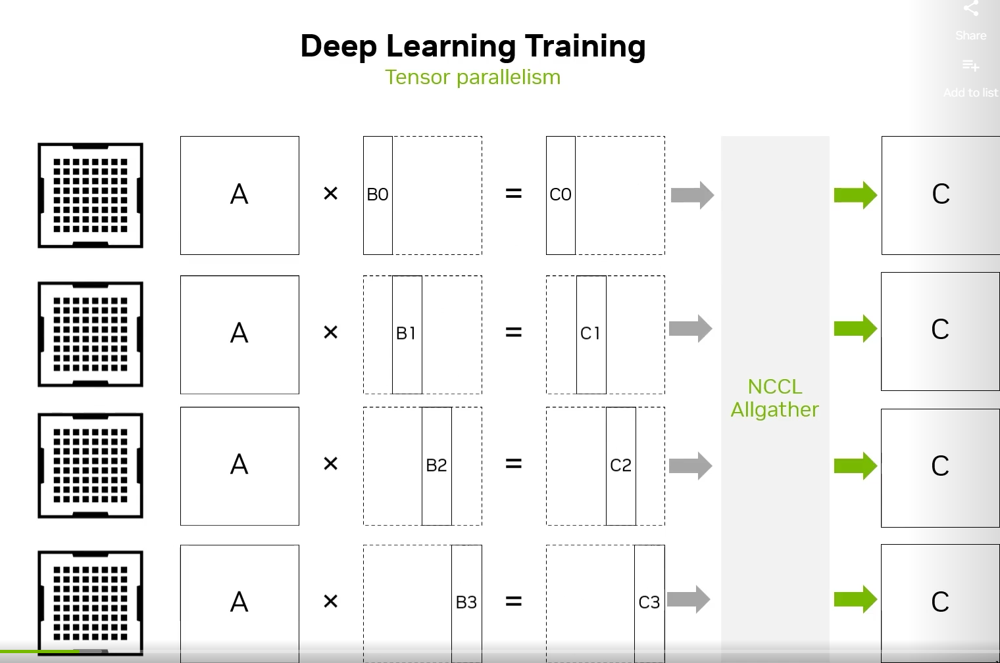
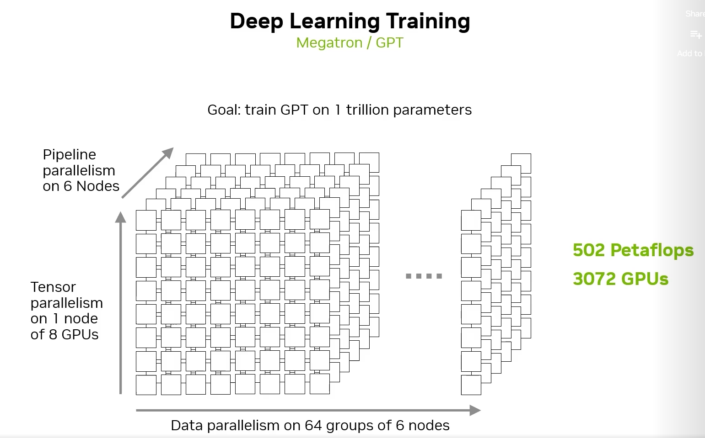
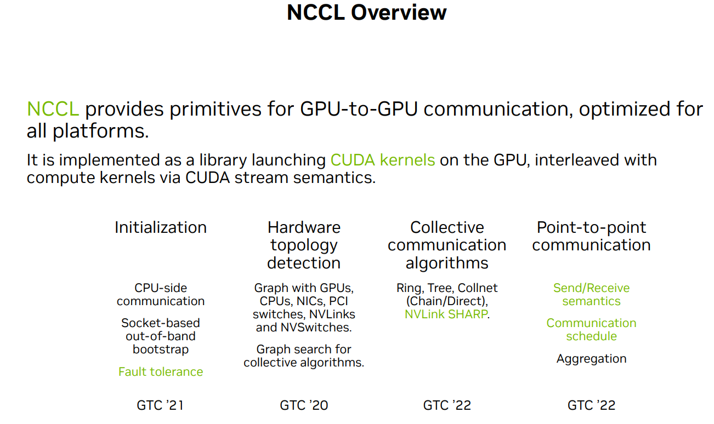
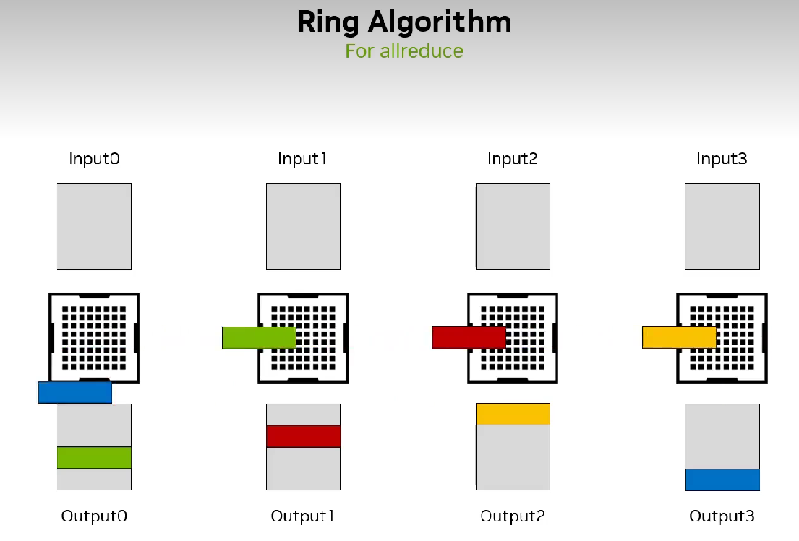
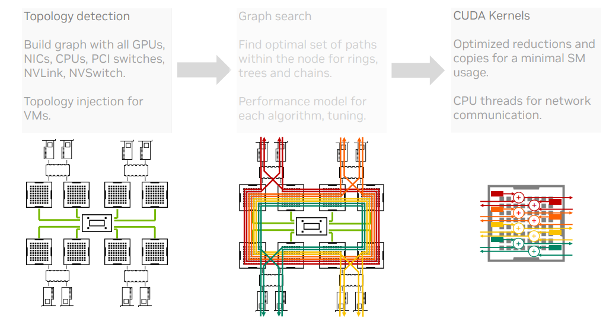

[[toc]]

# GTC 2023 Scaling Deep Learning Training: Fast Inter-GPU Communication with NCCL

[GTC 2023 大会上关于 NCCL 的演讲](https://www.nvidia.com/en-us/on-demand/session/gtcspring23-s51111/) 摘录，来自英伟达 Principal Engineer，Sylvain Jeaugey。

类似于 MPI 在并行计算中的地位，NCCL 是多卡集合通信的核心框架，NV 在 2016 年开始实现了这套框架，文档见[NVIDIA Collective Communication Library (NCCL) Documentation](https://docs.nvidia.com/deeplearning/nccl/user-guide/docs/index.html)。

为什么需要 NCCL？这和模型的并行训练方法有关。最常见的并行训练方法是数据并行，在本地计算完梯度后，进行一次 NCCL 的 All Reduce 操作，让每张 GPU 上的都能同步到全局的梯度信息。缺陷是 GPU 数量增加后，batch size 需要增加，过大的 batch size 可能导致模型精度下降。

第二种是模型并行，把一个大模型的各个部分放置到不同的设备上，好处是可以避免数据并行中 batch size 的增大。但是坏处是这时需要用 NCCL 的 P2P Send/Recv 操作在各个部分进行参数的更新，不同部分的计算效率、参数量不同，可能存在空隙，利用率不足。

或者张量并行，将两个大型张量的计算拆分开，例如下图，使用一个 NCCL AllGather 操作收集各个部分的计算结果。

现在最火的莫过于大型语言模型（LLM），将上面三者结合，是一个并行训练的典型场景：

NCCL 有着丰富的特性，这里的重点是它单机内部的数据传输都是直接写成了核函数、自动拓扑分析（可以指定XML，意味着可以在虚拟机内部搞些骚操作）、Ring/Tree 结构下的集合通信实现、RDMA 支持。

接着 Sylvain 仔细讲了 Ring 和 Tree 结构，以 All Reduce 为例。Ring 很朴素，直接把所有节点穿成环，好处是简单易懂、负载均衡，坏处是线性增加的延迟，因为要把数据切分成 chunk 每个节点过一遍。Tree 则是很自然的二分思想，在树上进行 reduce 操作，延迟自然就低了。NCCL 中会建立两棵树，叶子进行计算，非叶子进行集合通信。建立两棵树是为了保证一个节点在一棵树中是叶子节点，在另一棵树中则是非叶节点；同时可以保证一个节点在两棵树中必定是共有两个父节点和两个子节点。另外就是更加高级和高性能的 Collnet，主打网内计算（In Network Computing），在传输的同时进行 reduce 操作。 

接下来就是 NCCL 的大致工作流程：

最后讲了讲今年他们搞了什么新特性，宣传一波（求求别更新了，老代码还没看懂
