[[toc]]

# GTC 2022 How CUDA Programming Works

[GTC 2022 大会上关于 GPU 架构的演讲](https://www.nvidia.com/en-us/on-demand/session/gtcspring22-s41487/) 摘录，来自英伟达 CUDA Architect，Stephen Jones。Stephen 在 PPT 中给他的演讲换了个主题名字：Why CUDA Programming Is The Way It Is，听完醍醐灌顶，感觉这个标题是很贴切了。

## 最宝贵的资源：内存带宽

首先 Stephen 以安培架构为例，如下图，两个重要的数据，FP64 峰值为 9.7TFLOPS，Memory Bandwith 峰值是 1555 GB/s。

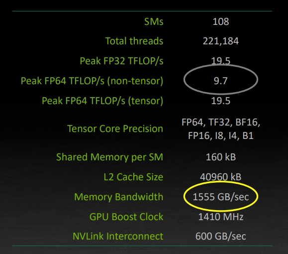

现在算一笔账：假设 108 个 SM 都以 1410 MHZ跑满了，SM 在每个时钟周期能加载 64 个字节，那么峰值应该是他们乘起来，9750 GB/s。但是内存的带宽仅有 1555 GB/s。

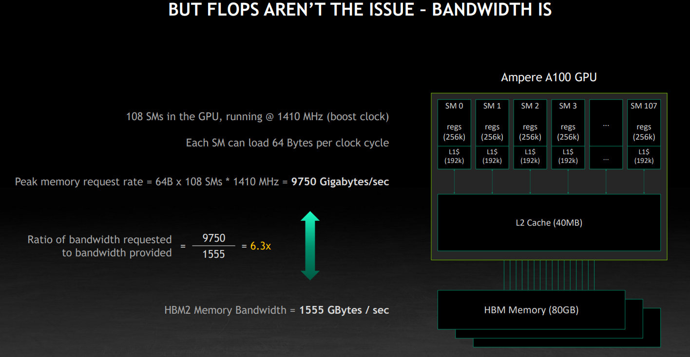

再算一笔账：1555GB/s 的带宽跑满了，如果都是加载 64 比特的，也就是 8 个字节，那应该是 194 GFLOPS。所以说，FLOPS 不是关键限制，GPU 仍然可能面临“显存墙”。

从底层来看，内存单元依赖一个电容元件，要么带电为 1，要么不带电为 0。

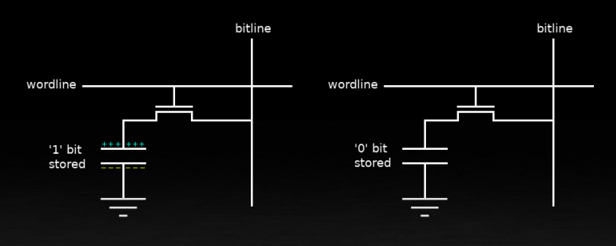

DRAM 芯片由数百万个这样的单元组成一个大的矩阵。数据使用行和列来索引。例如在读取时，一行中所有的单元都被激活，状态被复制到感应放大器上。问题是这样电容会放电，数据就会被破坏。然后根据列索引读取放大器中的数据。显而易见，一个优化就是一次性读取整行数据。但是在换一行读取的时候，需要写回数据，因为前一次的读取导致电容放电了，所以换行读取的开销也很大，切换行的成本是切换列的三倍。下图中的 page，也是指这样的一行。

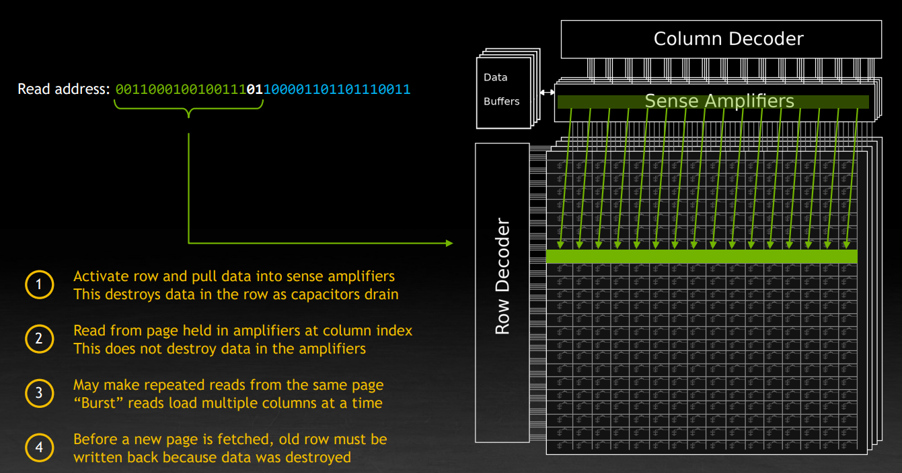

从 DRAM 加载和读取值的速率取决于电容器充电和放电所需的时间。读的时候放电，写回的时候充电。下图是一个概念性的公式。同时注意到，一行是 1KB。

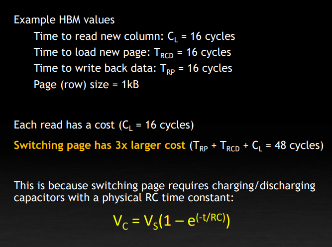

在实验中，也表现也基本符合理论，读取时候的间隔 stride 增大，读取 8 个字节的速度逐渐降低。

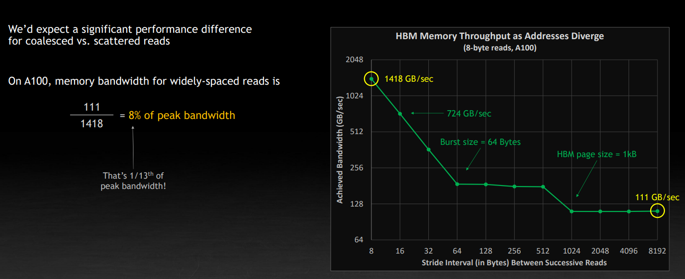

因此在写 CUDA 程序的时候同样要注意内存的布局和数据访问的方式。比如在 CPU 上大家都知道，右侧写法会比左侧满很多

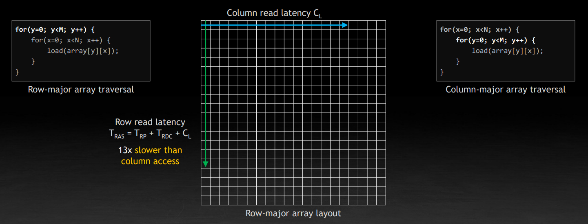

CUDA 中的基本执行单元是 thread block，块中的线程一定是同时处于工作状态的。每个线程运行着相同的代码，但是有自己的寄存器。SIMT 建立在独立的 PC 寄存器上，同时硬件会在 block 启动时自动填充 blockIdx 和 threadIdx，用于区分不同线程，线程控制是隐式的，每个线程有自己的状态。

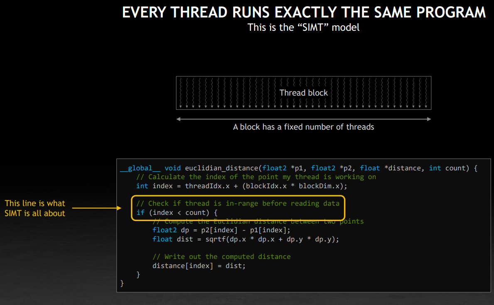

block 被分成了一个个 32 个线程组成的 wrap。如下图，如果每个线程读取 8 字节的数据，那么一个 wrap 会读取连续的 256 字节（因为 threadIdx 是连续的）。

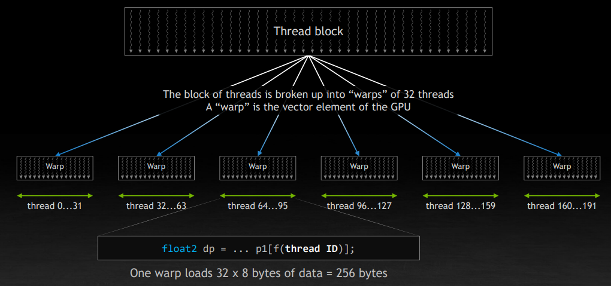

GPU 上的单个 SM 可以管理 64 个 wrap，也就是 2048 个线程。但是如图所示，它实际上只有四个独立的部分，也就是说，同一时间最多同时运行四个 wrap。其他的是在一个 queue 里面等待调度。

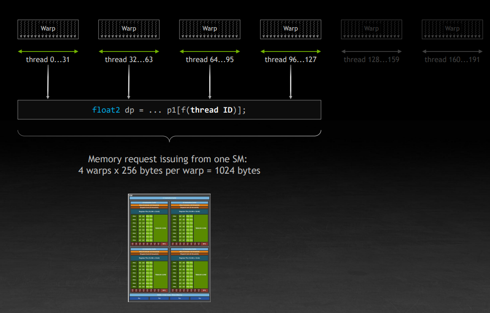

继续刚刚的讨论，那么一个 SM 上实际上跑了四个 wrap，每个 wrap 假设还是加载上面的 256 字节，那么就刚好是 1KB。还记得 1KB 吗？刚好是一个页面（内存单元中的一行）的大小。因此，尽管看上去是在进行随机内存读，但是由于是四个 wrap，共计 128 个线程在同时执行，恰好就读取了内存单元的连续的一行。对应下图中右边折线图左上角的情况。这一定程度上解释了为什么一个 wrap 是 32 个线程，为什么一个 SM 上可以同时运行 4 个 wrap。Stephen 也给出了建议：不要让你的 thread block 的大小超过 128。NV 开源的 CUTLASS  的就有相关优化。

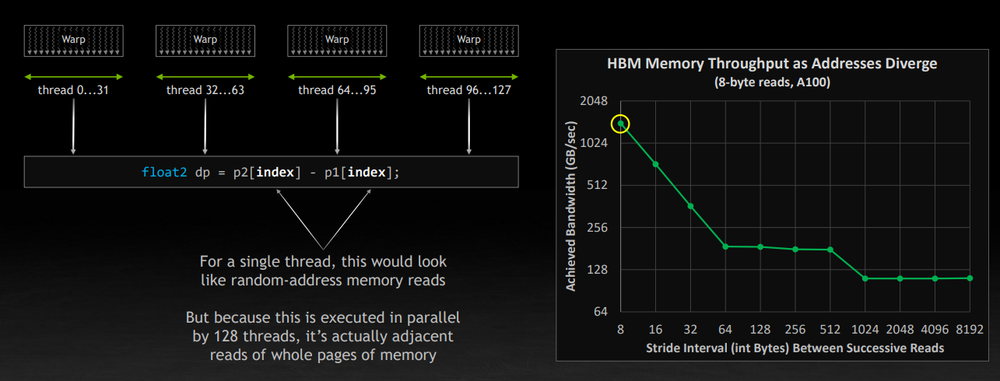

## 占用率

接下来讨论占用率 occupancy，以 A100 为例，108 个 SM，221184 个线程，资源是有限的，就像一个嵌入式系统，要清楚你能够利用到的硬件资源。一旦 grid 被加载，里面的 block 就会被放置到可用的 SM 上。这一步将会尽可能地让 block 广泛分布。

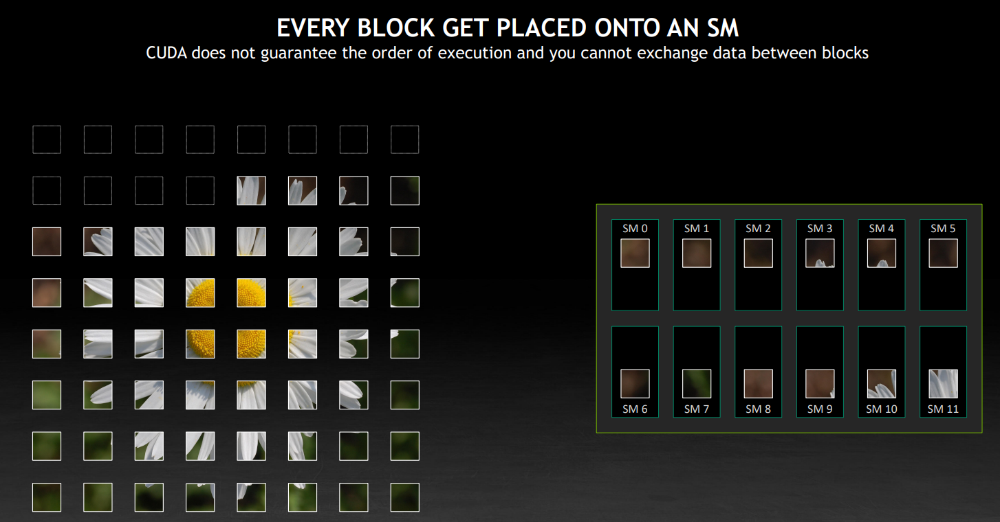

图中每个 SM 上放置了两个 block，实际上取决于 block 的大小，单个 SM 中上限不超过 32 个，尽可能占满 SM。当一个 block 工作完成后，它会退出，硬件会安排另一个 block 到这个 SM 上，继续尽力占满 SM。但是填满 SM 到底是什么意思？

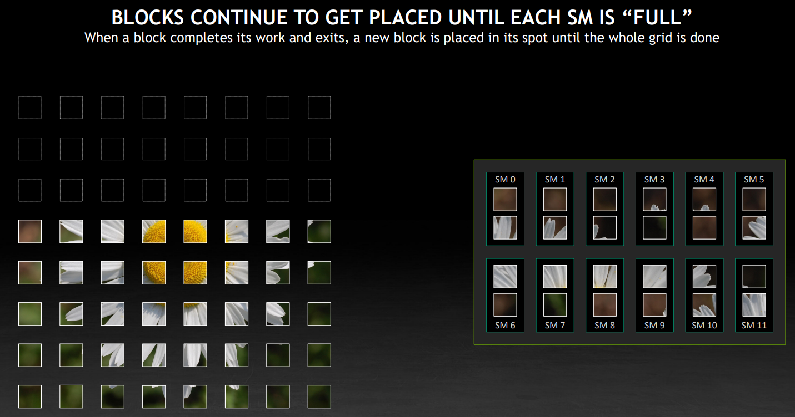

这需要回到 SM 的硬件资源上，最重要的是顶部的四个：最大线程数，最大块数、每个 SM 的寄存器数量、每个 SM 的共享内存总量。另外，block 会尽可能均匀地分布到不同 SM 上，是因为这里的每个 SM 的数据加载带宽限制（由于要支持多个 SM 同时工作，所以每个 SM 的带宽是只占总带宽的一部分）。

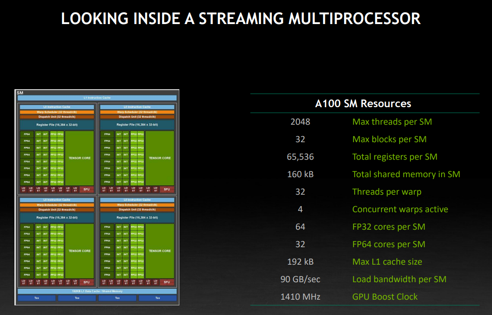

还是以一段程序为例，这里涉及到上面提到的 SM 中的几个资源，这里要注意寄存器是一个 per-thread 的资源需求，所以要乘以 block 内的 thread 数量。

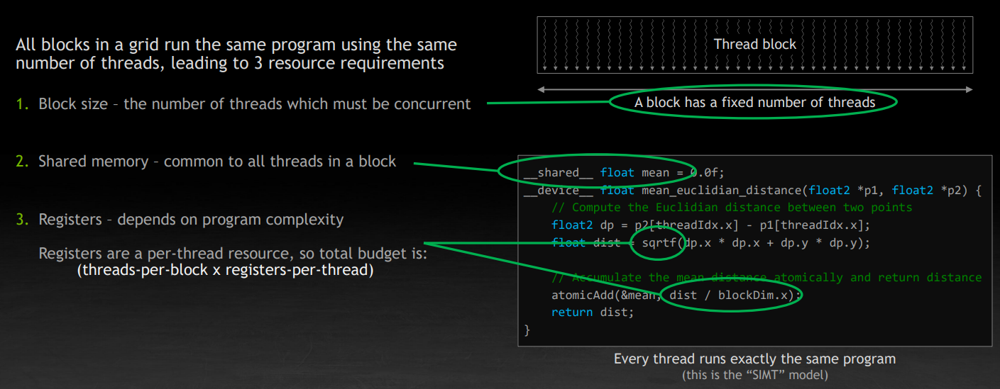

下面讨论一个 block 是依据什么被放到 SM 上的，注意一个 block 永远不会横跨两个 SM。如果没有足够的资源，SM 会放弃运行该 block。block 是保障并行性的最大元素，块内可以通过共享内存进行数据交换和线程同步，块内的线程总是同时处于工作状态。

如下图，右侧给出了一个虚拟的 block 的资源需求。我们希望尽可能多的 block 工作在 SM 上，但是由于共享内存不足，只能放三个 block。假设共享内存需求从 64KB 变成了32 KB，那么只能放 4 个，限制条件又变成了寄存器。但是，只从 block 的执行效率上来看，我们快了 33%（如果我们忽略共享内存调整，对执行速度的潜在的影响）。

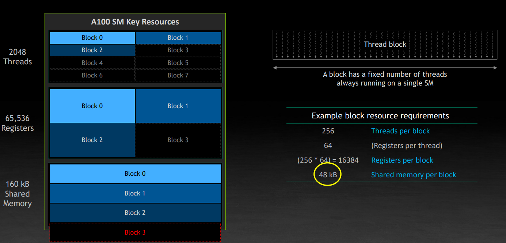

现在考虑另一个 grid，它不需要共享内存，每个线程所需的寄存器数量也比较少。事实上这是一个典型的排序、数据拷贝等用途的 kernel。那么 GPU 会尝试将它放到之前的空隙里面。

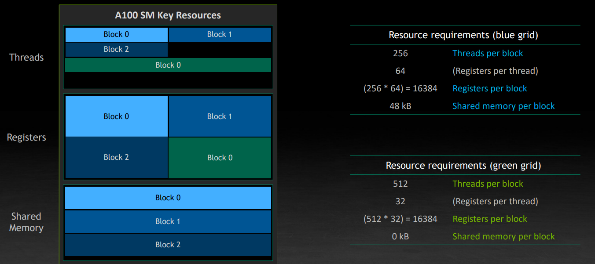

这里也蕴含了另一个重要的点，独立的任务可以同时运行在 GPU 上，比如下图中的不同 Stream 间，可能有计算和数据拷贝的交错，也就是上图讨论的任务调度的技巧，也称为 oversubscription。

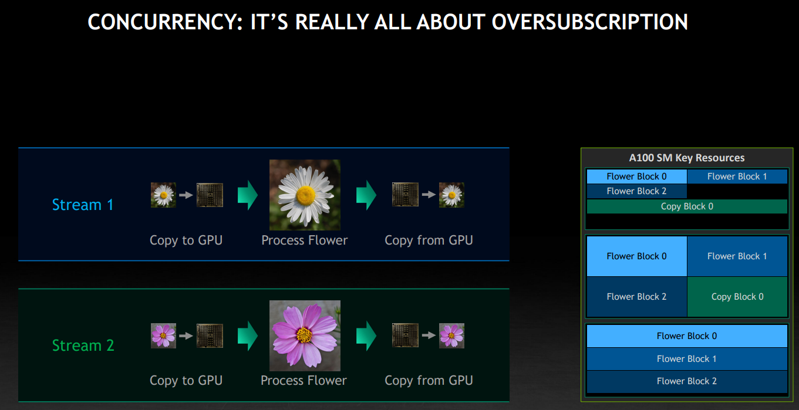

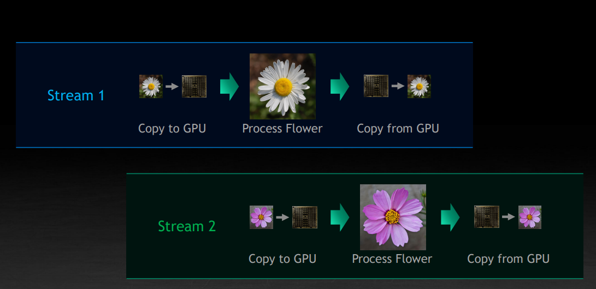
