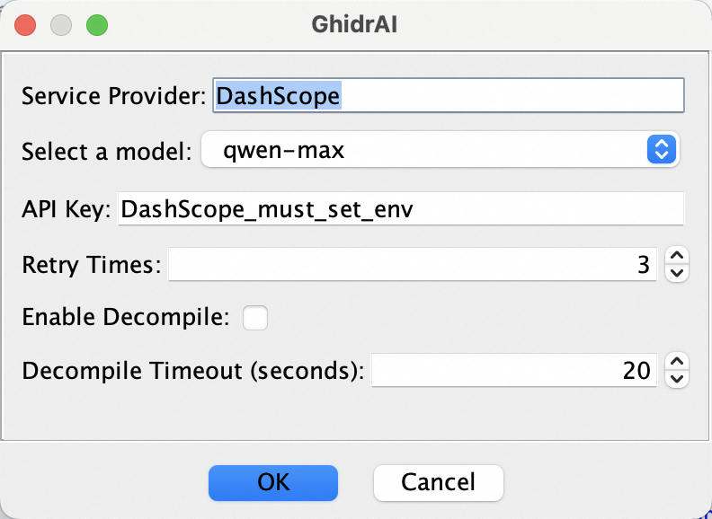
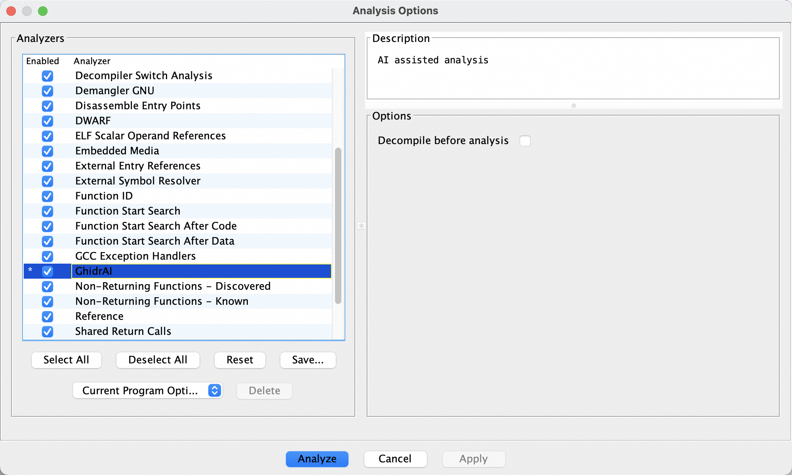
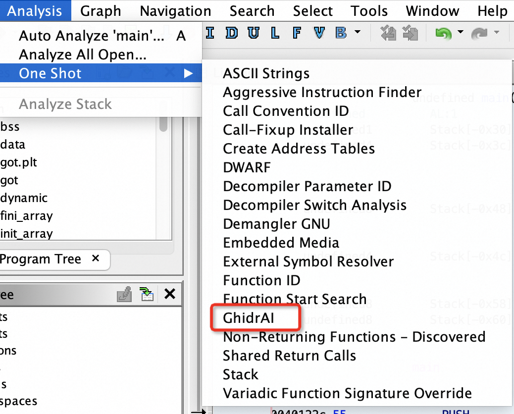

[[toc]]

项目地址 https://github.com/Forsworns/GhidrAI

## 背景介绍

如果你做过一些逆向工程，那么一定听说过 IDA Pro，但是很可惜，IDA 太贵了。那有没有可以白嫖的类似工具呢？[Ghidra](https://github.com/NationalSecurityAgency/ghidra) 是 GitHub 上的一款开源逆向工程工具，使用 Java 开发，天然具有跨平台的特性。目前它的社区仍然十分活跃。与 IDA 类似，它也提供了接口供用户进行插件开发。

[Gepetto](https://github.com/JusticeRage/Gepetto) 是 IDA Pro 的一款网红插件（还参加了 IDA 插件大赛但是很可惜没拿奖），问世于前年 ChatGPT 刚刚出圈的时候，所以受到了大量关注和 star。但是很可惜，我买不起 IDA 也没法获取到 OpenAI 的服务。于是在去年萌生了为 Ghidra 开发一个类似插件的想法，一定是要可以白嫖的那种！

但我最初走偏了，效仿 NBA 球星杜兰特，选择一条最艰难的道路，想在 Ghidra 里面直接跑 Python 代码，从而直接利用 AI 在 Python 的生态。在这里我花了不少时间折腾 Ghidra 的 Python3 插件 [Ghidrathon](https://github.com/mandiant/Ghidrathon) 和 [Jep](https://github.com/ninia/jep)。当时也碰到了一些问题，很感谢 Ghidrathon 的维护者最后帮忙解决了。
但是随着时间的发展，可以白嫖的途径越来越多，比如我最后选用的 [阿里云 DashScope][AliyunURL]，模型上新都会有免费体验的时间；开源社区也有很多一键搭建本地 LLM 服务的项目。而且在我们的需求场景下，模型的输入和输出都很长，网络通信的这点耗时和推理用时比起来根本不值一提。于是我意识到：人生苦短，我不能再折腾 Python 了。

抱着上述想法，终于在这次过年的时候，我开发了插件 [GhidrAI][GhidrAIURL]。由于本人不是专业的 Java 开发人员，如果你发现代码写得很烂，敬请斧正，来者不拒。

## 其实就是项目 README 翻译

GhidrAI 是一个 Ghidra 扩展，使用 [阿里云 LLM 服务][AliyunURL] 来解释函数的作用，并自动重命名其变量。最重要的是，这些服务是免费的！

### 环境需求
目前仅在 Ghidra 10.4 上验证了 GhidrAI。注意：Ghidra 10.4 需要 [JDK 17 64-bit](https://adoptium.net/temurin/releases/)。

### 构建 GhidrAI
使用以下步骤为您的环境构建 GhidrAI

- 从 [此处](https://github.com/NationalSecurityAgency/ghidra/blob/stable/GhidraDocs/InstallationGuide.html#InstallationNotes) 安装 Ghidra。
- 从 [此处](https://gradle.org/releases) 安装 Gradle。
从 [此处](https://github.com/Forsworns/GhidrAI) 下载最新的 GhidrAI 发布版。

在 GhidrAI 源目录中运行以下命令：
注意：**您可以选择设置名为 `GHIDRA_INSTALL_DIR` 的环境变量，而不是指定 `-PGHIDRA_INSTALL_DIR`。**
```bash
gradle -PGHIDRA_INSTALL_DIR=<Ghidra 安装的绝对路径>
```
如果成功，您将在 GhidrAI 源目录中找到一个名为 `dist` 的新目录，其中包含您的 GhidrAI 扩展（.zip）。如果您遇到任何问题，请打开一个新问题。（运行中的问题请提供 ` ~/.ghidra/.ghidra_${VERSION}/application.log` 中的日志文件。）

### 安装 GhidrAI
使用以下步骤将您的 GhidrAI 扩展安装到 Ghidra：

- 注意： **对于 [阿里云 DashScope][AliyunURL]，您必须使用 DASHSCOPE_API_KEY 环境变量。**
- 启动 Ghidra
- 转至 `File > Install Extensions...`
- 点击绿色 + 按钮
- 导航到您之前构建的 GhidrAI 扩展（.zip）
- 点击 `确定`
- 重新启动 Ghidra

或

您可以直接将 GhidrAI 扩展（.zip）解压缩到 `<Ghidra 安装的绝对路径>\Ghidra\Extensions`，Ghidra 将在下次启动时提示您配置 GhidrAI。


### 使用 GhidrAI
**选中** 函数并点击鼠标右键，可以找到 GhidrAI 对应的选项。图中右边的紫色注释显然是用 AI 生成的。


点击 `Tools > GhidrAI`，能够找到配置项的对话框，配置项的更多细节可以去读项目中的说明 [说明](https://github.com/Forsworns/GhidrAI/blob/main/data/README.md).



GhidrAI 也提供了一个自动的分析器，你可以通过 `Analysis > Auto Analyze ...` 或 `Analysis > One Shot` 找到它。





## 画个大饼
我对这个项目还有一些想法，比如：
- 首先自然是支持更多的白嫖/付费 LLM 服务途径，去薅各个云厂商的羊毛。
- 更一般的支持 [One-API](https://github.com/songquanpeng/one-api) 的接口，便捷地请求本地服务。
- 支持多个模型生成的结果进行对比，或允许交互选择多个潜在结果，类似现在各类代码补全工具的推荐功能。
- 现在的实现其实是非常粗暴的，每次会话并不会携带上下文。希望通过携带更长的上下文，拿到更精确的分析结果，但是相应得响应会更慢？

[AliyunURL]: https://help.aliyun.com/zh/dashscope/developer-reference/activate-dashscope-and-create-an-api-key
[GhidrAIURL]: https://github.com/Forsworns/GhidrAI