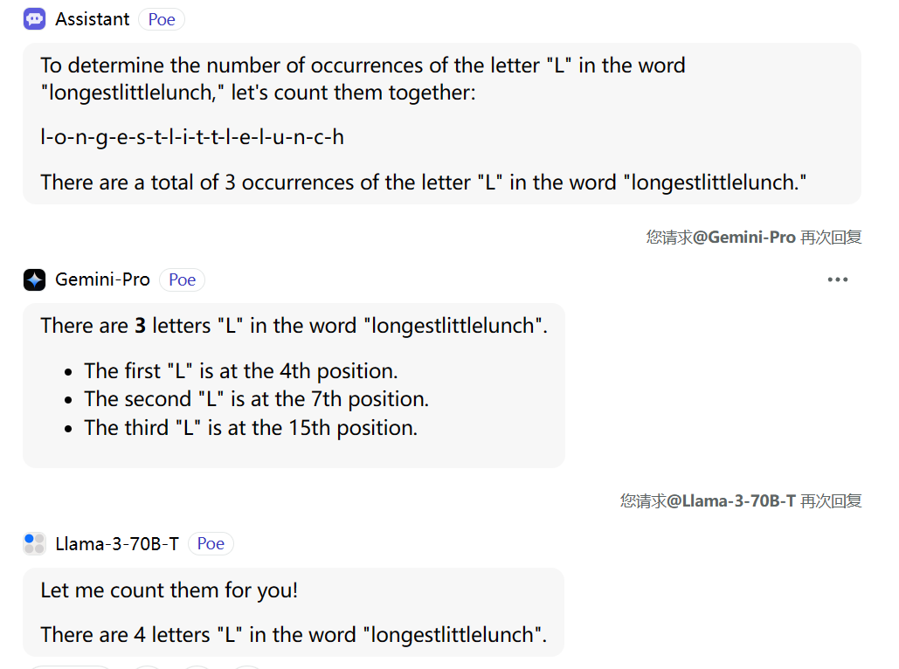

[[toc]]

前段时间 Andrej Karpathy 大神发了视频手把手带着大家了解 LLM 使用的 Tokenizer，记录一下。

[教学仓库地址](https://github.com/karpathy/minbpe)

[视频地址](https://www.youtube.com/watch?v=zduSFxRajkE4)

视频中演示的应用，对不同的 tokenizer 的分词结果做了[可视化](https://tiktokenizer.vercel.app)

# 引入

首先来看几个问题，实际上它们都和 tokenizer 有关：

- 为什么 LLM 不能拼写单词
- 为什么 LLM 不能做一些很简单的字符串操作，比如反转字符串
- 为什么 LLM 在非英语任务上表现差
- 为什么在简单数学任务上 LLM 的表现差
- 为什么 GPT-2 在编写 Python 代码方面有困难
- 为什么 LLM 看到 `<end-of-text>` 就终止了
- Open AI 的 "Trailing space" 提示是什么用意
- 为什么 LLM 看到 "SolidGoldMagikarp" 就出错了
- 为什么在使用 LLM 时，我应该使用 YAML 而不是 JSON

接着 Andrej 在演示应用中测试了几个不同的 Tokenizer 的效果，发现 GPT-2 在处理 python 代码时，倾向于将每个空格划分为独立的 token，导致缩进中出现了大量冗余 token；而 GPT-4 使用的 cl100k_base 在处理 python 代码时，对缩进的处理更加智能。同时，GPT-4 划分出的 token 数量远小于 GPT-2。当然 token 也不是越少越好，相当于要找到一个平衡点，信息足够密集但是又可以被划分开。

# 基础的字节对编码

python 中字符串以 unicode 编码，借助 `ord` 方法可以查看单个字符的码点。能不能简单地使用这些数字作为输入呢？
因为这会导致我们模型的词汇量特别大，unicode 有 15 万码点，并且还在活跃地扩充中。（以 transformer 为例，导致最终用于预测的 softmax 层节点过多，要在 15 万个可能中预测一个；过大的 token 数，也意味着 embedding 要足够大，导致 transformer 模型本身的规模也变大了，上下文也会显著增加），因此我们要找到一个好的编码。

unicode 下的三种编码类型，UTF-8, UTF-16, UTF-32，将 unicode 转换为二进制字节流。我们更偏向于使用 UTF-8，因为后两者都会让我们的字节流中出现大量冗余的 0。直接拿字节流显然也是不好的，单个字节 256 个可能，完全是在预测字节序列。而且所有的输入文本都会被拉伸为很长的字节流表示，transformer 的注意力 context 会被浪费掉，特别是很多模型的 context 是很有限的。Andrej 在这里实际上展示了一篇论文，MEGABYTE: Predicting Million-byte Sequences with Multiscale Transformers。

于是出现了字节对编码算法，Byte Pair Encoding（BPE），Andrej 再次引用了维基百科来介绍它。实际上是一种无损压缩算法，每一轮会将当前数据转中最常见的一对编码，替换为一个新的编码，写入到字典中，循环这个过程直到达到设定的词汇量上限。（和 LZ77 等无损压缩算法不同，BPE 保证了编码后还是之前的编码数据类型，并保留了相邻 token 的相邻关系。）在大量的文本上完成训练后，就可以得到一个通用的编码字典，这里使用的训练文本和 LLM 的训练是独立的，可能不一致。训练集中的不同语言的密度，将会影响学习到的字典对它是否进行有效的压缩，决定了它最终在 token 空间中的密度。如果训练集中有更多中文，那显然更多中文的用词习惯将会被学习到，编码后输入给 LLM 的中文序列也会更短。

Andrej 在这里手写了一个基础的的 BPE encoder/decoder 用作 tokenizer。 

# OpenAI 更为先进的 tokenizer

GPT-2 的论文，Language Models are Unsurpervised Multitask Learners，介绍了基础的 BPE 算法面临的问题：如果文本中包含了词语 dog，它在文章中以 "dog,"，"dog!" 等形式大量出现，那 BPE 显然会讲这些相邻字符合并到字典中进行压缩，显然这很低效。于是他们使用了正则表达式，添加了人工先验。

在 OpenAI 的 github 上查看 GPT-2 的代码仓库，会发现一个 [`gpt-2/src/encoder.py`](https://github.com/openai/gpt-2/blob/master/src/encoder.py)，里面有他们使用的正则：

```python
regex.compile(r"""'s|'t|'re|'ve|'m|'ll|'d| ?\p{L}+| ?\p{N}+| ?[^\s\p{L}\p{N}]+|\s+(?!\S)|\s+""")
```

这里主要做的就是把字符串拆分开，数字和字母拆分开，保留 `'s`,`'ve` 这样的 token（源码上有段注释，表明了这里实际上有缺陷，即忽略了大写的情况，只匹配了小写，我们在后面将会看到 cl100k 修复了它）。值得注意的是，它还会保留单词前的单个空格。比如 `----you` 将会被分割成 `---` 和 `-you`，这里 `-` 代表空格。

遗憾的是 GPT-2 开源的只是推理代码，而非训练代码，因此我们没法给定文本训练一个自己的 tokenizer。

OpenAI 有另一个公开的 tokenizer 库，[tiktoken](https://github.com/openai/tiktoken) 库，它是由 rust 写的！但是同样它只是一个推理库，无法进行训练。

GPT-4 的 cl100k 中使用的正则表达式可以在 tiktoken 的[源码中找到](https://github.com/openai/tiktoken/blob/1b9faf2779855124f05174adf1383e53689ed94b/tiktoken_ext/openai_public.py#L85)，

```python
r"""'(?i:[sdmt]|ll|ve|re)|[^\r\n\p{L}\p{N}]?+\p{L}+|\p{N}{1,3}| ?[^\s\p{L}\p{N}]++[\r\n]*|\s*[\r\n]|\s+(?!\S)|\s+"""
```

这个新正则表达式中，值得关注的点除了 GPT-2 中的大小写问题被修复了，还有就是现在只会匹配长度为 1-3 的数字，不会合并超过三位数字，以防 token 中出现很长的数字。

回到 GPT-2 的 encoder.py，会发现 OpenAI 的 encoder、decoder 确实是类似 Andrej 前面手写的 BPE tokenizer。 但是这里奇怪的一点是他们同时还有一对 byte encoder 和 byte decoder。用于 BPE encoder/decoder 前后。

# 特殊 token

除了 BPE 算法中组合出的 token，我们也可以加入一些人工设置的特殊 token，区分数据的不同部分。

例如，GPT-2 的 token 字典的规模是 50257，这个规模是怎么来的呢？单个字节是 256，然后它们在训练时做了 50000 次合并，最后剩余一个是 `'<|endoftext|>'`。打印下字典，也会发现事实如此。类似的，微调过的对话模型 gpt-3.5-turbo 使用了 `<im_start>`、`<im_end>` 用作特殊的 token 标记对话的开始和结束。

tiktoken 也允许我们加载某个基础的 tokenizer，然后创建自己的特殊 token 去拓展它。

# sentencepiece

[sentencepiece](https://github.com/google/sentencepiece) 是一个常用的 tokenizer 库，它不仅可用于推理，还允许你训练自己的 tokenizer，Llama 和 Mistral 系列的模型都是用了它。

它和 Tiktoken 不同。Tiktoken 会首先获取  unicode 码点，然后用 UTF-8 编码成为字节流，再运行 BPE 合并字节。而 sentencepiece 会直接在 unicode 码点的层级上运转。因此会有一些罕见的码点不会经常出现，可以用超参数 `character_coverage` 来控制，稀有码点会被直接转换成 `UNK` token。如果开启了 `byte_fallback` 选项，则会编码到 utf-8 并对这些字节进行编码。

sentencepiece 有很多历史包袱，可配置的参数特别多，Andrej 从 Llama-2 的配置中抄了一段过来。值得注意的是里面的 normalization 相关的选项完全可以关掉，这是之前 nlp 基础任务做正则化用的，但是显然 LLM 可以接收原始的字符串。另外，sentencepiece 有 sentence 的概念，这是因为当年曾有一种想法是在一堆独立的句子上训练 tokenizer，但是现在大家都在完整的文章上训练了，而且定义到底什么是一个句子，是很困难的。

# 总结

回到最初的几个问题：

- 为什么 LLM 不能拼写单词

因为字符被组合成了 tokens，其中一些 token 很长，因此模型对字符的理解会较弱。在视频中 Andrej 让 ChatGPT 去数一个词中的特定的字符个数，得到了错误的答案。我在 Poe 上用不同模型进行了尝试，如下图，只有 Llama-3 答对了。



- 为什么 LLM 不能做一些很简单的字符串操作，比如反转字符串

同样由于缺乏对字符串的理解能力，LLM 也不擅长做这件事。给它一个算法，然后让它模拟倒是可行。

- 为什么 LLM 在非英语任务上表现差

LLM 训练时候小语种数据不足，tokenizer 本身也没有经过良好训练。

- 为什么在简单数学任务上 LLM 的表现差

加法类似一种字符级别的算法，但是基于 BPE，数字会被合并成 token，导致难以处理。视频中推荐阅读博客 [Integer tokenization is insane](https://www.beren.io/2023-02-04-Integer-tokenization-is-insane/)。

- 为什么 GPT-2 在编写 Python 代码方面有困难

如全文所述，GPT-2 处理 python 的缩进时，把每个空格都当做了一个 token，这也影响到了上下文和 attention 的计算。在 GPT-4 中进行了改进。

- 为什么 LLM 看到 `<end-of-text>` 就终止了

因为在 tokenizer 中使用它作为了特殊标记，可能是在训练时用来分割语料。特殊标记可能成为 LLM 的攻击点。

- OpenAI 的 "Trailing space" 提示是什么用意

使用 OpenAI 的生成模型时，输入 Prompt 让它填充，例如 "Here is a tag lien for the ice cream shop:"。但是如果换用"Here is a tag lien for the ice cream shop: "，即句尾多加一个空格，就会收到 "Trailing space" 警告。

这也是前文提过的，OpenAI 的 tokenizer 使用的正则，会保留单词前的单个空格，在 BPE 中会被合并到 token 中。sentencepiece 中甚至有一个选项可以在句子中添加一个空格前缀，以防止这种现象出现。

多加了一个空格，就导致当前的 prompt 在转换成 token 后，出现了一个远离正常的 token 分布的奇异 token，会影响模型预测出的概率分布。这些 LLM 是构建于 token 之上的，而非我们常规认知里的的字符。

- 为什么 LLM 看到 "SolidGoldMagikarp" 就会输出一些混乱的结果

视频中推荐了文章 [SolidGoldMagikarp (plus, prompt generation)](https://www.lesswrong.com/posts/aPeJE8bSo6rAFoLqg/solidgoldmagikarp-plus-prompt-generation)。文中对 token 的嵌入做了聚类，然后发现了一些奇怪的 token 被聚集在了一起。这些 token 是从哪里来的，字面上看，它们毫无意义。有趣的是，如果你向模型输入包含这些 token 的 prompt，会得到混乱的回复。

深入调查后，发现这个 SolidGoldMagikarp 其实是一名 reddit 用户。于是，可能是因为训练 tokenizer 的数据和训练语言模型的数据不同，而碰巧 tokenizer 的训练数据中包含了大量来自 reddit 的文本，然后 SolidGoldMagikarp 他发了很多帖子，或者被多次回复引用，然后被 BPE 算法学到了，合并成了一个 token。但是当训练语言模型的时候，并没有那部分 reddit 数据，于是这个 token 就不会被激活，它会被随机初始化，但是永远不会被采样到，也不会被更新，有点像未分配的内存。然后在推理的时候，你触发到了这个 token，那么就是采样到了未经初始化的嵌入，导致了未定义的行为。

无端联想：前两天看了个很乐的文章，百度贴吧弱智吧的语料是很好的训练来源哈哈

- 为什么在使用 LLM 时，我应该使用 YAML 而不是 JSON

YAML 这种结构化文本在 GPT-4 上会消耗更少的 token，更加高效，更加经济。
