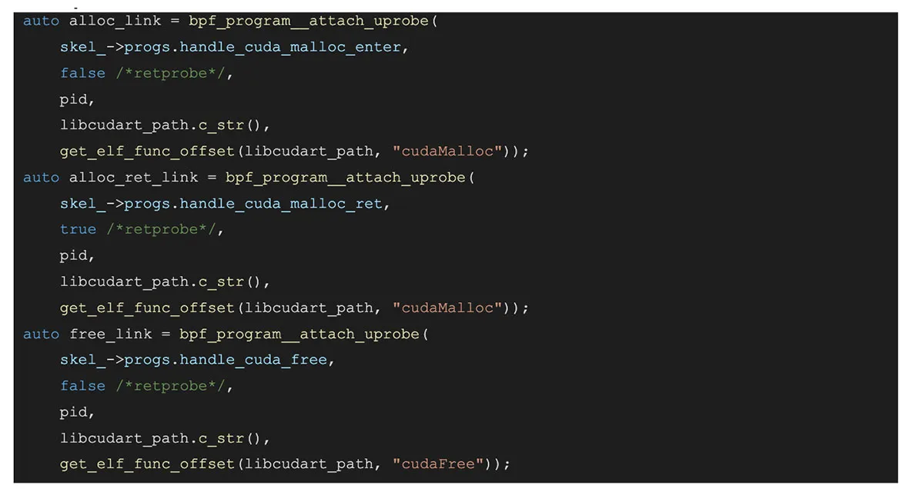
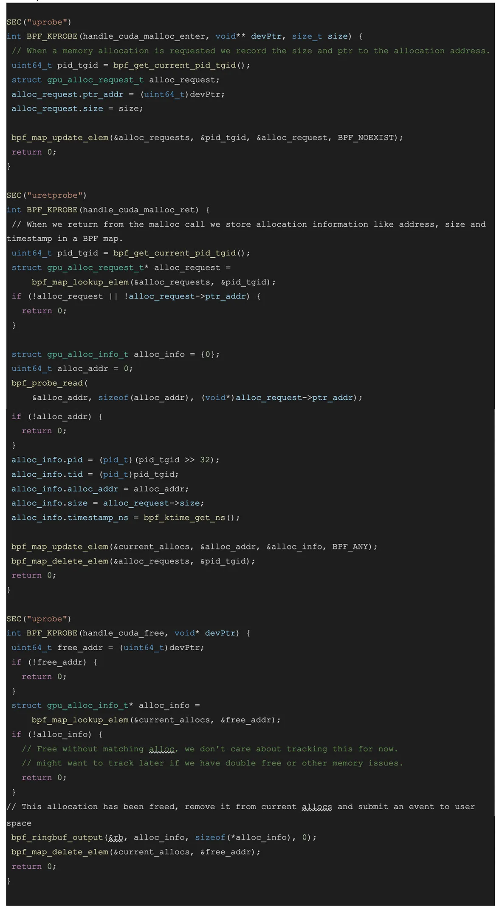

[[toc]]


# Meta 的 GPU 可观测建设

最近注意到一篇[博客](https://atscaleconference.com/systemscale-ai-observability/)，里面讲了 Meta 是如何在各个层面上对 AI 系统进行可观测建设的。

从底层到上层都是一些耳熟能详的工具，或者已经火过一把的 Meta 开源项目，例如：

- [Meta Dynolog](https://github.com/facebookincubator/dynolog)
- Nvidia’s Datacenter GPU Manager (DCGM)
- [Pytorch Profiler](https://pytorch.org/docs/stable/profiler.html)
- [Pytorch Kineto](https://github.com/pytorch/kineto)

但是里面有一个有趣的项目：[Strobelight](https://github.com/facebookincubator/strobelight)，一个基于 BPF 的 GPU 可观测工具、神秘啊，别的项目博客中都贴了仓库地址，这个明明能在 github 搜到，但是没贴链接 = =。

具体而言，Strobelight 是一个在 Meta 的所有主机上运行的守护进程，既充当分析器又充当分析器编排工具。可以通过某些事件（例如 OOM 事件）触发分析。Strobelight 由多个子分析器组成。通过这些子分析器，它能够从机群中的任何主机收集各种性能分析，如 CPU 堆栈、内存快照和Python 堆栈。Strobelight 在许多子分析器中依赖于 BPF。他们最近还向 Strobelight 的分析器套件中添加了基于 BPF 的 CPU->GPU 分析器。

应该就是文中的典型用例 Gpusnoop，它是一个基于 BPF 的 profiler 套件。它能 hook 到一系列有趣的 GPU 事件上，例如 CUDA 核函数加载、CUDA events 同步、显存管理事件，也支持 pytorch 相关事件。

# 案例分析：基于 BPF trace CUDA 显存管理

通过使用 uprobes attach 到 CUDA 显存管理事件，gpusnoop 可以用于构建显存分配的时间线，并检测泄漏的显存的调用栈。

下面是简化后的代码，它将 attach 到 cudaMalloc 和 cudaFree 事件，并记录所有已释放和未释放的显存，以及它们的大小和调用栈。

用户侧代码示例：



BPF 侧代码示例：




上述代码 attach 到 cudaMalloc 事件，并跟踪请求的分配大小，然后 attach 到 cudaMalloc 的返回事件，获取分配到的地址。它使用这些数据来跟踪未释放的显存分配及其大小。然后，我们可以使用这些数据，在任何时刻跟踪未释放的显存分配及其大小和调用栈。我们还可以可视化这些数据，并检测显存泄漏，或者使用它来缩小使用最多显存的调用栈范围。

# Strobelight 代码分析：基于 BPF trace CUDA 核函数加载

Gpusnoop 的代码应该没有开源，但是 [Strobelight](https://github.com/facebookincubator/strobelight) 里面倒是确实有一个 trace CUDA 核函数加载的 BPF [代码示例](https://github.com/facebookincubator/strobelight/blob/main/strobelight/src/profilers/gpuevent_snoop/GpuEventSnoop.cpp)。

全局定义了一个 64M 的 BPF Ring Buffer 用来存放 BPF 侧 trace 到的 `gpukern_sample` 信息，它的定义如下，也就是 `cudaLaunchKernel` 的参数，和一些 cpu 侧的信息、栈。

```cpp
struct gpukern_sample {
  int pid, ppid;
  char comm[TASK_COMM_LEN];
  uint64_t kern_func_off;
  int grid_x, grid_y, grid_z;
  int block_x, block_y, block_z;
  uint64_t stream;
  uint64_t args[MAX_GPUKERN_ARGS];
  size_t ustack_sz;
  stack_trace_t ustack;
};
```

BPF 侧代码比较简短，完整贴上来了

```cpp
#define SP_OFFSET(offset) (void*)PT_REGS_SP(ctx) + offset * 8

SEC("uprobe")
int BPF_KPROBE(
    handle_cuda_launch,
    u64 func_off,
    u64 grid_xy,
    u64 grid_z,
    u64 block_xy,
    u64 block_z,
    uintptr_t argv) {
    struct gpukern_sample* e = bpf_ringbuf_reserve(&rb, sizeof(*e), 0);

    struct task_struct* task = (struct task_struct*)bpf_get_current_task();

    e->pid = bpf_get_current_pid_tgid() >> 32;
    e->ppid = BPF_CORE_READ(task, real_parent, tgid);
    bpf_get_current_comm(&e->comm, sizeof(e->comm));

    e->kern_func_off = func_off;
    e->grid_x = (u32)grid_xy;
    e->grid_y = (u32)(grid_xy >> 32);
    e->grid_z = (u32)grid_z;
    e->block_x = (u32)block_xy;
    e->block_y = (u32)(block_xy >> 32);
    e->block_z = (u32)block_z;

    bpf_probe_read_user(&e->stream, sizeof(uintptr_t), SP_OFFSET(2));

    // Read the Cuda Kernel Launch Arguments
    for (int i = 0; i < MAX_GPUKERN_ARGS; i++) {
        const void* arg_addr;
        // We don't know how many argument this kernel has until we parse the
        // signature, so we always attemps to read the maximum number of args,
        // even if some of these arg values are not valid.
        bpf_probe_read_user(
            &arg_addr, sizeof(u64), (const void*)(argv + i * sizeof(u64)));

        bpf_probe_read_user(&e->args[i], sizeof(arg_addr), arg_addr);
    }

    // Read the Cuda Kernel Launch Stack
    e->ustack_sz =
        bpf_get_stack(ctx, e->ustack, sizeof(e->ustack), BPF_F_USER_STACK) /
        sizeof(uint64_t);

    bpf_ringbuf_submit(e, 0);
    return 0;
}
```

用户侧基本就是 libbpf 的脚手架样板。然后需要注意的是因为是用 uprobe，得额外写一个解析 `/proc/$pid/exe` 里每个文件找 `cudaLaunchKernel` 符号的步骤，然后把 attach 上去，这里 `$pid` 是被 attach 的进程。

从 ring buffer 里面 poll 到 `gpukern_sample` 后，触发下面这个回调进行分析
```cpp
static int handle_event(void* ctx, void* data, size_t /*data_sz*/) {
    const struct gpukern_sample* e = (struct gpukern_sample*)data;

    SymUtils* symUtils = (SymUtils*)ctx;

    SymbolInfo symInfo = symUtils->getSymbolByAddr(e->kern_func_off, env.args);

    fmt::print(
        "{} [{}] KERNEL [0x{:x}] STREAM 0x{:<16x} GRID ({},{},{}) BLOCK ({},{},{}) {}\n",
        e->comm,
        e->pid,
        e->kern_func_off,
        e->stream,
        e->grid_x,
        e->grid_y,
        e->grid_z,
        e->block_x,
        e->block_y,
        e->block_z,
        symInfo.name.substr(0, MAX_FUNC_DISPLAY_LEN) +
            (symInfo.name.length() > MAX_FUNC_DISPLAY_LEN ? "..." : ""));

    fmt::print("Args: ");
    for (size_t i = 0; i < symInfo.args.size() && i < MAX_GPUKERN_ARGS; i++) {
    fmt::print("{} arg{}=0x{:x}\n ", symInfo.args[i], i, e->args[i]);
    }
    fmt::print("\n");

    fmt::print("Stack: \n");
    auto stack = symUtils->getStackByAddrs((uint64_t*)e->ustack, e->ustack_sz);
    for (auto& frame : stack) {
    frame.print();
    }
    fmt::print("{:-<40}\n", '-');
    return 0;
}
```
感觉这个项目的难度在于 [symUtils](https://github.com/facebookincubator/strobelight/blob/main/strobelight/src/utils/SymUtils.cpp) 里面的这些 parser 写起来比较难…… BPF 侧还是很简单的

# 为什么是 BPF

所以核心问题是为什么要用 BPF？原始博客中的几个说法感觉说服力并不强，只是从 BPF 的角度去讲了
- BPF 自身的安全性、可编程性：老生常谈。
- 性能开销低：可随时启停，基于 uprobe，存疑。
- 用户无感，不需要用户代码改动。
