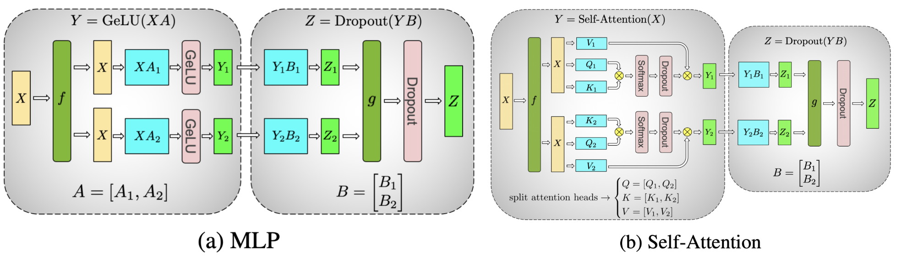
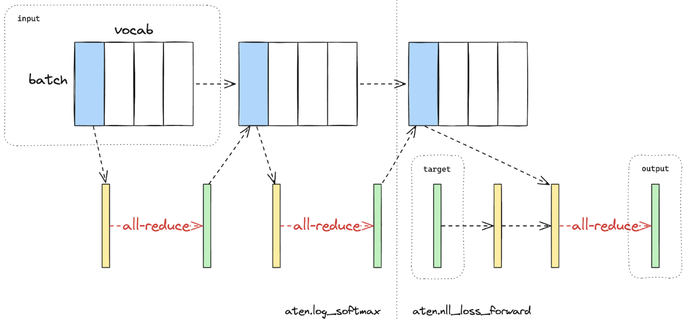
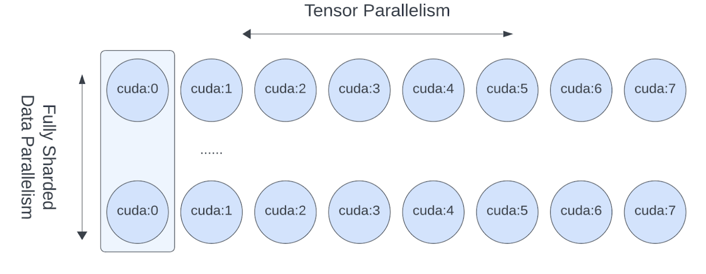

[[toc]]

## Pytorch 张量并行 Tutorial

https://pytorch.org/tutorials/intermediate/TP_tutorial.html

该文档介绍的是如何应用 FSDP (Fully Sharded Data Parallel) 和 TP (Tensor Parallel) 训练 Transformer 类模型。

### TP 是怎么起效的

[Tensor Parallel（TP）](https://arxiv.org/abs/1909.08053) 是一个高效的模型并行方法，本文提到的 [Sequence Parallel (SP)](https://arxiv.org/abs/2205.05198) 是一种特殊的 TP，它在 `nn.LayerNorm` 或 `RMSNorm` 的 sequence 维度上做分片，节省训练期间激活部分的显存占用。当模型变大，这部分占用会很高，所以一般 TP 都是以 SP 的形式实施。

下图展示了 Transformer 模型的 MLP 层和 Self-Attention 层是怎么采用 TP 的方式进行分片的。原始的矩阵乘法都可以被分片处理。



Pytorch TP 的工作流程大致如下：

#### 分片初始化：

- 决定模型各层的并行策略 `ParallelStyle`，调用 `parallelize_module`。
- 并行化的模型参数被转换为 DTensor，DTensor 负责使用分片的计算方法允许并行化的模型。

#### 运行时的前向反向更新

- 根据用户给 `ParallelStyle` 指定的输入输出 DTensor 的规模，使用集合通信方法进行转换。
- 在并行蹭上进行分片后的计算。

### 什么时候应该使用 TP

Pytorch 的 FSDP 已经可以实现多卡上分片计算，但是卡数增多后，FSDP 就会有别的问题：
1. GPU 数量过大时（128/256），FSDP 以来的 `allgather` 等集合通信会被通信耗时影响。通过在 FSDP 之上部署 TP/SP，FSDP 的尺度可以被大幅削减，我们可以在节点内部署 TP/SP，节点间使用 FSDP。
2. 由于收敛性和 GPU 显存限制，全局的 batch size 达到了数据并行的上限，无法继续提升了。TP/SP 成为了唯一的方法去继续拓展到更多的 GPU，这也意味着 GPU 数量和模型规模可以继续扩张。
3. 特定的模型，当本地的 batch size 变小以后，TP/SP 可以返回对 FLOPS 调优的矩阵乘法。

当预训练的时候，很容易达到上限。预训练一个数亿大模型的模型会花很多月，即使使用几千个 GPU。

- 问题 1 很容易碰到，例如 Llama 2 70B 使用 2000 张 GPU 训练了 35 天，多维并行的规模为 2000。
- 当 transformer 模型变大，很快就会碰到问题 2。例如在 Llama 2 的全局 batch size 为 1000 时，即使设置 local batch size 为 1，也不能仅实施 FSDP，因为有 2000 张卡。

### 如何实施 TP

Pytorch TP API 提供的是对模型各层进行分片策略的接口。

- `ColwiseParallel` 和 `RowwiseParallel`：以行/列的方式分片 `nn.Linear` 和 `nn.Embedding`

- `SequenceParallel`: 对 `nn.LayerNorm`, `nn.Dropout`, `RMSNormPython` 等进行分片

- `PrepareModuleInput` 和 `PrepareModuleOutput`: 设定模块的输入输出分片设置，以便采用合适的集合通信操作

以 [Llama2](https://github.com/pytorch/examples/blob/main/distributed/tensor_parallelism/llama2_model.py) 为例，首先借助 `DeviceMesh` 简洁地初始化 NCCL，TP 一般在节点内使用，如下面这个八卡的用例：

```python
# run this via torchrun: torchrun --standalone --nproc_per_node=8 ./tp_tutorial.py

from torch.distributed.device_mesh import init_device_mesh

tp_mesh = init_device_mesh("cuda", (8,))
```

[Llama2](https://github.com/pytorch/examples/blob/main/distributed/tensor_parallelism/llama2_model.py) 的实现中，核心的 `TransformerBlock ` 由 `Attention` 和 `FeedForward` 层组成，`FeedForward` 如下

```python
# forward in the FeedForward layer
def forward(self, x):
    return self.w2(F.silu(self.w1(x)) * self.w3(x))
```

显然可以对 `w1/w3` 按列进行分片，`w2` 按行进行分片，代码如下，不需要关心底层的集合通信，会被自动执行

```python
from torch.distributed.tensor.parallel import ColwiseParallel, RowwiseParallel, parallelize_module

layer_tp_plan = {
    # by default ColwiseParallel input layouts is replicated
    # and RowwiseParallel output layouts is replicated
    "feed_foward.w1": ColwiseParallel(),
    "feed_forward.w2": RowwiseParallel(),
    "feed_forward.w3": ColwiseParallel(),
}
```

类似地，对 `Attention` 模块，我们可以按列分片 `q/k/v` 的投影过程，然后按行对 `wo` 的线性投影进行分片。

```python
layer_tp_plan = {
    # by default ColwiseParallel input layouts is replicated
    # and RowwiseParallel output layouts is replicated
    "attention.wq": ColwiseParallel(),
    "attention.wk": ColwiseParallel(),
    "attention.wv": ColwiseParallel(),
    "attention.wo": RowwiseParallel(),
    "feed_forward.w1": ColwiseParallel(),
    "feed_forward.w2": RowwiseParallel(),
    "feed_forward.w3": ColwiseParallel(),
}
```

基本上模型的分片就完成了，值得注意的是人格对线形层进行按列分片，输出就会被按张量的最后一个维度去分片，而按行分片的线形层则接收在最后一个维度上进行分片的输入。如果在按列/按行分片的线性层间还有别的操作（如 `view()` 操作），需要去调整张量的形状。

Llama2 的 attention 层中就有 `view` 操作。`wq/ wk/ wv` 的线性层是按列分片的，激活张量是在 `num_heads` 维度上进行分片，所以需要调整 `num_heads` 为局部的 `num_heads`。

最后调用 `parallelize_module` 将模型转换到 DTensor 上，集合通信就会被自动注册到各个模块的输入和输出上。

```python
for layer_id, transformer_block in enumerate(model.layers):
    layer_tp_plan = {...}  # i.e. the plan we just generated

    # Adjust attention module to use the local number of heads
    attn_layer = transformer_block.attention
    attn_layer.n_heads = attn_layer.n_heads // tp_mesh.size()
    attn_layer.n_kv_heads = attn_layer.n_kv_heads // tp_mesh.size()

    parallelize_module(
        module=transformer_block,
        device_mesh=tp_mesh,
        parallelize_plan=layer_tp_plan,
    )
```

现在我们已经详细阐述了每个 `TransformerBlock` 的分片计划，通常在第一层中有一个 `nn.Embedding`，最后一层有一个 `nn.Linear`投影层，用户可以选择对第一个 `nn.Embedding` 进行逐行或逐列分片，并对最后一个 `nn.Linear` 投影层进行逐列分片，同时指定适当的输入和输出布局。

```python
model = parallelize_module(
    model,
    tp_mesh,
    {
        "tok_embeddings": RowwiseParallel(
            input_layouts=Replicate(),
        ),
        "output": ColwiseParallel(
            output_layouts=Replicate(),
        ),
    }
)
```

### SP 例子

SP 是在上面所示的 TP 的基础上进行的。基本的 TP 只在注意力模块和前馈模块中分片张量，会复制它们的模块输入和输出（即前向传递中的激活和反向传递中的梯度）。序列并行则在序列维度上进行分片。

在典型的 `TransformerBlock` 中，`forward()` 函数结合了用于正则化的层（`LayerNorm` 或 `RMSNorm`）、注意力层、前馈层和残差连接。例如：

```python
# forward in a TransformerBlock
def forward(self, x):
    h = x + self.attention(self.attention_norm(x))
    out = h + self.feed_forward(self.ffn_norm(h))
    return out
```

在大多数情况下，注意力和前馈模块之外的激活（和梯度）的形状为 [批次大小，序列长度，隐藏维度]。在 DTensor 的术语中，SP 使用 Shard(1) 布局来执行模块的前向传递和反向传递的激活计算。以下代码示例演示如何将序列并行应用于`TransformerBlock` 中的正则化层：

```python
from torch.distributed.tensor.parallel import (
    PrepareModuleInput,
    SequenceParallel,
)

layer_tp_plan = {
    # Now the input and output of SequenceParallel has Shard(1) layouts,
    # to represent the input/output tensors sharded on the sequence dimension
    "attention_norm": SequenceParallel(),
    "attention": PrepareModuleInput(
        input_layouts=(Shard(1),),
        desired_input_layouts=(Replicate(),),
    ),
    "attention.wq": ColwiseParallel(),
    "attention.wk": ColwiseParallel(),
    "attention.wv": ColwiseParallel(),
    "attention.wo": RowwiseParallel(output_layouts=Shard(1)),
    "ffn_norm": SequenceParallel(),
    "feed_forward": PrepareModuleInput(
        input_layouts=(Shard(1),),
        desired_input_layouts=(Replicate(),),
    ),
    "feed_forward.w1": ColwiseParallel(),
    "feed_forward.w2": RowwiseParallel(output_layouts=Shard(1)),
    "feed_forward.w3": ColwiseParallel(),
}
```

可以看到，我们现在使用 `PrepareModuleInput` 将注意力和前馈层的模块输入布局从 `Shard(1)` 修改为 `Replicate()`，并将它们的输出布局标记为 `Shard(1)`。就像 TP 中发生的那样，我们只需要指定输入和输出的张量分片布局，层之间的通信将自动发生。

需要注意的是，在 SP 中，我们假设 `TransformerBlock` 的输入和输出始终在序列维度上进行分片，以便多个 `TransformerBlock` 可以无缝连接。这可以通过显式指定起始的 `nn.Embedding` 层的输出和最终 `nn.Linear` 投影层的输入为 `Shard(1)` 来实现：

```python
model = parallelize_module(
    model,
    tp_mesh,
    {
        "tok_embeddings": RowwiseParallel(
            input_layouts=Replicate(),
            output_layouts=Shard(1),
        ),
        "norm": SequenceParallel(),
        "output": ColwiseParallel(
            input_layouts=Shard(1),
            output_layouts=Replicate()
        ),
    }
)
```

### LP

损失并行 LP（Loss Parallel）用于在计算损失函数时节省内存和通信，因为模型输出通常非常大。在 LP 中，当模型输出在巨大的词汇维度上进行分片时（比如 GPT4 使用的 cl100k_base，具有 10万种 token），可以高效地计算交叉熵损失，而无需将所有模型输出聚集到每个 GPU 上。这不仅显著减少了内存消耗，还通过减少通信开销和并行进行分片计算来提高训练速度。下图简要说明了 LP 如何通过进行分片计算来避免将所有模型输出聚集到每个 GPU 上。


下图在使用 LP 进行交叉熵损失前向计算。蓝色代表分片张量，绿色代表复制张量，黄色代表具有部分值的张量（将进行全局的 reduction 集合通信）。黑色箭头表示本地计算，红色箭头表示 GPU 之间的集合通信行为。图里分两步是因为在针对类别计算损失的时候，`CrossEntropyLoss` 可以拆解成 `LogSoftmax` 和 `NLLLoss`。



在 PyTorch 的 TP API中，可以通过上下文管理器 `loss_parallel` 启用 LP。使用 `loss_parallel`，可以直接使用 `torch.nn.functional.cross_entropy` 或 `torch.nn.CrossEntropyLoss`，而无需修改代码中的其他部分。

要应用 LP，模型的预测结果通常是形状为[批次大小，序列长度，词汇大小]的张量，应在词汇大小的维度上进行分片。可以通过标记最后一个线性投影层输出的输出布局来轻松实现这一点。

```python
model = parallelize_module(
    model,
    tp_mesh,
    {
        "tok_embeddings": RowwiseParallel(
            input_layouts=Replicate(),
            output_layouts=Shard(1),
        ),
        "norm": SequenceParallel(),
        "output": ColwiseParallel(
            input_layouts=Shard(1),
            # use DTensor as the output
            use_local_output=False,
        ),
    },
)
```

在上述代码中，我们还在输出之前对规范化层应用了 SP。我们使用`use_local_output=False`，使输出保持为一个 DTensor，以便在`loss_parallel` 的上下文种使用。之后，可以直接调用交叉熵损失函数，如下所示。请注意，反向计算也需要在该上下文中进行。

```python
import torch.nn.functional as F
from torch.distributed.tensor.parallel import loss_parallel

pred = model(input_ids)
with loss_parallel():
    # assuming pred and labels are of the shape [batch, seq, vocab]
    loss = F.cross_entropy(pred.flatten(0, 1), labels.flatten(0, 1))
    loss.backward()
```

### TP 和 FSDP 结合

现在我们已经展示了如何将 TP/SP 应用于模型，让我们也看一下如何将 TP 和 FSDP 结合起来使用。由于 TP 会阻塞计算的通信，我们希望确保它在本地的 NVLink 间传输。在实践中，我们通常在 host 内应用 TP，并在 host 间应用FSDP。



图3. FSDP 和 TP在不同的设备维度上工作，FSDP 通信在 host 间进行，TP 通信在 host 内进行。

通过 2D DeviceMesh 可以轻松表示这种 2D 并行模式，我们只需要将每个“子” DeviceMesh 传递给各个并行API：

这样我们就可以轻松地在每个 host 内应用 TP 并在 host 间应用 FSDP，而不需要对 Llama 模型进行任何代码更改。并可以继续增加模型规模，使用大量GPU进行高效训练。

## 张量并行 API

`torch.distributed.tensor.parallel.parallelize_module(module, device_mesh, parallelize_plan)` 接口用于对任意 `nn.Module` 实行张量并行。它将返回一个并行化的后的 `nn.Module`。用法如下，指定模型、Device Mesh 和具体参数的并行策略。

```python
from torch.distributed.tensor.parallel import parallelize_module, ColwiseParallel
from torch.distributed.device_mesh import init_device_mesh
# Define the module.
m = Model(...)
tp_mesh = init_device_mesh("cuda", (8,))
m = parallelize_module(m, tp_mesh, {"w1": ColwiseParallel(), "w2": RowwiseParallel()})
```

详细内容阅读[文档](https://pytorch.org/docs/stable/distributed.tensor.parallel.html)。


## Device Mesh

关于 DeviceMesh，可以参考 [相关 文档](https://pytorch.org/tutorials/recipes/distributed_device_mesh.html)，它用于简化多维并行情况下，NCCL 集合通信分组的配置。

在没有 Device Mesh 的时候，单机八卡想要分成两个节点，每个节点四张卡，做集合通信的话，初始化代码如下

```python
import os

import torch
import torch.distributed as dist

# Understand world topology
rank = int(os.environ["RANK"])
world_size = int(os.environ["WORLD_SIZE"])
print(f"Running example on {rank=} in a world with {world_size=}")

# Create process groups to manage 2-D like parallel pattern
dist.init_process_group("nccl")
torch.cuda.set_device(rank)

# Create shard groups (e.g. (0, 1, 2, 3), (4, 5, 6, 7))
# and assign the correct shard group to each rank
num_node_devices = torch.cuda.device_count()
shard_rank_lists = list(range(0, num_node_devices // 2)), list(range(num_node_devices // 2, num_node_devices))
shard_groups = (
    dist.new_group(shard_rank_lists[0]),
    dist.new_group(shard_rank_lists[1]),
)
current_shard_group = (
    shard_groups[0] if rank in shard_rank_lists[0] else shard_groups[1]
)

# Create replicate groups (for example, (0, 4), (1, 5), (2, 6), (3, 7))
# and assign the correct replicate group to each rank
current_replicate_group = None
shard_factor = len(shard_rank_lists[0])
for i in range(num_node_devices // 2):
    replicate_group_ranks = list(range(i, num_node_devices, shard_factor))
    replicate_group = dist.new_group(replicate_group_ranks)
    if rank in replicate_group_ranks:
        current_replicate_group = replicate_group
```

可以简化成

```python
from torch.distributed.device_mesh import init_device_mesh
mesh_2d = init_device_mesh("cuda", (2, 4), mesh_dim_names=("replicate", "shard"))

# Users can access the underlying process group thru `get_group` API.
replicate_group = mesh_2d.get_group(mesh_dim="replicate")
shard_group = mesh_2d.get_group(mesh_dim="shard")
```

### 案例

Hybrid Sharding Data Parallel(HSDP) 是一个 2D 策略，在单个节点内实施 FSDP，节点间实施 DDP。

下面这段代码和上面的分组拓扑一致，分成两个节点，每个节点四张卡；两个节点间 DDP，是要 replicate；节点内 FSDP，是做了 shard。

```python
import torch
import torch.nn as nn

from torch.distributed.device_mesh import init_device_mesh
from torch.distributed.fsdp import FullyShardedDataParallel as FSDP, ShardingStrategy


class ToyModel(nn.Module):
    def __init__(self):
        super(ToyModel, self).__init__()
        self.net1 = nn.Linear(10, 10)
        self.relu = nn.ReLU()
        self.net2 = nn.Linear(10, 5)

    def forward(self, x):
        return self.net2(self.relu(self.net1(x)))


# HSDP: MeshShape(2, 4)
mesh_2d = init_device_mesh("cuda", (2, 4))
model = FSDP(
    ToyModel(), device_mesh=mesh_2d, sharding_strategy=ShardingStrategy.HYBRID_SHARD
)
```

## DTensor

https://github.com/pytorch/pytorch/blob/main/torch/distributed/_tensor/README.md

Pytorch 的 Tensor Parallel 依赖于底层的 DistributedTensor (DTCensor) 数据结构，实现 SPMD（Single Program Multiple Devices），支持 sharding 和 replication。

需要注意的是当 DTensor 直接用于 Data Parallel 的时候，可能会比 pytorch 中实现的 DDP 和 FSDP 要慢，因为他们有全局的信息，而 DTensor 只是张量级别的。