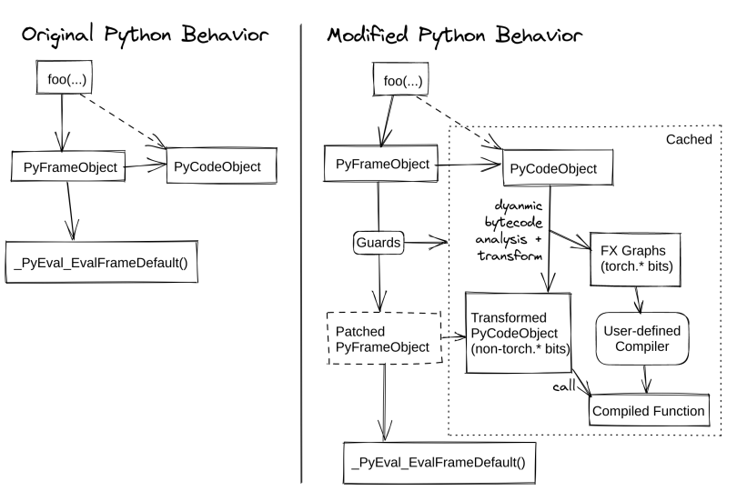
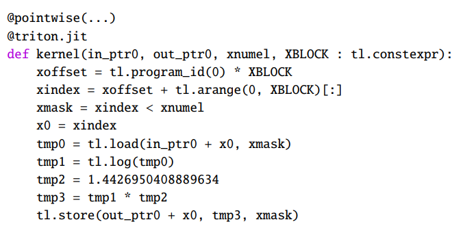

[[toc]]

论文 "PyTorch2: Faster Machine Learning Through Dynamic
Python Bytecode Transformation and Graph
Compilation" 介绍了 PyTorch2 中引入的新 API，[torch.compile](https://pytorch.org/docs/stable/torch.compiler.html#torch-compiler)
背后的实现原理。它旨在解决中在 Pytorch 中构建计算图的问题，并最终通过编译技术加速代码执行。

torch.compile 基于以下底层技术：

- TorchDynamo（`torch._dynamo`）：内部API，基于 CPython 的特性，[PEP523 Frame Evaluation API](https://peps.python.org/pep-0523/)，以安全地捕获 PyTorch 计算图。

- TorchInductor：默认的深度学习编译器，可以为多种加速器和后端生成快速的代码。要通过torch.compile实现加速，需要使用后端编译器。对于NVIDIA和AMD GPU，它利用OpenAI Triton作为关键构建块。

- AOT （Ahead-Of-Time）Autograd：不仅捕获用户级代码，还捕获反向传播。这使得使用 TorchInductor 能够加速前向传播和反向传播。

借助 torch.compile，Pytorch2 的算子数量也显著减少了，参见 https://pytorch.org/docs/stable/torch.compiler_ir.html

`torch.compile` 的使用很简单，可以通过装饰器加在函数上

```python
@torch.compile
def opt_foo2(x, y):
    a = torch.sin(x)
    b = torch.cos(y)
    return a + b
print(opt_foo2(torch.randn(10, 10), torch.randn(10, 10)))
```

可以直接将 `torch.nn.Module` 作为参数

```python
class MyModule(torch.nn.Module):
    def __init__(self):
        super().__init__()
        self.lin = torch.nn.Linear(100, 10)

    def forward(self, x):
        return torch.nn.functional.relu(self.lin(x))

mod = MyModule()
opt_mod = torch.compile(mod)
print(opt_mod(torch.randn(10, 100)))
```

或者直接写 [triton](https://pytorch.org/tutorials/recipes/torch_compile_user_defined_triton_kernel_tutorial.html) 算子

```python
import triton
from triton import language as tl

@triton.autotune(
    configs=[
        triton.Config({"BLOCK_SIZE": 4}, num_stages=3, num_warps=8),
        triton.Config({"BLOCK_SIZE": 4}, num_stages=4, num_warps=4),
        triton.Config({"BLOCK_SIZE": 2}, num_stages=3, num_warps=8),
        triton.Config({"BLOCK_SIZE": 2}, num_stages=4, num_warps=4),
    ],
    key=[],
)
@triton.jit
def add_kernel_autotuned(
    in_ptr0,
    in_ptr1,
    out_ptr,
    n_elements,
    BLOCK_SIZE: "tl.constexpr",
):
    pid = tl.program_id(axis=0)
    block_start = pid * BLOCK_SIZE
    offsets = block_start + tl.arange(0, BLOCK_SIZE)
    mask = offsets < n_elements
    x = tl.load(in_ptr0 + offsets, mask=mask)
    y = tl.load(in_ptr1 + offsets, mask=mask)
    output = x + y
    tl.store(out_ptr + offsets, output, mask=mask)

@torch.compile(fullgraph=True)
def add_fn(x, y):
    output = torch.zeros_like(x)
    n_elements = output.numel()
    grid = lambda meta: (triton.cdiv(n_elements, meta["BLOCK_SIZE"]),)
    add_kernel_autotuned[grid](x, y, output, n_elements)
    return output

x = torch.randn(4, device="cuda")
y = torch.randn(4, device="cuda")
out = add_fn(x, y)
print(f"Vector addition of\nX:\t{x}\nY:\t{y}\nis equal to\n{out}")
```

# 论文笔记

## 1 摘要/导言

作为 eager 模式的框架，pytorch 易于学习和调试，但是难以借助编译器实现图级别的优化。框架只能看到局部的算子信息，无法做算子融合和调度。已有的一些尝试，基于记录/重放、python 解析、懒执行等方法，会影响 pytorch 本身的易用性。记录/重放可能导致错误结果，python 解析无法处理复杂的 python 程序，懒执行的运行时开销太大，因此都不实际。

本文介绍了两个 PyTorch 的扩展，TorchDynamo 和 TorchInductor，它们实现了在 PyTorch2 中发布的 `torch.compile` 功能。TorchDynamo 是一个基于Python的即时编译器（JIT），它在不损失 Python 灵活性的情况下，使得 PyTorch 程序能够进行图编译。它挂载在 python 的 frame evaluation API 之上，通过在执行之前动态修改 Python 字节码，并将一系列 PyTorch 操作提取到一个 FX 图中来实现这一目标，然后使用可扩展的后端对其进行 JIT 编译。TorchInductor 是 TorchDynamo 的默认编译器后端，它将PyTorch 程序转换为 OpenAI 的 Triton（用于GPU）和 C++（用于CPU）。这些扩展为在 PyTorch 等 eager-mode 框架中通过编译器应用优化提供了一种新途径。


## 2 过去的 PyTorch 图捕获方法

eager 模式的框架，难点不仅在于执行时仅有局部信息，还在于它的代码中可以混淆任意 python 代码、第三方库，无法像基于图的框架，限制用户的行为。下面介绍下在实现 TorchDynamo 之前，pytorch 社区的尝试。

### 2.1 torch.jit.trace

`torch.jit.trace` 使用记录/重放的方法来构建 TorchScript 图。在 Pytorch dispatcher 的层面进行记录，dispatcher 是用来把算子转换成特定设备的核函数，以及用于自动微分的，用 C++ 实现。因为记录是实现在 C++ 层面，因此它无法捕获到 python 中的控制流。比如下面这个例子

```python
def example1(x):
    if len(torch.nonzero(x)) > 1:
        return x + 1
    return x - 1
```

假设输入是 `tensor([0,0])`，它会捕获到一个等价于下面代码的图

```python
def example1_incorrect_capture(x):
    torch.nonzero(x)
    return x - 1
```

显然输入换成 `tensor([1,1])`，捕获到的图就非法了。同时，python 代码中任意非 pytorch 的部分，也是无法捕获的，如三方库、日志打印、程序执行的副作用。

### 2.2 torch.jit.script

`torch.jit.script` 也用来构建 TorchScript 图，但是是通过解析 python 语法树进行静态分析，它能够正确捕获上面的 example1。但是问题是它在尝试将 python 整个实现成一个静态语言，遇到未实现的 python 组件将会导致它无法工作。它只支持部分模型，而且支持大些模型的工作量很大。

### 2.3 Lazy Tensor

Pytorch/XLA 使用这种方法，它是一个 C++ 层面的方法，每轮迭代它都会延后算子执行，累积成一个图，然后将图喂给 XLA 编译器。它会对图做哈希以避免重复编译。它有效而且通用性强，但是运行时开销大（额外维护图结构）、延迟高（不必要的 device/host 串行）、有时可能频繁触发重新编译。

目前 Pytorch/XLA 已经集成了 TorchDynamo，它不会在每轮迭代都采用 Lazy Tensor，同时借助 TorchDynamo 来判断是否需要重新捕获图。

### 2.4 torch.fx.symbolic_trace

`torch.fx.symbolic_trace` 也是一个基于记录/重放的图捕获技术，但是它工作在 python 层面，因此可以捕获到 python 中的条件判断。它借助一个代理对象来执行用户的代码，因此可以捕获到关于规模/值的读取行为，而不是像 `torch.jit.trace` 一样直接代入真实的张量值。它的图表示，`FX graph` 格式，也被 TorchDynamo 所采纳。

但是它无法处理下面的例子，

```python
def example3(x):
    global call_count
    call_count += 1
    return torch.rand(10) + x
```

它会生成类似下面代码的图，随机数和全局副作用都丢失了，因为它们不会和 `x` 的代理变量交互。而且即使全局副作用被捕获了，下游的编译器也大多不支持它，因为机器学习的图结构中几乎都没有 python 中的全局变量的概念。

```python
def example3_incorrect_capture(x):
    return _tensor_constant0 + x
```

### 2.6 和 JAX 中的图捕获的对比

JAX 天然是和 XLA 联合设计的，而且对用户程序也有限制，`jax.jit` 不支持依赖数据的 python 控制流，并且要求用户函数是纯函数（无副作用），因此它可以采用一种类似 `torch.fx.symbolic_trace` 的图捕获技术，并且还更简单。

与之相对，torch 一开始设计的时候没有编译器的概念，是一个仅支持 eager 模式的框架，已经有大量的模型基于它构建，换条路不现实了。

## 3 TorchDynamo 设计实现

TorchDynamo 是一个工作在 CPython 层面的 python 字节码 JIT 编译器。它将 python 字节码翻译到 python 字节码，只是会将原始的字节码中的 pytorch 运算替换成编译后的产物，从而实现 pytorch 的算子融合。下图是它的原理。



### 3.1 API

当使用 `torch.compile` 运行 pytorch `Module` 时，自定义的 CPython Frame Evaluation Hook （参见 3.2）将重写正在执行的每个Python 函数的字节码，以提取和编译 PyTorch 算子。这个字节码重写可以被缓存，因为它可能依赖于程序的某些动态属性，需要使用 guards（参见 3.3）来在后续调用中进行检查。

### 3.2 CPython Frame Evaluation Hook


### 3.3 Guards


### 3.4 Symbolic Evaluation

### 3.5 Modeling Python Data Structures

### 3.6 Inlining, Control Flow, and Closures

### 3.7 Mutation and Side Effects

## 4 TorchInductor 设计实现

### 4.5 Triton 代码生成

Triton codegen 负责将 TorchInductor 的 IR 映射到 Triton 核函数。下图显示了上述 log2 示例生成的代码。



该核函数一次处理 `XBLOCK` 个元素的块。如果元素的数量不是`XBLOCK` 的倍数，则末尾可能会有一些元素被屏蔽。在代码生成过程中，我们简化了索引。例如，在 IR 中，2D strided 加载被转换为连续加载。代码生成还负责公共子表达式消除（CSE），通过生成代码时使用缓存，并分配以 tmp 开头的临时变量名。pointwise修饰符用于简化启发式块大小、自动调优和预先编译核函数的样板代码。修饰符是正在生成的核函数类型（pointwise、reduction或template），其参数是核函数的必需元数据，例如数据对齐方式。

在生成 reduction 核函数时，TorchInductor有两种代码生成模式。对于较小的 reduction 操作，它将生成持久 reduction，整个reduction加载到单个块中并在寄存器/共享内存中保留；在这种情况下，reduction 直接映射到 Triton 的 reduction 操作符。对于较大的 reduction，TorchInductor 生成一个循环，将整个块用作累加器，并在循环结束时调用 Triton reduction。

对于更复杂的操作（矩阵乘法和卷积），TorchInductor 有自己的模板系统，用于生成混合手写 Triton 和生成的 Triton 代码。模板使用 Jinja 编写，与 TorchInductor 的代码生成系统进行交互。


### 4.6 C++ 代码生成

CPU 后端会对应到 C++ 代码和 OpenMP。C++ 代码会有向量化和非向量化的实现。向量化的实现会讲大多数运算映射到 pytorch 的`at::vec::Vectorized` 类。这个类一次会处理 16 个元素，也是标准的 pytorch 核函数调用 SIMD 指令集的方式。非向量化的实现就是转换到 STL 标准库。两个实现都会尝试展开部分循环以实现并行。


### 4.7 Wrapper Codegen

Wrapper Codegen 指的是生成调用核函数的代码，它负责计算张量规模、管理显存分配。有两个实现，一个生成 python 代码，另一个生成 C++ 代码，python 后延更加灵活，支持一些边界情况，C++ 代码开销更小。

当 `torch.compile` 指定 `mode="reduce-overhead"` 时，TrochInductor 会尝试使用 CUDA Graph 来消除 wrapper 代码的开销，基于 API `cuStreamBeginCapture` 和 `cuStreamEndCapture`，属于 CUDA 自动图捕获。如果是张量是动态规模，或者不是 CUDA 张量的话，就放弃借助 CUDA Graph。

注意这里是 CUDA API 层面的图，和上面讲的算子层面的图不同。

### 4.8 相关的深度学习编译器

pytorch 选用了 OpenAI 的 Triton，因为它可以生成比手写库还快的核函数，大多编译器甚至没有考虑过这方面的工作，面对复杂算子会直接调用手写库。

# CUDA Graph 相关缺陷

https://pytorch.org/docs/stable/torch.compiler_cudagraph_trees.html

由于 [CUDA Graph](https://developer.nvidia.com/blog/cuda-graphs/) 使用了确定性的显存地址，所以前面的执行结果会被后续的执行结果覆盖。也就是说下面的用例会出错

```python
import torch

@torch.compile(mode="reduce-overhead")
def my_model(x):
    y = torch.matmul(x, x)
    return y

x = torch.randn(10, 10)
y1 = my_model(x)
y2 = my_model(x)
print(y1)
# RuntimeError: Error: accessing tensor output of CUDAGraphs that has been overwritten by a subsequent run.
```

Pytorch 在实现 `torch.compile` 的时候，采用了一种启发式的方法来避免这个问题。在推理过程中会在每次调用 `torch.compile` 时开始新的迭代；在训练过程中也是如此，只要没有未调用的待处理反向传播。如果这些启发式算法不正确，可以使用 `torch.compiler.mark_step_begin()` 标记开始新的迭代，或在开始下一次运行之前（在 `torch.compile` 之外）克隆上一次迭代的张量。