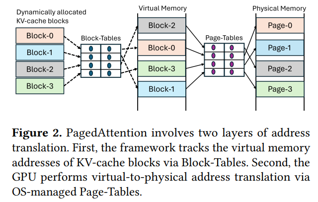
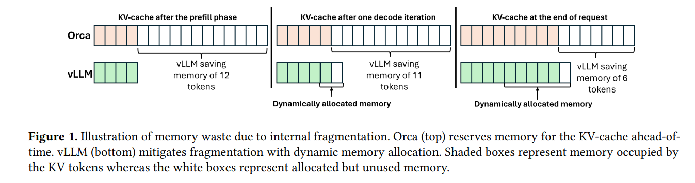
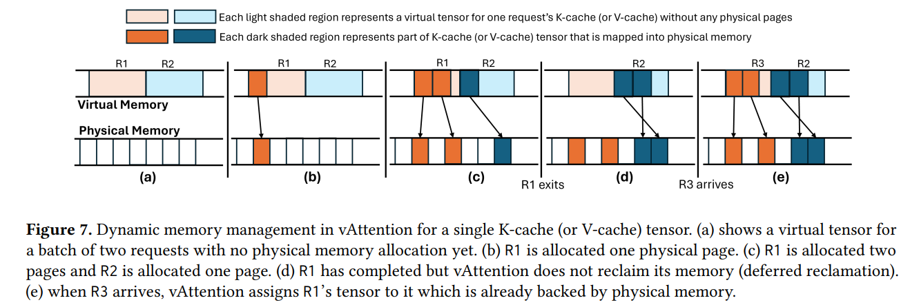

[[toc]]

读一下 arxiv 上刚刚上传的论文 [vAttention: Dynamic Memory Management for Serving LLMs without PagedAttention](https://arxiv.org/pdf/2405.04437)。

在 vllm 项目中也有相关 [issue](https://github.com/vllm-project/vllm/issues/4675)，论文作者出现在评论区声称近期会将其实现开源。

暂时搬运下公众号文章

https://mp.weixin.qq.com/s/E9Df1prkEbw23hPF59IrwQ

收益：

token qps是vLLM的1.97x倍;

prompt的prefill阶段速度是FlashAttention的3.97倍，FlashInfer的1.45倍；

使用者不需要修改之前的attention代码。

论文解读
LLM推理分为两个阶段：prefill和decoding。prefill阶段主要是一次性处理所有的用户输入；decoding阶段是每次输入一个token，输出一个token。由于每一个生成的token都需要利用输入prompt以及之前的token的K和V信息，为了避免重复计算，可以使用KV-Cache把之前的token对应的K和V记录下来。

KV-Cache可以显著减少K和V的计算量，但是需要显存来存储对应的值。每一个Decoder Block都需要这么多byte来存储K以及V，其中B代表batch size，L代表sequence length，H代表number of head，D代表size of head，P代表kv的数据格式需要多少比特才能存储，比如fp16就需要2 byte。如果N代表Block数量，那么一个模型总共需要的kv cache的存储空间为。

Orca以及FasterTransformer这些系统里面，L一般都设置为max seq length，也就是允许的最大生成长度。很显然，根据上面的计算公式，这是一个很大的值，也成为了限制可以调度的batch size最大的影响因素。但是，LLM里面有一个很显著的特点就是每个输入的数据生成的token长度不统一，有可能第一个输入生成5个token就生成完了，另外一个输入生成5000个token都还没有生成完。我们都按照最大长度来分配kv cache的话，很多分配的显存都没有被使用，而这些没有被使用却被分配的显存还减小了batch size的大小，从而降低了系统的吞吐。

vLLM受到操作系统管理虚拟内存的启发，提出了PagedAttention。PagedAttention把KV-cache分割成固定大小的block，每次需要的时候动态分配一个block。通过这样的方式，vLLM可以只在一个请求需要的的时候为其分配需要的显存。

vLLM内存管理模式

vLLM节省内存示意图：

但是天下没有免费的午餐：

传统的attention算子的实现都是假设K和V都是在显存中连续存储，而vLLM把KV-cache的存储从连续的虚拟内存变成了非连续的。这就使得传统的实现无法继续使用，必须重写attention kernel；
每次计算的时候需要取所有block里面的k和v，这就使得服务框架必须追踪每个block和显存地址的映射关系。而这就使得服务框架更加复杂。服务框架干的这个事情恰好就是操作系统干的virtual-to-physical address转换的事情，其实有重复；
vLLM承认他们的基于PagedAttention的实现比原始的FasterTransformer kernel实现要慢20 − 26%，这部分主要是查询Block-Tables以及执行额外的分支造成的；
实现额外的内存管理需要额外的CPU时间。最开始的vLLM的BlockTable准备占一个解码迭代步骤30%的时间。即便最新有一些修复，它依然在TensorRT-LLM里面占据了10%，让吞吐下降了11%，从412 tokens/sec降到了365 tokens/sec。
CUDA 10.2开始引入了virtual memory management API，这一组细粒度的API可以让虚拟内存和物理内存分配分开并进行自由组合。

使用这一组API，我们可以像传统的推理框架一样一开始就为KV-Cache分配连续的虚拟内存，这样所有之前写的attention kernel都可以重用。不同的是，这些虚拟内存并没有对应的物理内存。物理内存的分配是像vLLM里面一样，需要的时候才分配。这就是作者提出的vAttention的核心所在。

cuMemCreate默认最小2MB的物理内存。这对于KV-Cache来说依然单次分配得太多。幸好这部分driver的实现NV是开源的，于是作者修改了底层driver实现，让其可以支持4KB, 64KB, 2MB的最小内存分配单元。

另外，显存的分配还是有明显的时延的，在每次需要物理显存分配得时候会出现卡顿。为了解决这个问题，系统跟踪显存的使用，在预测到下一轮即将需要新分配显存的时候就启动后台线程进行分配，这样在真的需要分配的时候后台线程已经分配好。
