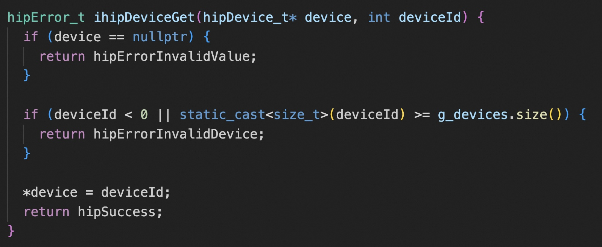
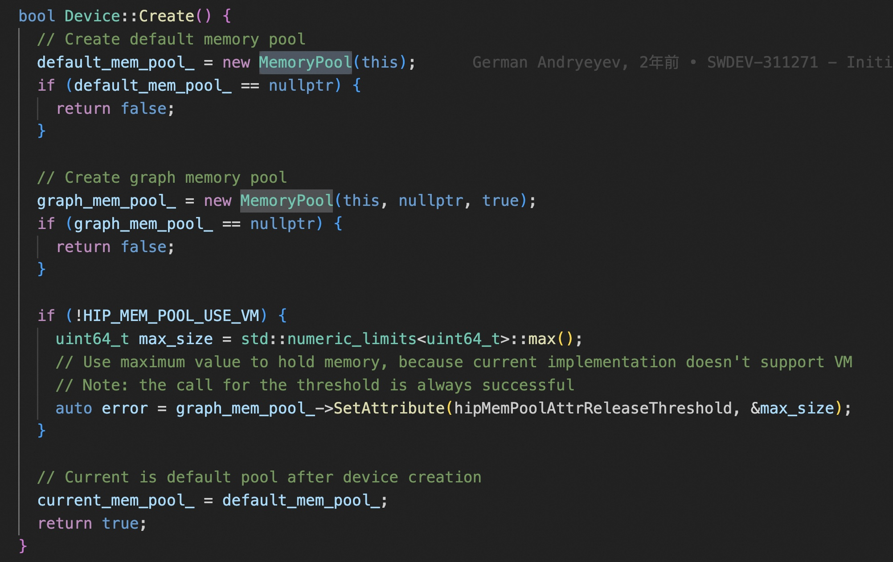
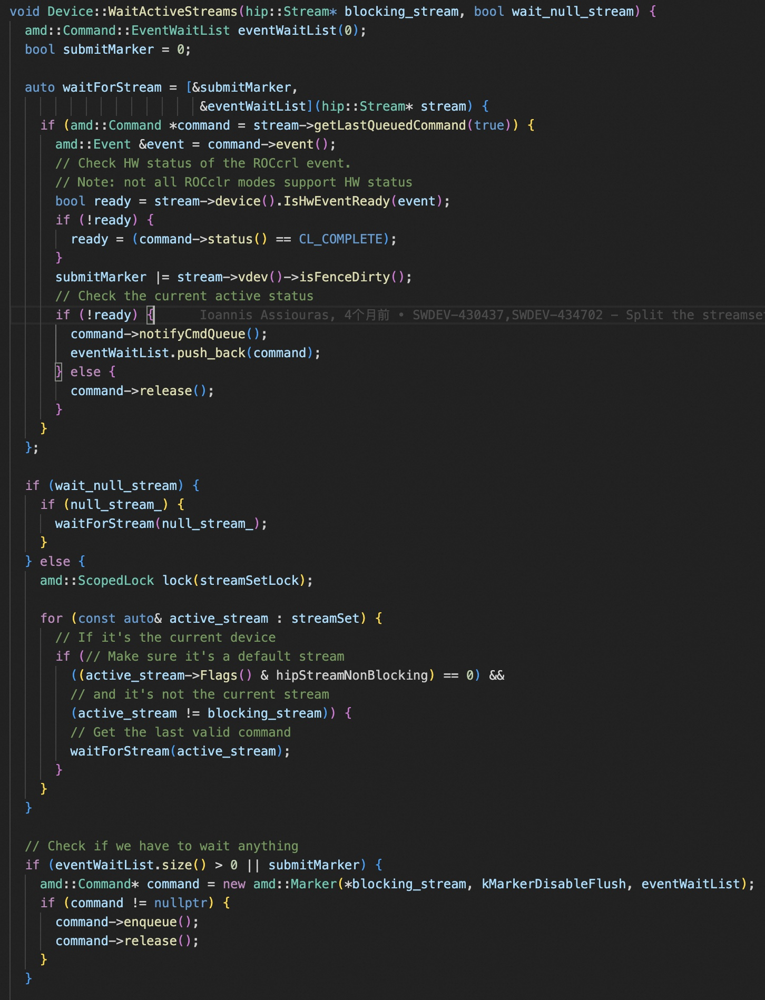
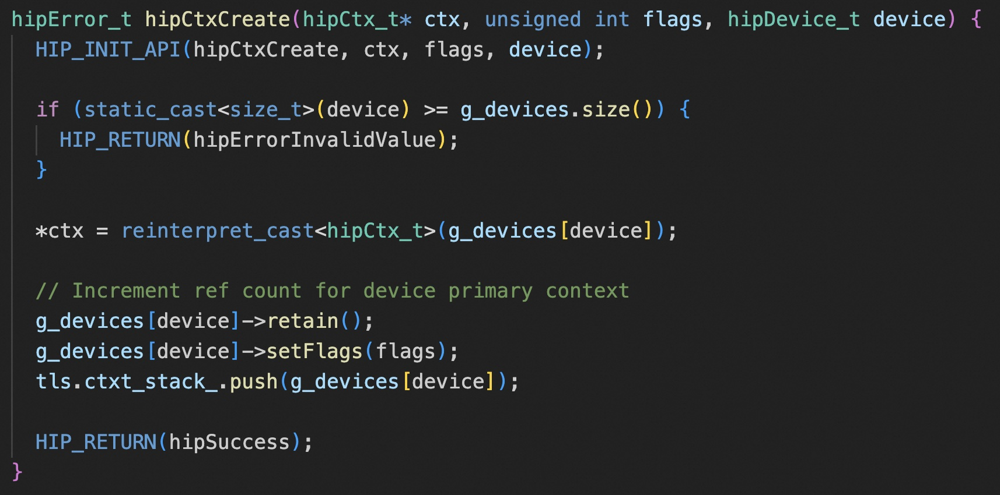
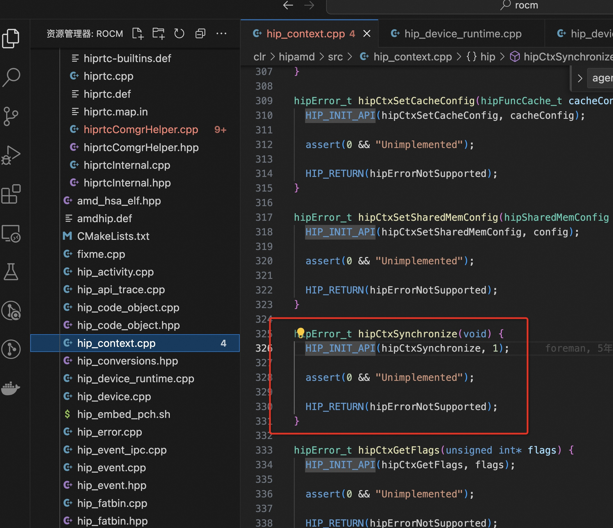
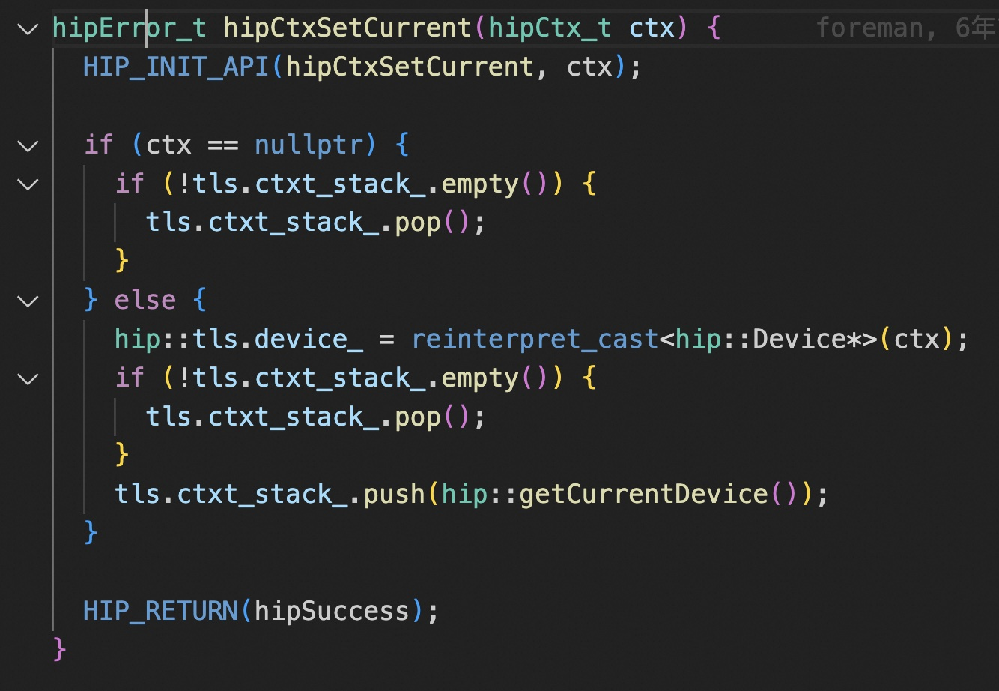
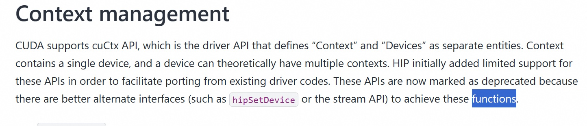

[[toc]]

https://github.com/ROCm/hipother
Hip 的 nvidia 头文件

https://github.com/ROCm/clr
hip/rocm release 6.2

# clr/hipamd/src/

## hip_device.cpp
ihipDeviceGet 和 cuda 一样，默认 ordinal 就是 hipDevice_t

常规 API 和  graph API 的默认的 memory pool 是分开的。

在 stream 上做同步，是通过遍历每个 steram 上的 amd::Command，加入到一个列表里，然后实例化一个 amd::Marker 类型的 amd::Command，标识阻塞任务。
lambda 函数 waitForStream 捕获了当前上下文的 eventWaitList 和 submitMarker，累积需要同步的 event。
和 cuda 一样，stream 的同步，需要判断是不是特殊的 null stream。

## hip_device_runtime.cpp
device 对外的 api。比如 hipDeviceGetAttribute 会调用 device.cpp 里面的 ihipGetDeviceProperties。

## hip_context.cpp

rocm 创建 ctx，就是将 primary ctx 直接引用计数增加了一次。

hipCtxSynchronize 这个 API 看代码就是不支持， 难怪之前看 cuMemFree 的那个问题的时候，cuda 是按 ctx 做的同步，rocm 直接整个device 做的同步……不过这个也挺奇怪，为什么不直接调用下 hipDeviceSynchronize，而是抛个 not support 错误。

其实直接从下面这个 API 就可以看出来，对外的模糊结构体指针 hipCtx_t 本身就是一个 hip:Device 类型的指针，ctx 和 device 其实是不做区分的。

Amd 文档里倒是写明了 ctx 相关 api 并不是完全支持，但是这感觉在 cuda 12 的 green ctx 出来以后，兼容性会更加严重

也可以去看下 hipify 的兼容性文档
https://github.com/ROCm/HIPIFY/blob/455103c5428d3bf6dfe6351c93d7bde222bb9f86/docs/tables/CUDA_Driver_API_functions_supported_by_HIP.md

## hip_stream_ops.cpp

实现 hip::ihipStreamOperation，构建 amd::StreamOperationCommand 类型的 amd::Command。

## hip_stream.cpp

## hip_table_interface.cpp

获取 HipCompilerDispatchTable 和 HipDispatchTable 上的函数指针。

搞这么一个 dispatch table 结构体让 API 维持稳定，参考 clr/hipamd/src/hip_api_trace.cpp

# clr/rocclr/platform/command.hpp

amd::Command 类型是提交给硬件 command 队列的类，抽象了所有OpenCL operations（因为 hip 后来才搞的，所以和 OpenCL 共用了这个类），提交给 HostQueue 执行。继承 amd::Command 的子类都需要实现 submit 接口。
